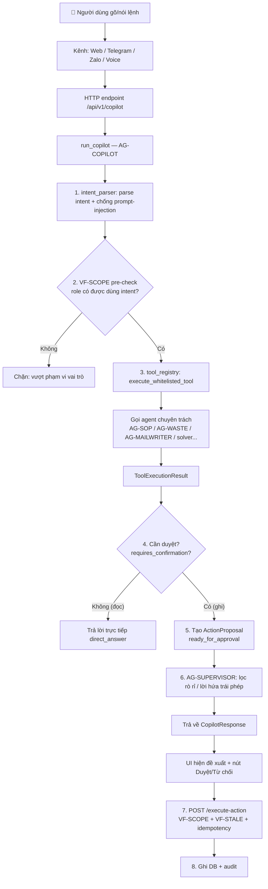
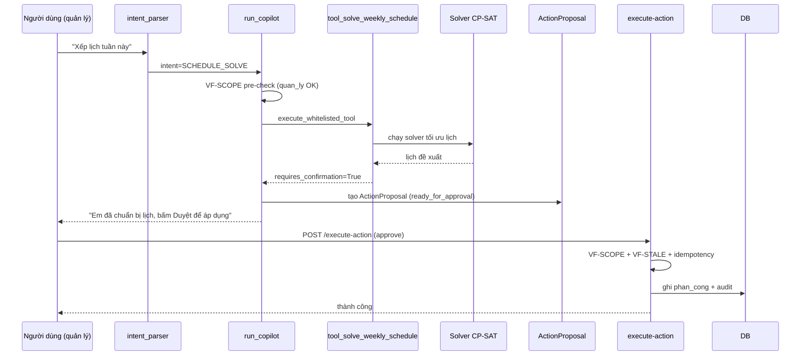
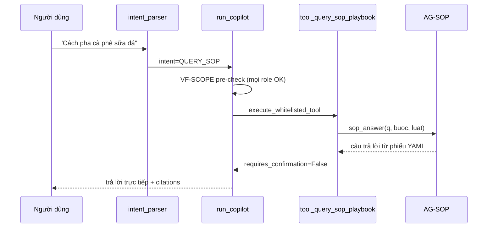
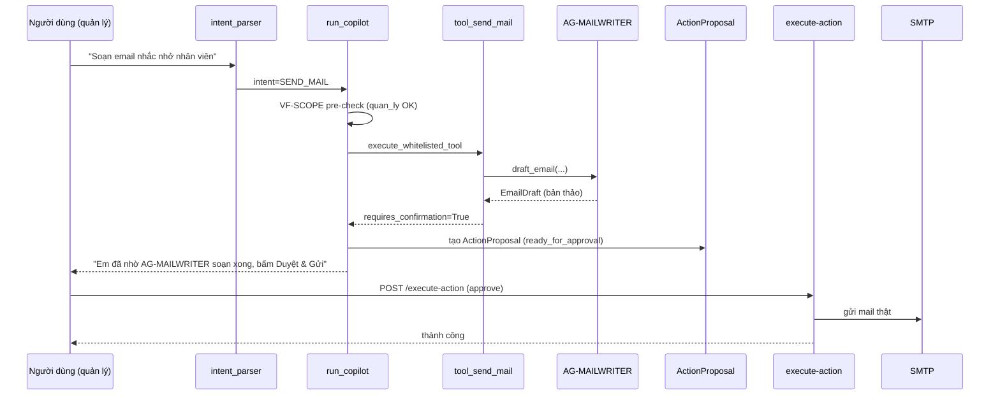

# AG-COPILOT — Bản đồ luồng hoạt động từng chức năng

> **Mục đích:** Nhìn **tổng quát** cách một câu lệnh của người dùng đi qua hệ thống:
> từ lúc gõ/nói → parse intent → kiểm tra quyền → gọi tool/agent nào → tạo đề xuất →
> chờ duyệt → thực thi → ghi DB → trả lời.
>
> **Ngày lập:** 2026-09-19
> **Nguồn:** `packages/agents/src/ca_agents/ag_copilot/*`, `packages/contracts/src/ca_contracts/__init__.py`,
> `apps/api/src/ca_api/interfaces/http/copilot.py`, `packages/gates/src/ca_gates/*`.
> **Nguyên tắc:** Fail-closed (ADR-008) — mọi thao tác ghi đều phải qua **2 pha** (đề xuất → duyệt).

---

## 1. Kiến trúc tổng thể (một câu lệnh đi qua đâu)

**Tóm tắt 8 bước chung:**

| Bước | Thành phần | Việc làm |
|---|---|---|
| 1 | `intent_parser.py` | Nhận diện **intent** từ câu tự nhiên + chặn prompt-injection / bypass duyệt |
| 2 | `COPILOT_ROLE_INTENT_MATRIX` | **VF-SCOPE pre-check**: role có được dùng intent này không (fail-closed) |
| 3 | `tool_registry.py` | Chạy **tool whitelist** tương ứng intent (không cho LLM gọi tool tùy ý) |
| 4 | Tool | Gọi **agent chuyên trách** / đọc dữ liệu thật (inject qua `configure_data_sources`) |
| 5 | `copilot_agent.py` | Nếu cần ghi → tạo **ActionProposal** (2 pha); nếu chỉ đọc → trả lời thẳng |
| 6 | `ag_supervisor.py` | **AG-SUPERVISOR**: lọc rò rỉ dữ liệu nhạy cảm, lời hứa tài chính trái phép |
| 7 | `copilot.py` `execute-action` | Người dùng bấm **Duyệt** → kiểm tra VF-SCOPE, VF-STALE, idempotency |
| 8 | `persist.py` | **Ghi DB** + ghi **audit** vết hệ thống |

---

## 2. Phân loại intent theo "cách hoạt động"

Có **3 nhóm** hành vi khác nhau:

| Nhóm | Hành vi | Ví dụ intent |
|---|---|---|
| **R0_READ** | Chỉ **đọc**, trả lời ngay, không cần duyệt | `GET_MY_PROFILE`, `QUERY_SOP`, `GET_SCHEDULE`, `GET_INVENTORY`... |
| **R1_DRAFT** | Tạo **bản nháp** (draft), chưa ghi DB | `CREATE_RULE_PROPOSAL` |
| **R2_CONFIRM** | Tạo **đề xuất chờ duyệt** → người có quyền bấm Duyệt mới ghi DB | `SCHEDULE_SOLVE`, `APPROVE_SHIFT_SWAP`, `SEND_MAIL`, `PROPOSE_*`... |

> **Quy tắc vàng:** Intent **ghi dữ liệu** luôn trả về `ActionProposal` (chưa ghi DB).
> Chỉ khi người dùng bấm **Duyệt** ở pha 2 thì dữ liệu mới thực sự được ghi.

---

## 3. Bản đồ từng chức năng (intent → tool → agent → luồng)

> Cột **"Gọi agent"** = agent chuyên trách được triệu hồi (qua data source inject).
> Cột **"Cần duyệt"** = có tạo `ActionProposal` chờ duyệt không.

### 3.1. Đọc & tra cứu (R0_READ — trả lời ngay)

| Intent | Tool | Gọi agent / nguồn | Cần duyệt | Luồng |
|---|---|---|---|---|
| `GET_MY_PROFILE` | `tool_get_my_profile` | bảng `users` (theo `user_id` session) | ❌ | Đọc hồ sơ chính mình → trả lời |
| `LIST_STAFF` | `tool_list_staff` | bảng `users` | ❌ | Liệt kê nhân sự (không lộ email/PII) |
| `QUERY_MENU` | `tool_query_menu` | bảng `menu_mon` | ❌ | Đọc menu hiện hành |
| `GET_INVENTORY` | `tool_get_inventory` | KV `tieu_thu` | ❌ | Tồn kho + cảnh báo dưới ngưỡng |
| `GET_SHIFT_SWAPS` | `tool_get_shift_swaps` | KV `swap` | ❌ | Yêu cầu đổi ca đang chờ |
| `GET_HANGING_TASKS` | `tool_get_hanging_tasks` | KV `treo` | ❌ | Việc treo đang chờ |
| `GET_HANDOVERS` | `tool_get_handovers` | `ca_playbook.list_sua` | ❌ | Lịch sử bàn giao/sửa lịch |
| `GET_SCHEDULE` | `tool_get_schedule` | KV `phan_cong` + `list_ca_meta` | ❌ | Lịch tuần + trạng thái xác nhận |
| `GET_MY_SHIFTS` | `tool_get_my_shifts` | KV `phan_cong` (self-scoped) | ❌ | Ca của chính người hỏi |
| `GET_CONSTRAINT_CANDIDATES` | `tool_get_constraint_candidates` | KV `inbox_rang_buoc` | ❌ | Ràng buộc chờ duyệt (scope theo role) |
| `QUERY_SOP` | `tool_query_sop_playbook` | **AG-SOP** (`sop_answer`) | ❌ | Trả lời từ phiếu YAML + luật đã duyệt |
| `ANALYZE_WASTE` | `tool_get_waste_summary` | **AG-WASTE** (`waste_cluster`) | ❌ | Nhóm ghi chú hao hụt theo ngày |
| `QUERY_AUDIT` | `tool_query_audit` | `audit_list` (redact payload) | ❌ | Vết hệ thống (chỉ quản lý/chủ quán) |
| `GET_SERPAPI_QUOTA` | `tool_get_serpapi_quota` | `get_serpapi_quota` | ❌ | Hạn ngạch SerpApi + circuit breaker |
| `GET_SURVEY_RESULT` | `tool_get_latest_survey_result` | `get_latest_survey` | ❌ | Kết quả khảo sát giá gần nhất |

### 3.2. Ghi dữ liệu — 2 pha (R2_CONFIRM — cần duyệt)

| Intent | Tool | Gọi agent / nguồn | Cần duyệt | Luồng |
|---|---|---|---|---|
| `SCHEDULE_SOLVE` | `tool_solve_weekly_schedule` | **Solver CP-SAT** (`ca_solver`) | ✅ | Đề xuất lịch tuần → duyệt → ghi `phan_cong` |
| `APPROVE_SHIFT_SWAP` | `tool_prepare_swap_approval` | KV `swap` / `shift_swaps` | ✅ | Chuẩn bị duyệt đổi ca → duyệt → ghi |
| `CREATE_RULE_PROPOSAL` | `tool_propose_rule_from_recent_edits` | `ca_playbook` (`de_xuat`) | ✅ | Đề xuất luật mới từ lịch sử sửa |
| `INVENTORY_RESTOCK_CHECK` | `tool_check_inventory_restock` | KV `tieu_thu` | ✅ | Đề xuất nhập kho → duyệt |
| `SEND_MAIL` | `tool_send_mail` | **AG-MAILWRITER** (`draft_mail`) | ✅ | Soạn thư → duyệt → gửi SMTP |
| `RUN_CATCHMENT_SURVEY` | `tool_propose_catchment_survey` | **AG-PRICING** (`run_survey_job`) + SerpApi | ✅ | Đề xuất khảo sát giá → duyệt → chạy job |
| `PROPOSE_HANGING_TASK` | `tool_propose_hanging_task` | KV `treo` | ✅ | Tạo việc treo → duyệt |
| `PROPOSE_TASK_COMPLETE` | `tool_propose_task_complete` | KV `treo` | ✅ | Đánh dấu việc xong → duyệt |
| `PROPOSE_CONSUMPTION_RECORD` | `tool_propose_consumption_record` | KV `tieu_thu` | ✅ | Ghi tiêu thụ → duyệt |
| `PROPOSE_TIME_OFF` | `tool_propose_time_off` | KV `inbox_rang_buoc` | ✅ | Báo bận/xin nghỉ → duyệt |
| `PROPOSE_MENU_UPDATE` | `tool_propose_menu_update` | bảng `menu_mon` | ✅ | Cập nhật menu → duyệt |
| `PROPOSE_ORDER_TRANSITION` | `tool_propose_order_transition` | bảng `don` | ✅ | Chuyển trạng thái đơn → duyệt |
| `PROPOSE_PIN` | `tool_propose_pin` | KV `pins` | ✅ | Ghim thông báo → duyệt |
| `PROPOSE_PAGE_SYNC` | `tool_propose_page_sync` | `page_status` | ✅ | Đồng bộ Facebook Page → duyệt |
| `PROPOSE_PAGE_DRAFT` | `tool_propose_page_draft` | `page_status` | ✅ | Tạo bài draft Page → duyệt |
| `PROPOSE_TKB_CONFIRM` | `tool_propose_tkb_confirm` | KV `tkb_nv` | ✅ | Xác nhận TKB → duyệt |
| `PROPOSE_SWAP_CONSENT` | `tool_propose_swap_consent` | KV `swap` | ✅ | Đồng ý đổi ca → duyệt |
| `PROPOSE_HANDOVER` | `tool_propose_handover` | KV `handover_history` | ✅ | Ghi bàn giao ca → duyệt |

### 3.3. Trạng thái đặc biệt

| Intent | Tool | Ghi chú |
|---|---|---|
| `GET_PAGE_STATUS` | `tool_get_page_status` | Đọc trạng thái kênh (không duyệt) |
| `OUT_OF_SCOPE` | — | Câu hội thoại/chào hỏi → `_generate_conversational_reply` (LLM nếu live, fallback quy tắc) |

---

## 4. Luồng chi tiết 3 chức năng tiêu biểu

### 4.1. "Xếp lịch tuần này" (SCHEDULE_SOLVE — ghi, cần duyệt)

### 4.2. "Cách pha cà phê sữa đá" (QUERY_SOP — đọc, trả lời ngay)

### 4.3. "Soạn email nhắc nhở nhân viên" (SEND_MAIL — ghi, cần duyệt)

---

## 5. Các agent chuyên trách (ai làm gì)

| Agent | Vai trò | Được gọi khi |
|---|---|---|
| **AG-COPILOT** | Điều phối chính: parse intent, RBAC, tạo proposal | Mọi lệnh |
| **AG-SOP** | Trả lời quy trình từ phiếu YAML + luật đã duyệt | `QUERY_SOP` |
| **AG-WASTE** | Nhóm ghi chú hao hụt theo ngày | `ANALYZE_WASTE` |
| **AG-MAILWRITER** | Soạn thảo email chuyên nghiệp (chỉ tạo bản thảo, không tự gửi) | `SEND_MAIL` |
| **AG-SUPERVISOR** | Cổng an toàn: lọc rò rỉ dữ liệu, lời hứa tài chính trái phép | Mọi phản hồi ra ngoài |
| **Solver CP-SAT** | Tối ưu lịch tuần | `SCHEDULE_SOLVE` |
| **AG-PRICING** | Điều phối khảo sát giá thị trường (SerpApi) | `RUN_CATCHMENT_SURVEY` |
| **AG-FBPAGE** | Quản lý Facebook Page (inbox/chatbot) | Kênh Page |
| **AG-TREND** | Trending TikTok/Threads (Apify/Camoufox) | Kênh mạng xã hội |

> **Kiến trúc hexagonal:** `tool_registry.py` **không import** trực tiếp các agent khác.
> API layer gọi `configure_data_sources()` một lần lúc startup để **tiêm** các hàm
> (`sop_answer`, `waste_cluster`, `draft_mail`, `run_survey_job`...) vào. Tool chỉ gọi
> qua callable được inject — đảm bảo tách lớp, dễ test.

---

## 6. Các cổng bảo mật (gates) chạy ở đâu

| Cổng | Vị trí | Chặn gì |
|---|---|---|
| **VF-SCOPE** | Pre-check trong `run_copilot` + `execute-action` | Role không đủ quyền, cross-tenant |
| **VF-STALE** | `execute-action` | Dữ liệu nguồn đổi giữa lúc đề xuất và duyệt |
| **Idempotency** | `execute-action` | Gửi trùng request duyệt |
| **Prompt-injection** | `intent_parser` | Bypass duyệt, ép làm việc vượt quyền |
| **AG-SUPERVISOR** | `run_copilot` (trước khi trả lời) | Rò rỉ PII, lời hứa tài chính trái phép |
| **Rate limit** | `run_copilot` | 30 request/60s mỗi user |

---

## 7. Cách đọc nhanh một intent bất kỳ

Muốn biết **một intent hoạt động thế nào**, tra theo 4 câu:

1. **Intent nào?** → `CopilotIntent` trong `packages/contracts/src/ca_contracts/__init__.py`
2. **Role nào được dùng?** → `COPILOT_ROLE_INTENT_MATRIX` (cùng file)
3. **Tool nào chạy?** → `WHITELISTED_INTENTS` / `_TOOLS` trong `tool_registry.py`
4. **Cần duyệt không?** → `requires_confirmation` trong kết quả tool

> **Nguồn duy nhất (single source of truth):** `COPILOT_ROLE_INTENT_MATRIX` trong
> `packages/contracts/src/ca_contracts/__init__.py`. Mọi thay đổi quyền phải sửa ở đây.