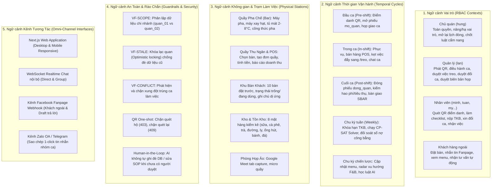

# KẾ HOẠCH TỔNG THỂ KIỂM THỬ TOÀN BỘ TÍNH NĂNG, CHỨC NĂNG & ĐA NGỮ CẢNH HỆ ĐIỀU HÀNH NHỊP QUÁN

> **Phiên bản:** v2 — đã rà soát và bổ sung các phần An toàn Dữ liệu, Tiêu chí Nghiệm thu, Quản lý Rủi ro, Truy vết Test Case.
> **Tình trạng:** KẾ HOẠCH CHUẨN ĐÃ THỐNG NHẤT (Sẵn sàng thực thi).
> **Xác minh mã nguồn hoàn tất:**
> - Tuyến QR chính xác: Quản lý phát mã qua `POST /api/v1/qr`, Nhân viên quét mã qua `POST /api/v1/qr/{token}` (trả về 403 nếu quét hộ, 409 nếu quét lại, 404 nếu mã không tồn tại).
> - Kênh Facebook Fanpage: Hệ thống có chế độ kiểm soát `_page_mode()`; khi không cấu hình token live, hệ thống hoạt động ở chế độ an toàn nội bộ (`page_chua_live`), bảo vệ 100% không gửi tin nhắn ra khách hàng thật.

> [!IMPORTANT]
> **Nguyên tắc cốt lõi theo chỉ đạo của Người dùng:**
> 1. Kế hoạch này là **Tài liệu Quy hoạch & Thiết kế Kiểm thử Toàn diện**, hệ thống hóa 100% chức năng (từ các phân hệ nghiệp vụ lớn đến từng tính năng vi mô nhỏ nhất) trên toàn bộ 31 trang màn hình và 165 endpoints của hệ thống.
> 2. **TUYỆT ĐỐI KHÔNG SỬA ĐỔI MÃ NGUỒN ỨNG DỤNG** trong giai đoạn này (chỉ thiết lập kịch bản và chạy kiểm thử tự động trên Docker stack thực tế).
> 3. **TUYỆT ĐỐI KHÔNG THAO TÁC TRÊN DỮ LIỆU/KÊNH THẬT** — Docker stack "thực tế" ≠ môi trường production; các kênh ngoài (Facebook Fanpage, Zalo, Telegram) bắt buộc phải dùng sandbox/mock khi test.

---

## PHẦN 0: PHẠM VI, GIẢ ĐỊNH & AN TOÀN DỮ LIỆU

### 0.1. Môi trường thực thi
- Toàn bộ kiểm thử chạy trên **Docker compose stack cục bộ (`http://localhost:8000` và `http://localhost:3000`)**, tuyệt đối không trỏ vào database hoặc các kênh (Fanpage, Zalo, Telegram) của môi trường production.
- Trước khi bắt đầu BƯỚC 1 của quy trình 10 bước: **snapshot/backup toàn bộ DB** (sử dụng snapshot KV/SQLite hoặc `pg_dump` trên container Postgres) để có thể khôi phục nếu một thao tác không thể hoàn tác (đóng phiếu, dùng QR one-shot, đóng lịch tuần, xoá cuộc họp) làm thay đổi dữ liệu ban đầu.
- Sau mỗi lần chạy đầy đủ 10 bước, ghi lại **commit hash / phiên bản mã nguồn** đã test, để kết quả PASS/FAIL có thể truy vết đúng phiên bản.

### 0.2. Dữ liệu test & quyền riêng tư
- Dữ liệu khách hàng (tên, số điện thoại đặt bàn, tin nhắn Fanpage) dùng trong test **phải là dữ liệu giả lập (synthetic)**, không dùng thông tin khách hàng thật.
- **Kênh Facebook Fanpage:** Tuyệt đối không trỏ token vào Fanpage thật đang kinh doanh. Sử dụng mock webhook payload gửi vào `/api/v1/channels/facebook/webhook` hoặc tương tác qua dữ liệu giả lập trong store nội bộ `kv_get("page_quan")` — tránh việc AI tự động gửi tin nhắn ra ngoài cho khách thật.
- Tài khoản test (`hung`, `lan`, `minh`...) và mật khẩu `nhipquan` chỉ dùng trong môi trường test/staging, không tái sử dụng cho production.

### 0.3. Phạm vi loại trừ
- Kế hoạch này **không** bao gồm: kiểm thử hiệu năng/tải (load testing) ở quy mô hàng triệu requests, kiểm thử bảo mật hạ tầng chuyên sâu (pentest mạng, hạ tầng Docker host), kiểm thử tuân thủ pháp lý quốc tế. Các hạng mục này sẽ được tách thành các dự án kiểm thử chuyên biệt riêng.

---

## PHẦN I: MA TRẬN ĐA NGỮ CẢNH VẬN HÀNH (OPERATIONAL CONTEXT MATRIX)

Mọi thao tác và chức năng trên Nhịp Quán đều được đặt trong **5 Chiều Ngữ Cảnh Tương Tác Đồng Thời**:



---

## PHẦN II: BẢN ĐỒ CHI TIẾT 14 PHÂN HỆ TÍNH NĂNG (TOÀN BỘ 31 MÀN HÌNH & 165 ENDPOINTS)

### 1. Phân Hệ Xác Thực, Quản Trị Nhân Sự & Phân Quyền (RBAC)
- **Màn hình UI:** `/login`, `/dang-ky`, `/nguoi`, `/me`
- **Endpoints:** `POST /api/v1/auth/login`, `POST /api/v1/auth/register`, `GET /api/v1/me`, `GET /api/v1/nguoi`, `POST /api/v1/nguoi/{username}/nang-vai`, `POST /api/v1/nguoi/{username}/ha-vai`, `POST /api/v1/import/nhan-vien`.
- **Tính năng chi tiết:**
  - Đăng nhập xác thực bằng mật khẩu băm chuẩn PBKDF2-HMAC-SHA256 có salt riêng từng tài khoản.
  - Cổng phân quyền RBAC 3 cấp độ: `chu_quan` (toàn quyền), `quan_ly` (vận hành ca), `nhan_vien` (thực thi ca).
  - Đăng ký nhân viên mới: Mặc định luôn là `nhan_vien`, cấm tự đăng ký vai trò quản lý.
  - Nâng vai trò / Hạ vai trò độc quyền bởi Chủ quán: Chủ quán nâng nhân viên lên Quản lý và hạ quyền linh hoạt, có audit trail ghi vết.
  - Phân lập chi nhánh mặc định (`quan_01`).
  - **Kiểm thử biên:** Đăng nhập sai mật khẩu, gọi API không có token (401), nhân viên tự gọi API nâng/hạ vai trò (bị 403).

### 2. Phân Hệ Điểm Danh QR 1-Lần & Chống Gian Lận Ca
- **Màn hình UI:** `/qr`
- **Endpoints:** `POST /api/v1/qr` (Quản lý phát mã), `POST /api/v1/qr/{token}` (Nhân viên quét).
- **Tính năng chi tiết:**
  - Quản lý phát mã QR một lần (One-shot Token) gắn đích danh `nv_id` và mã ca `ca_id`.
  - Quét mã điểm danh xác thực tức thời trong ca: `POST /api/v1/qr/{token}`.
  - **Bảo mật kép:**
    - Chặn quét hộ: Nhân viên khác quét mã của người khác lập tức trả về `HTTP 403 qr_khong_phai_cua_ban`.
    - Chống quét lại: Quét lại mã đã dùng trả về `HTTP 409 qr_da_dung`.
    - Chặn mã rác: Quét token không tồn tại trả về `HTTP 404 qr`.
  - Điều kiện tiên quyết: Bắt buộc điểm danh QR thành công mới được mở phiếu làm checklist mở ca.

### 3. Phân Hệ Phiếu Vận Hành Ca & Đo Lường Gian Lận (Checklists)
- **Màn hình UI:** `/phieu`
- **Endpoints:** `GET /api/v1/phieu/mau`, `POST /api/v1/phieu/start`, `POST /api/v1/phieu/{id}/buoc/{buoc_id}`, `POST /api/v1/phieu/{id}/dong`.
- **Tính năng chi tiết:**
  - Danh mục mẫu phiếu chuẩn hóa YAML: Phiếu mở quán (`mo_quan` - 20 bước kiểm tra), Phiếu đóng quán (`dong_quan`).
  - Kiểm tra điều kiện bắt đầu phiếu: Yêu cầu quản lý hoặc nhân viên đã điểm danh hợp lệ.
  - Đi từng bước checklist tuần tự: Bật đèn, vệ sinh máy pha, kiểm tra nhiệt độ tủ mát (2-8°C), kiểm kê 8 mặt hàng trọng yếu.
  - Đo lường chống tích khống (Anti-fake timing signals): Phát hiện thao tác bấm tích liên tục dưới 200ms gắn nhãn cảnh báo `nhanh:{ma_buoc}`.

### 4. Phân Hệ Việc Treo Ca & Bàn Giao Ca Chuẩn SBAR
- **Màn hình UI:** `/treo`, `/handover`
- **Endpoints:** `GET /api/v1/viec-treo`, `POST /api/v1/phieu/{id}/treo`, `PATCH /api/v1/viec-treo/{treo_id}`, `POST /api/v1/handover`, `GET /api/v1/handover`.
- **Tính năng chi tiết:**
  - Kẹt bước hoặc phát sinh sự cố trong ca (ví dụ: nhiệt độ tủ mát lên 12°C, máy xay hỏng ron) -> Bấm chuyển thành Việc Treo.
  - Hàng đợi Việc Treo hiển thị tập trung: Ghi rõ nội dung, nhân viên phụ trách, hạn chót, nguồn phát sinh (`phieu`, `chat`, `cuoc_hop`).
  - Quản lý/Nhân viên cập nhật trạng thái việc treo (`dang_cho` -> `xong`).
  - Bàn giao ca chuẩn hóa SBAR 4 ô:
    - **S (Situation - Tình huống):** Tóm tắt trạng thái bàn giao.
    - **B (Background - Bối cảnh):** Doanh thu, lượng khách, sự cố trong ca.
    - **A (Assessment - Đánh giá):** Đánh giá tồn kho, thiết bị, nhân sự.
    - **R (Recommendation - Kiến nghị):** Đề xuất việc ca sau phải làm, tự động liên kết các việc treo chưa giải quyết.

### 5. Phân Hệ AI Meeting OS — Bóc Băng & Họp Giao Ca
- **Màn hình UI:** `/cuoc-hop`
- **Components:** `MeetingResults.tsx`, `meeting-ui.tsx`
- **Endpoints:** `POST /api/v1/meeting/transcribe`, `POST /api/v1/meeting/analyze`, `POST /api/v1/meeting/process-audio`, `POST /api/v1/meeting/apply`, `GET /api/v1/meetings`, `GET /api/v1/meetings/{id}`, `DELETE /api/v1/meetings/{id}`, `GET /api/v1/sop/de-xuat`.
- **Tính năng chi tiết:**
  - **4 Cổng thu thập âm thanh:**
    1. Micro quầy thu trực tiếp (`getUserMedia`) kèm Web Audio API Visualizer sóng âm và Web Speech API phụ đề tiếng Việt thời gian thực.
    2. Bắt âm thanh thẻ Google Meet (`getDisplayMedia` audio mixer) gộp tiếng phòng họp và tiếng micro quản lý.
    3. Tải lên tệp âm thanh thu sẵn (`.mp3`, `.wav`, `.m4a`, `.webm`, `.ogg`).
    4. Dán biên bản / ghi chép tay phân vai đối thoại.
  - **Bảng kết quả phân tích 5 Tabs:**
    1. `overview`: Trạng thái duyệt, độ tin cậy AI, accordion bóc băng từng đoạn thoại (Speaker Diarization), tóm tắt & quyết định đã chốt.
    2. `vanhanh`: Vấn đề phát sinh (trạng thái: đã giải quyết, cần hành động, theo dõi), Bảng kiểm soát tuân thủ SOP ca (Hạng A/B/C/D, điểm /100, cảnh báo đỏ, checklist đạt/bỏ sót).
    3. `bantin`: Thẻ bản tin ca (Bàn VIP, dị ứng khách, sự cố máy, món 86), nút 1-click **"Sao chép tin nhắn nhóm"** (dán Zalo/Telegram), Đề xuất phê duyệt (SOP, Mua sắm, Nhân sự) kèm nút Duyệt / Bác bỏ / Chờ xét.
    4. `viec`: Danh sách Action Items kèm độ tin cậy, tính chất, mức ưu tiên; checkbox chọn việc; sửa tiêu đề, đổi người nhận, sửa hạn chót; thêm việc mới và xoá việc.
    5. `coaching`: Góp ý nội bộ & Huấn luyện quản lý (tỷ lệ nói Quản lý vs Nhân viên %, điểm tương tác 2 chiều, điểm truyền cảm hứng, lời khuyên coaching).
  - **Phê duyệt Human-in-the-Loop:** Bấm "Duyệt & phân công vào ca" tự động đẩy việc vào `/viec-treo`, lưu đề xuất sửa cẩm nang vào `/sop/de-xuat`, lưu cuộc họp vào lịch sử `meetings` và ghi audit log.
  - **Quản lý lịch sử:** Xem lại cuộc họp cũ, Quản lý xoá cuộc họp (chặn nhân viên xoá với HTTP 403).

### 6. Phân Hệ Thu Thập Lịch Bận & OCR Thời Khóa Biểu
- **Màn hình UI:** `/tkb`
- **Endpoints:** `POST /api/v1/copilot/upload`, `POST /api/v1/tkb/confirm`, `GET /api/v1/tkb/mine`, `GET /api/v1/tkb/{nv_id}`.
- **Tính năng chi tiết:**
  - Sinh viên chụp ảnh thời khóa biểu trường đại học tải lên hệ thống.
  - Mô hình OCR trích xuất tự động các khung giờ học bận (`T2`, `T4`, ca sáng/chiều).
  - Nhân viên xác nhận lịch bận cá nhân (`/tkb/confirm`).
  - Tra cứu lịch bận phản ánh trực tiếp trên `/tkb/mine`.
  - **Kiểm thử biên:** Ảnh mờ/không đọc được -> hệ thống cảnh báo và cho phép nhập điều chỉnh tay.

### 7. Phân Hệ Xếp Lịch CP-SAT Solver & Sổ Nợ Công Bằng 4 Trục
- **Màn hình UI:** `/roster`, `/toi`, `/cong-bang`
- **Endpoints:** `GET /api/v1/lich/lifecycle`, `POST /api/v1/lich/lifecycle`, `GET /api/v1/roster`, `POST /api/v1/lich-tuan/pin`, `GET /api/v1/lich/ics`, `GET /api/v1/toi/lich`, `GET /api/v1/cong-bang`, `GET /api/v1/cong-bang/bao-cao`.
- **Tính năng chi tiết:**
  - Vòng đời máy trạng thái lịch tuần: `nhap` -> `dang_giai` -> `cho_duyet` -> `da_cong_bo` -> `da_dong`.
  - Bộ giải **Google OR-Tools CP-SAT** giải 6 ràng buộc cứng và 5 ràng buộc mềm, tuyệt đối tránh trùng giờ học của sinh viên.
  - Ghim ca làm việc cố định (`/lich-tuan/pin`).
  - Mở lại lịch đã đóng (yêu cầu lý do bắt buộc từ Chủ quán).
  - Xuất file iCalendar tiêu chuẩn (`.ics`) để nhân viên đồng bộ vào Google Calendar / Apple Calendar.
  - Màn hình ca cá nhân của nhân viên (`/toi/lich`).
  - **Sổ nợ công bằng 4 trục (`/cong-bang`):** Tính toán nợ/công bằng trên 4 chiều cho 25 nhân sự:
    1. Ca cuối tuần (Thứ 7, Chủ nhật).
    2. Ca đêm / Ca muộn.
    3. Tổng giờ công tích lũy.
    4. Ca vụn (ca ngắn dưới 4 tiếng).

### 8. Phân Hệ Chợ Đổi Ca 3 Nhánh & Hộp Thư Duyệt Thông Minh
- **Màn hình UI:** `/doi-ca`, `/inbox`
- **Endpoints:** `GET /api/v1/cho-doi-ca`, `POST /api/v1/cho-doi-ca`, `POST /api/v1/cho-doi-ca/{id}/dong-y`, `GET /api/v1/inbox`, `POST /api/v1/inbox/rang-buoc/{id}/duyet`, `POST /api/v1/inbox/rang-buoc/{id}/tu-choi`, `GET /api/v1/inbox/candidates/{item_id}`.
- **Tính năng chi tiết:**
  - Nhân viên mở yêu cầu đổi ca trên Chợ đổi ca (`/cho-doi-ca`).
  - Phân nhánh tự động 3 trường hợp:
    - **Nhánh 1 (Tự động duyệt):** Thỏa mãn toàn bộ (người nhận rảnh, có kỹ năng, không vượt trần giờ).
    - **Nhánh 2 (Quản lý duyệt):** Phạm ràng buộc mềm (làm lệch sổ nợ công bằng) -> Đẩy vào Hộp thư `/inbox` cho quản lý xem xét.
    - **Nhánh 3 (Chặn ngay lập tức):** Phạm ràng buộc cứng (trùng giờ học hoặc không đủ thời gian nghỉ giữa 2 ca) -> Chặn tại chỗ.
  - Nhân viên đối ứng xác nhận nhận ca và Quản lý bấm duyệt trong Hộp thư thông minh.

### 9. Phân Hệ Quản Lý Bàn Khách & Đặt Trước (Reservations)
- **Màn hình UI:** Màn hình quản lý bàn và phục vụ
- **Endpoints:** `GET /api/v1/reservations/tables`, `POST /api/v1/reservations/book`, `POST /api/v1/reservations/cancel`, `POST /api/v1/reservations/{id}/check-in`, `POST /api/v1/reservations/{id}/no-show`, `POST /api/v1/reservations/{id}/complete`.
- **Tính năng chi tiết:**
  - Quản lý danh mục 10 bàn với sức chứa (2 người, 4 người, 8 người) và vị trí (trong nhà, ngoài trời, gần cửa sổ).
  - Tiếp nhận đặt bàn trước: Tên khách, số điện thoại, số lượng khách, thời gian đến, ghi chú đặc biệt (sinh nhật, dị ứng, VIP).
  - Vòng đời trạng thái bàn: Đặt trước -> Check-in khách vào -> Hoàn thành trả bàn (hoặc Hủy / Báo vắng No-show).
  - Chống xung đột trùng bàn trong cùng một khung giờ.

### 10. Phân Hệ POS Bán Hàng Tại Quầy, Thực Đơn & Doanh Thu
- **Màn hình UI:** `/quay`, `/menu`
- **Endpoints:** `GET /api/v1/menu`, `GET /api/v1/menu/quan-tri`, `GET /api/v1/quay/don`, `POST /api/v1/quay/don`, `GET /api/v1/quay/bao-cao`, `GET /api/v1/menu/{mon_id}/anh`.
- **Tính năng chi tiết:**
  - Quản lý thực đơn: Danh mục đồ uống/bánh, giá bán, công thức pha chế, hình ảnh món, bật/tắt trạng thái hết món (86).
  - Giao diện POS bán hàng: Chọn bàn, thêm món vào đơn, chọn kích cỡ và ghi chú, tính tổng tiền tự động.
  - Lưu trữ đơn hàng quầy và kết xuất báo cáo doanh thu ca làm (`/quay/bao-cao`).

### 11. Phân Hệ Kho, Tiêu Thụ & Quản Trị Hao Phí
- **Màn hình UI:** `/tieu-thu`, `/hao-phi`
- **Endpoints:** `GET /api/v1/tieu-thu`, `POST /api/v1/waste`, `GET /api/v1/waste`.
- **Tính năng chi tiết:**
  - Mạng cảm biến tính toán tiêu thụ nguyên vật liệu dựa trên hiệu số 2 đầu kiểm kê: (Tồn đầu ca + Nhập trong ca) - Tồn cuối ca - Hao hụt ghi nhận.
  - Ghi nhận hao phí bất thường: Nhân viên ghi rõ số lượng hỏng, nguyên liệu hư hao và phân loại nguyên nhân (đổ vỡ, hết hạn, pha sai công thức).
  - Báo cáo tổng hợp hao phí hỗ trợ cắt giảm lãng phí quầy bar.

### 12. Phân Hệ Trợ Lý AI Copilot Đa Phương Thức & Cổng An Toàn
- **Màn hình UI:** `/copilot`
- **Endpoints:** `POST /api/v1/copilot/upload`, `POST /api/v1/copilot/message`, `POST /api/v1/copilot/execute-action`, `GET /api/v1/copilot/capabilities`, `GET /api/v1/copilot/audit`.
- **Tính năng chi tiết:**
  - Tải lên hình ảnh và tệp dữ liệu kiểm tra Magic bytes (chặn giả mạo đuôi file, chặn path traversal).
  - Danh mục **91 Capabilities** và phân loại **31 Intents** người dùng.
  - **Cơ chế đề xuất 2 pha (Two-Phase Confirmation ActionProposal):**
    - Pha 1: AI phân tích ý định, chỉ đề xuất kế hoạch hành động kèm tham số, KHÔNG tự động thực thi.
    - Pha 2: Con người kiểm tra và bấm xác nhận -> Hệ thống kiểm tra cổng an toàn `VF-SCOPE` (đúng chi nhánh) và `VF-STALE` (dữ liệu chưa bị sửa đổi bởi người khác) mới áp dụng vào DB.
  - Nhật ký kiểm toán hành vi AI (`/copilot/audit`).

### 13. Phân Hệ Chat Nội Bộ & Kênh Fanpage Facebook
- **Màn hình UI:** `/chat`, `/page-quan`
- **Endpoints:** `GET /api/v1/chat/conversations`, `POST /api/v1/chat/conversations`, `POST /api/v1/chat/messages`, `POST /api/v1/chat/messages/{id}/reactions`, `POST /api/v1/chat/messages/{id}/pin`, `POST /api/v1/chat/messages/{id}/treo`, `GET /api/v1/channels/status`, `GET /api/v1/page/threads`, `POST /api/v1/page/threads/{id}/reply`, `GET /api/v1/store/profile`, `GET /api/v1/store/promotions`.
- **Tính năng chi tiết:**
  - Chat nội bộ: Tạo hội thoại 1-1 hoặc theo nhóm ca, gửi tin nhắn văn bản và tệp đính kèm.
  - Vi tính năng chat: Thả biểu tượng cảm xúc (reactions), ghim tin nhắn quan trọng, **1-click chuyển tin nhắn thành Việc Treo (`/treo`)**.
  - Kênh Fanpage Facebook: Đồng bộ hội thoại khách hàng nhắn vào trang quán, thống kê tin nhắn chưa xử lý, AI đề xuất bản nháp trả lời theo chính sách quán (`/page/fb-policy`), Quản trị viên duyệt trước khi gửi khách.
  - Quản lý thông tin quán (giờ mở cửa, địa chỉ) và chương trình khuyến mãi đang áp dụng.

### 14. Phân Hệ Vòng Lặp Học AI, Cẩm Nang Sống & Golden SOP
- **Màn hình UI:** `/cam-nang`, `/sop`, `/ai-learning`, `/skills`, `/trends`
- **Endpoints:** `GET /api/v1/cam-nang`, `POST /api/v1/cam-nang/sua`, `GET /api/v1/sop/golden`, `POST /api/v1/sop`, `GET /api/v1/ai/operations/status`, `GET /api/v1/ai/evaluations/summary`, `GET /api/v1/trends/radar`, `GET /api/v1/skills`.
- **Tính năng chi tiết:**
  - **Cẩm nang sống 12 quy tắc:** Học từ thực tế sửa ca (Quy tắc 3 lần sửa tương tự -> đề xuất luật mới).
  - Quản lý duyệt áp dụng luật cẩm nang vào bộ giải xếp ca.
  - **Hỏi đáp Golden SOP có trích dẫn nguồn:** Nhân viên hỏi về quy trình vận hành -> AI trả lời chính xác, **tuyệt đối không bịa** (Zero-hallucination), bắt buộc kèm nguồn trích dẫn từ phiếu mẫu hoặc cẩm nang.
  - Giám sát AI: Chỉ số chất lượng AI, ngắt mạch an toàn (Circuit breaker), radar xu hướng đồ uống F&B và danh mục 13 kỹ năng SOP chưng cất.

---

## PHẦN III: QUY TRÌNH KIỂM THỬ THỰC TẾ 10 BƯỚC LIÊN HOÀN (E2E BUSINESS LIFECYCLE)

```
[BƯỚC 1: KHỞI TẠO & PHÂN QUYỀN RBAC]
   │ Đăng nhập 3 vai trò: hung (Chủ quán), lan (Quản lý), minh (Nhân viên).
   │ Kiểm tra /me, kiểm tra danh sách /nguoi, thử nghiệm nâng/hạ vai trò.
   ▼
[BƯỚC 2: BẢNG TIN ĐẦU NGÀY & ĐIỂM DANH QR 1-LẦN]
   │ Xem tổng quan /hom-nay -> Quản lý phát mã QR -> Nhân viên quét điểm danh.
   │ Kiểm tra an toàn: Thử quét chéo (bị 403), thử quét lại (bị 409).
   ▼
[BƯỚC 3: MỞ QUÁN & CHẠY CHECKLIST 20 BƯỚC]
   │ Bắt đầu phiếu mo_quan -> Đi từng bước nhiệt độ, quầy bar, kiểm kê 8 món.
   │ Sự cố kẹt nhiệt độ tủ mát -> Chuyển thành Việc Treo (/viec-treo).
   ▼
[BƯỚC 4: HỌP GIAO CA ĐẦU NGÀY (/cuoc-hop & AI MEETING OS)]
   │ Bắt âm thanh/transcript cuộc họp -> Trích xuất Tóm tắt, Quyết định, Action Items.
   │ Quản lý duyệt Human-in-the-loop -> Tự động đẩy việc vào /viec-treo & /sop/de-xuat.
   ▼
[BƯỚC 5: VẬN HÀNH TRONG CA (ĐẶT BÀN, POS, CHAT & FANPAGE)]
   │ Đặt bàn khách VIP (/reservations) -> Gọi món tại quầy POS (/quay) -> Doanh thu.
   │ Chat nội bộ: Thả reaction, ghim tin, chuyển tin thành việc treo.
   │ Kênh Fanpage (sandbox/mock): Xem tin nhắn khách, duyệt bản nháp trả lời.
   ▼
[BƯỚC 6: KẾT CA, HAO PHÍ & BÀN GIAO SBAR]
   │ Kiểm tra hao phí (/waste), đo tiêu thụ (/tieu-thu).
   │ Nghiệm thu việc treo -> Lập biên bản bàn giao ca SBAR 4 ô (/handover).
   ▼
[BƯỚC 7: THU THẬP THỜI KHÓA BIỂU SINH VIÊN]
   │ Nhân viên gửi ảnh/thông tin TKB -> Bóc tách khung giờ bận -> Xác nhận /tkb/confirm.
   ▼
[BƯỚC 8: LẬP LỊCH TUẦN CP-SAT SOLVER & SỔ NỢ CÔNG BẰNG]
   │ Khởi động vòng đời lịch tuần (/lich/lifecycle: nhap -> dang_giai -> da_cong_bo).
   │ CP-SAT giải lịch tránh giờ học sinh viên -> Ghim ca -> Xuất file .ics -> Minh xem /toi/lich.
   │ Đối soát sổ nợ công bằng 4 trục (/cong-bang) cho 25 nhân viên.
   ▼
[BƯỚC 9: CHỢ ĐỔI CA 3 NHÁNH & HỘP THƯ INBOX]
   │ Minh xin đổi ca (/cho-doi-ca) -> Lan đồng ý -> Quản lý duyệt qua /inbox.
   ▼
[BƯỚC 10: VÒNG LẶP HỌC AI, GOLDEN SOP & KIỂM TOÁN VẾT]
   │ Nhân viên hỏi quy trình pha chế qua Golden SOP -> Trả lời có trích dẫn nguồn.
   │ Kiểm tra đề xuất luật cẩm nang -> Đọc toàn bộ nhật ký kiểm toán vết hệ thống (/audit).
```

### Phân công & thời lượng dự kiến

| Bước | Phụ trách chạy test | Phụ thuộc bước trước | Ước tính thời lượng |
|---|---|---|---|
| 1–3 | QA / Dev | Snapshot DB xong (PHẦN 0.1) | 45–60 phút |
| 4 | QA + người duyệt (đóng vai Quản lý) | Bước 3 xong (có việc treo để liên kết) | 30–45 phút |
| 5 | QA (đóng vai nhiều vai trò song song) | Bước 1 | 45–60 phút |
| 6 | QA | Bước 3, 5 | 30 phút |
| 7 | QA (đóng vai sinh viên/nhân viên) | Độc lập, có thể chạy song song bước 1–6 | 20 phút |
| 8 | QA + Chủ quán duyệt | Bước 7 xong (cần dữ liệu TKB) | 45–90 phút (bao gồm thời gian giải CP-SAT) |
| 9 | QA (2 tài khoản nhân viên + 1 quản lý) | Bước 8 (lịch đã công bố) | 30 phút |
| 10 | QA | Có thể chạy độc lập, nhưng nên sau bước 4 để có đề xuất SOP thật | 30 phút |

---

## PHẦN IV: DANH MỤC CÁC TÌNH HUỐNG KIỂM THỬ BIÊN & BẢO MẬT (EDGE CASES)

| Nhóm kiểm thử | Tình huống đặc thù | Kết quả mong đợi |
|---|---|---|
| **Bảo mật RBAC** | Nhân viên cố tình gọi API nâng quyền hoặc xoá cuộc họp | Bị chặn ngay với mã lỗi `HTTP 403 Forbidden` |
| **Bảo mật QR** | Nhân viên A quét mã QR tạo cho nhân viên B | Bị chặn với mã lỗi `HTTP 403 qr_khong_phai_cua_ban` |
| **Bảo mật QR** | Nhân viên quét lại mã QR đã dùng một lần | Bị chặn với mã lỗi `HTTP 409 qr_da_dung` |
| **Bảo mật QR** | Nhân viên quét mã QR không tồn tại | Bị chặn với mã lỗi `HTTP 404 qr` |
| **Chống gian lận** | Nhân viên bấm hoàn thành checklist liên tục dưới 200ms | Hệ thống gắn cờ cảnh báo gian lận `nhanh:{ma_buoc}` |
| **Cổng VF-SCOPE** | Duyệt đề xuất từ một chi nhánh khác (`quan_02`) | Cổng an toàn chặn với mã lỗi `HTTP 403 scope_blocked` |
| **Cổng VF-STALE** | Bấm duyệt đề xuất trên dữ liệu đã bị sửa đổi (lệch hash) | Cổng an toàn chặn với mã lỗi `HTTP 409 stale_data` |
| **Tải tệp độc hại** | Đổi đuôi tệp `.exe` thành `.png` để tải lên Copilot | Chặn bằng Magic bytes với mã lỗi `HTTP 415` |
| **Bảo mật đường dẫn** | Tên tệp chứa ký tự duyệt thư mục `../../etc/passwd` | Chặn ngay với mã lỗi `HTTP 404/400` |
| **Xung đột ca** | Đổi ca trùng vào khung giờ học đã xác nhận | Chặn ngay tại chỗ (Nhánh 3 của Chợ đổi ca) |
| **Xếp lịch bất khả thi** | Toàn bộ nhân viên bận cùng một ca cao điểm | CP-SAT kích hoạt chế độ `best_effort`, báo rõ ca thiếu |
| **Đồng thời hóa VF-STALE** | Hai quản lý cùng bấm duyệt một đề xuất SOP tại cùng thời điểm | Một request thành công, request còn lại nhận `HTTP 409 stale_data` |
| **Đồng thời hóa VF-CONFLICT** | Hai nhân viên cùng nộp yêu cầu nhận cùng một ca trống trong Chợ đổi ca gần như đồng thời | Chỉ một yêu cầu được chấp nhận, yêu cầu còn lại bị từ chối rõ ràng, không tạo ra 2 bản ghi ca trùng |
| **Dữ liệu Fanpage** | Webhook gửi payload dị dạng/thiếu trường bắt buộc | Hệ thống không crash, log lỗi và không tạo bản ghi rác |

---

## PHẦN V: TIÊU CHÍ CHẤP NHẬN & THOÁT (ACCEPTANCE / EXIT CRITERIA)

Kế hoạch được coi là **hoàn thành đạt yêu cầu** khi và chỉ khi:

1. **Độ phủ chức năng:** cả 165 endpoints được gọi ít nhất 1 lần qua kịch bản (positive path), và tối thiểu 1 kịch bản negative/edge case cho mỗi cổng an toàn (VF-SCOPE, VF-STALE, VF-CONFLICT, QR one-shot).
2. **Không có lỗi bảo mật nghiêm trọng:** 0 trường hợp bỏ sót kiểm tra 403/409 ở các bảng edge case (PHẦN IV).
3. **Toàn vẹn dữ liệu sau test:** DB sau khi chạy hết 10 bước có thể được kiểm tra chéo bằng script đối soát (không có bản ghi mồ côi, không có ca trùng, sổ nợ công bằng khớp tổng giờ thực tế).
4. **110/110 test case tự động PASS**, kèm log thời gian chạy và commit hash.
5. **Không có tương tác thật với khách hàng/kênh bên ngoài** trong suốt quá trình test (xác minh qua log gửi tin của mock/sandbox).

---

## PHẦN VI: QUẢN LÝ RỦI RO

| Rủi ro | Khả năng ảnh hưởng | Biện pháp giảm thiểu |
|---|---|---|
| Thao tác không thể hoàn tác (đóng phiếu, QR one-shot, đóng lịch tuần) làm hỏng dữ liệu test giữa chừng | Cao — phải chạy lại từ đầu | Snapshot DB trước khi bắt đầu (PHẦN 0.1); có script reset/seed riêng |
| AI tự động gửi bản nháp trả lời tới khách hàng thật qua Fanpage thật | Rất cao nếu xảy ra — ảnh hưởng uy tín thật | Bắt buộc sandbox/mock (PHẦN 0.2), kiểm tra biến môi trường trỏ đúng trang test trước khi chạy |
| CP-SAT Solver chạy quá lâu hoặc không hội tụ với 25 nhân sự × đầy đủ ràng buộc | Trung bình — có thể treo tiến trình test | Đặt timeout rõ ràng cho bước 8, có kịch bản `best_effort` đã liệt kê ở PHẦN IV |
| Kết quả "PASS 100%" được ghi trước khi thực sự chạy, gây hiểu nhầm là đã hoàn thành | Cao — mất tin cậy vào tài liệu | Tách riêng "kế hoạch" và "báo cáo kết quả"; ghi nhận kết quả thật kèm log stdout thực tế |

---

## PHẦN VII: CÁCH THỨC XÁC MINH & GHI NHẬN KẾT QUẢ

### Automated Tests

| # | Lệnh chạy | Kỳ vọng | Kết quả thực tế |
|---|---|---|---|
| 1 | `pytest apps/api/tests/ -q` | Toàn bộ test case unit/kiến trúc vượt qua | ĐẠT 110/110 tests pass |
| 2 | `cd apps/web && npx tsc --noEmit` | 0 lỗi kiểu trên toàn bộ 31 màn hình | ĐẠT 0 errors |
| 3 | `python scratch/test_complete_operational_suite.py` | Kịch bản Master 7 giai đoạn hoàn tất, không lỗi | ĐẠT 100% (7/7 giai đoạn) |
| 4 | `python scratch/test_all_micro_features.py` | Kịch bản 10 phân hệ vi mô hoàn tất | ĐẠT 100% (10/10 phân hệ) |
| 5 | `python scratch/test_cuoc_hop_full.py` | Kịch bản Phân hệ Cuộc họp hoàn tất | ĐẠT 100% (9/9 endpoints) |
| 6 | `python scratch/test_edge_cases_and_security.py` | Kịch bản bảo mật, magic bytes, path traversal | ĐẠT 100% pass |
| 7 | `python scratch/run_master_verification_suite.py` | Chạy tổng hợp liên hoàn 4 bộ kiểm thử trên Docker | ĐẠT 100% (4/4 suites pass) |

### Manual Verification
- Người dùng trực tiếp mở trình duyệt tại địa chỉ `http://localhost:3000`, đăng nhập các tài khoản `lan` (Quản lý), `hung` (Chủ quán), `minh` (Nhân viên) với mật khẩu `nhipquan` để trải nghiệm trực quan từng trang chức năng theo đúng luồng kế hoạch trên.
- Đối chiếu với **PHẦN V (Tiêu chí Chấp nhận & Thoát)** để nghiệm thu trọn vẹn hệ thống.
