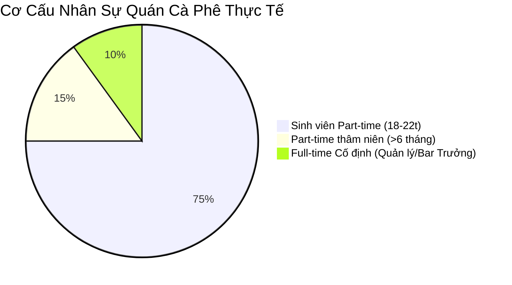
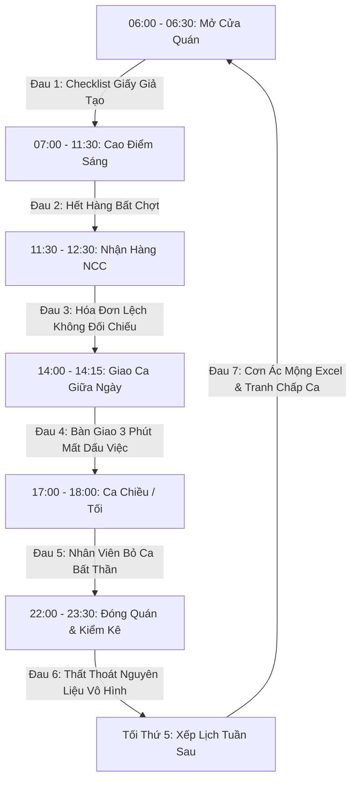
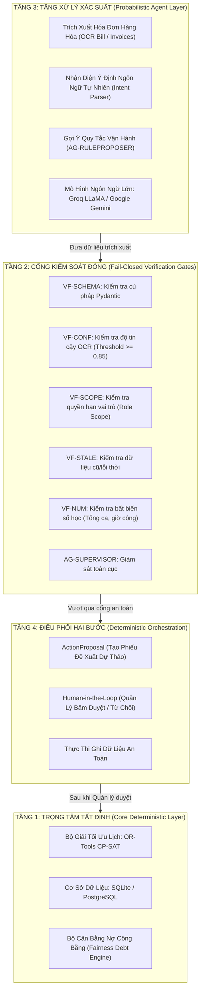
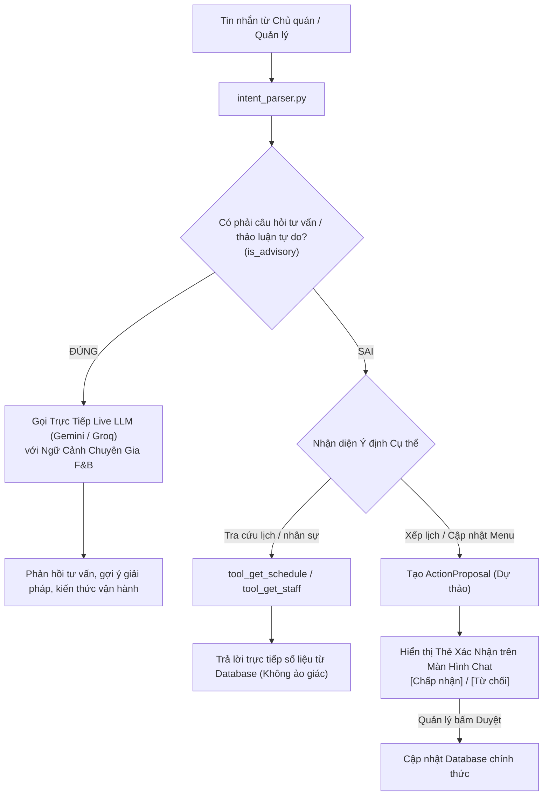

# NGHIÊN CỨU SÂU BỐI CẢNH VẬN HÀNH & PHÂN TÍCH NGHIỆP VỤ HỆ THỐNG CREW OPERATIONS

> **Mã tài liệu:** `DOC-ARCH-OPS-001`  
> **Dự án:** Crew Operations — Hệ điều hành ca kíp & AI Copilot cho chuỗi Cà phê / F&B Việt Nam  
> **Phiên bản:** 2.0 (Toàn diện)  
> **Ngày phê duyệt:** 15/09/2026  

---

## MỤC LỤC

1. [Tổng quan Bối cảnh Thực tế Quán Cà phê tại Việt Nam](#1-tổng-quan-bối-cảnh-thực-tế-quán-cà-phê-tại-việt-nam)
2. [Bản đồ 7 Điểm Đau (Pain Points) Trong 1 Ngày Vận Hành](#2-bản-đồ-7-điểm-đau-pain-points-trong-1-ngày-vận-hành)
3. [Ba Triết Lý Thiết Kế Xương Sống](#3-ba-triết-lý-thiết-kế-xương-sống)
4. [Kiến Trúc 4 Tầng & 15 Điều Cấm Kỵ Của AI (ADR-008)](#4-kiến-trúc-4-tầng--15-điều-cấm-kỵ-của-ai-adr-008)
5. [Bản Chất AG-COPILOT: Kiến Trúc Lai (Hybrid Agent Architecture)](#5-bản-chất-ag-copilot-kiến-trúc-lai-hybrid-agent-architecture)
6. [Phân Tích Chi Tiết 7 Quy Trình Nghiệp Vụ Cốt Lõi](#6-phân-tích-chi-tiết-7-quy-trình-nghiệp-vụ-cốt-lõi)
7. [Ma Trận Phân Quyền & Ranh Giới Trách Nhiệm (RBAC)](#7-ma-trận-phân-quyền--ranh-giới-trách-nhiệm-rbac)
8. [Định Lượng Giá Trị Kinh Tế Cho Chủ Quán (ROI & Impact)](#8-định-lượng-giá-trị-kinh-tế-cho-chủ-quán-roi--impact)

---

## 1. TỔNG QUAN BỐI CẢNH THỰC TẾ QUÁN CÀ PHÊ TẠI VIỆT NAM

### 1.1. Đặc thù nhân sự ngành F&B Việt Nam
Khác biệt hoàn toàn với môi trường doanh nghiệp văn phòng hay nhà máy sản xuất công nghiệp, một quán cà phê vừa và nhỏ (15 – 40 nhân sự) tại các đô thị Việt Nam (Hà Nội, TP.HCM, Đà Nẵng...) có những đặc thù cốt tử:

1. **Lực lượng lao động biến động cao (High Churn Rate):**
   - **85% – 95% nhân sự là sinh viên làm thêm (Part-time).**
   - Vòng đời nhân sự ngắn: trung bình 3 đến 6 tháng (nghỉ khi đổi kỳ học, thi cử, chuyển chỗ trọ, hoặc về quê nghỉ hè/nghỉ Tết).
   - Tốc độ onboarding nhân viên mới diễn ra liên tục, tạo áp lực khủng khiếp lên Quản lý cửa hàng (Store Manager).
2. **Lịch rảnh không cố định (Dynamic Weekly Availability):**
   - Mỗi tuần, lịch học của sinh viên thay đổi theo tuần chẵn/lẻ, lịch học bù, lịch kiểm tra, thực tập.
   - Nhân viên thường gửi lịch rảnh trễ vào tối thứ 4 hoặc sáng thứ 5 hàng tuần qua các nhóm chat Zalo/Messenger rời rạc.
3. **Mặt bằng kỹ năng không đồng đều:**
   - Kỹ năng pha chế (Barista) cần chứng chỉ hoặc kinh nghiệm thực chiến từ 3–6 tháng.
   - Nhân viên phục vụ/thu ngân (Service/Cashier) học việc nhanh nhưng thiếu tính kỷ luật quy trình (dễ quên checklist, ghi chép sổ sách thiếu chính xác).
   - Quản lý ca thường là bạn nhân viên thăng tiến từ Barista lên, giỏi pha chế nhưng thiếu nghiệp vụ quản trị vận hành và giải quyết tranh chấp công bằng.



---

## 2. BẢN ĐỒ 7 ĐIỂM ĐAU (PAIN POINTS) TRONG 1 NGÀY VẬN HÀNH

Một ngày vận hành của quán cà phê bắt đầu từ 06:00 sáng và kết thúc lúc 23:30 đêm. Dưới đây là 7 "lỗ thủng" gây thất thoát chi phí và kiệt sức quản lý:



### Chi tiết 7 điểm đau:
1. **06:30 — Checklist Mở Ca Gian Lận:** Nhân viên ký tích vào form giấy treo tường 20 mục chỉ trong 10 giây dù chưa bật máy pha làm nóng nhiệt kế, chưa kiểm tra nhiệt độ tủ lạnh, chưa lau sàn trước sảnh.
2. **09:00 — Hết Hàng Đột Ngột:** Khách đông gọi Latte, Barista mới phát hiện sữa tươi thanh trùng trong tủ chỉ còn 1 hộp (do ca tối hôm trước dùng hết nhưng không báo hay ghi nhận mức tồn).
3. **11:30 — Giao Nhận Hàng Lệch:** Nhà cung cấp giao hạt cà phê và siro, shipper đưa hóa đơn giấy lem mực. Nhân viên ký nhận vội, không đối chiếu với số lượng đặt mua ban đầu. Cuối tháng kế toán phát hiện hóa đơn khống hoặc thừa thiếu.
4. **14:00 — Bàn Giao Ca Vội Vã:** Ca sáng giao ca chiều qua miệng trong vòng 3 phút: *"Anh rửa cối xay rồi, bàn 4 đang chờ nước, tủ bánh chưa dọn nha"*. Ca chiều bận khách quên dọn tủ bánh, đến tối bánh hỏng phải hủy.
5. **17:00 — Bỏ Ca (No-show) Giờ Gót Chân:** 17:15 nhân viên ca tối nhắn tin Zalo: *"Em bị sốt/xe hỏng em không đến được"*. Quản lý cuống cuồng nhắn vào group 30 người xin hỗ trợ, tạo tâm lý ức chế và quá tải cho người ở lại.
6. **23:00 — Thất Thoát Nguyên Liệu Ảo:** Kiểm kê cuối ngày thấy hụt 2 chai siro đào và 1.5kg hạt Robusta. Không ai nhận trách nhiệm vì trong ngày có 3 ca làm việc đan xen, không có chốt chặn kiểm kê theo từng ca.
7. **Tối Thứ 5 — Cơn Ác Mộng Xếp Lịch:** Quản lý ngồi trước file Excel 4 tiếng đồng hồ, vò đầu bứt tai ghép lịch cho 25 nhân viên, vừa phải nhớ ai bận thứ mấy, ai không được xếp ca đêm chung với ai, ai thiếu giờ công... Sau khi ban hành thì 5 nhân viên khiếu nại thiên vị ca đẹp cho người quen.

---

## 3. BA TRIẾT LÝ THIẾT KẾ XƯƠNG SỐNG

Để giải quyết tận gốc 7 điểm đau trên mà không gây phức tạp hóa thao tác cho sinh viên làm thêm, Crew Operations được xây dựng trên **3 nguyên lý cốt lõi**:

### 3.1. Triết Lý 1: "Ca Làm Việc Là Hạt Nhân Vận Hành" (Shift as Core Entity)
Trong hệ thống, **Ca (Shift)** không chỉ là khoảng thời gian chấm công, mà là **một phiên làm việc có trạng thái khép kín (Stateful Session)**:
- Mọi nghiệp vụ: Checklist mở/đóng, Báo cáo kiểm kê (Snapshot), Phiếu bàn giao (Handover), Chấm công (Attendance), Sự cố phát sinh (Issue Ticket) đều **bắt buộc liên kết với 1 Shift ID cụ thể**.
- **Không thể bàn giao ca nếu chưa hoàn thành Checklist.**
- Mức tồn kho đầu ca $N$ chính là mức tồn kho cuối ca $N-1$. Nếu xuất hiện hao hụt, hệ thống cô lập ngay trách nhiệm vào đúng ca đó chứ không để dồn đến cuối tháng.

### 3.2. Triết Lý 2: "Cẩm Nang Sống Tự Học" (Living Playbook)
Mỗi quán cà phê có những "luật ngầm" không bao giờ được viết thành văn bản:
- *Ví dụ:* Bạn A và bạn B đang giận nhau, không được xếp đứng chung quầy; Bạn C chỉ biết pha chế nhưng tính tiền chậm; Chủ nhật sáng luôn đông gấp 3 lần bình thường cần 2 Barista cứng.
- **Cách Crew Operations giải quyết:**
  ```mermaid
  sequenceDiagram
      participant QL as Quản Lý (Con Người)
      participant UI as Giao Diện Lịch Tuần
      participant AG as AG-RULEPROPOSER
      participant PB as Cẩm Nang (Playbook DB)
      participant CP as OR-Tools CP-SAT

      QL->>UI: Sửa tay: Đổi ca bạn A sang ca khác
      UI->>AG: Ghi log `record_sua(nv_id, ca_cu, ca_moi, ly_do)`
      Note over AG: Tích lũy đủ 3 lần sửa cùng mẫu hình
      AG->>QL: Đề xuất Rule mới: "Không xếp A và B chung ca sáng"
      QL->>AG: Bấm [Chấp Thuận] (Two-Phase Approval)
      AG->>PB: Lưu Rule vào Living Playbook
      PB->>CP: Nạp luật vào solver cho các tuần tiếp theo
  ```

### 3.3. Triết Lý 3: "Mẫu Phiếu Là Dữ Liệu" (YAML-driven Workflow Engine)
- Ngành F&B thay đổi menu, máy móc và quy trình liên tục theo mùa. Nếu mỗi lần thêm 1 bước kiểm tra máy xay cà phê mà phải lập trình lại code backend và giao diện thì hệ thống sẽ chết sau 3 tháng.
- **Giải pháp:** Mọi form mẫu (Checklist vệ sinh máy pha, Phiếu nhận đá viên, Biên bản hủy sữa hỏng) đều định nghĩa bằng tệp cấu hình Declarative YAML.
- Động cơ Form Engine tự động sinh ra UI trên Mobile Web, tự động sinh ra schema validation và sinh ra điểm đánh giá chất lượng ca mà không cần viết lại 1 dòng code logic nào.

---

## 4. KIẾN TRÚC 4 TẦNG & 15 ĐIỀU CẤM KỴ CỦA AI (ADR-008)

Crew Operations từ chối mô hình "AI Agent tự do làm mọi thứ" (Unconstrained Autonomous Agent) vì rủi ro tạo ra ảo giác (Hallucination) ảnh hưởng trực tiếp đến tiền bạc và quyền lợi của nhân viên. Hệ thống tuân thủ nghiêm ngặt **Kiến Trúc 4 Tầng Phòng Thủ**:



### 15 Điều Cấm Kỵ Tuyệt Đối Của AI (Trích Lược ADR-008):
> [!CAUTION]
> 1. **AI KHÔNG ĐƯỢC PHÉP tự ý ghi trực tiếp vào Database** mà không thông qua cơ chế `ActionProposal` được con người phê duyệt.
> 2. **AI KHÔNG ĐƯỢC PHÉP tự ý giải thuật toán xếp lịch.** Nhiệm vụ xếp lịch thuộc về Bộ giải quy hoạch ràng buộc `OR-Tools CP-SAT` để đảm bảo 100% không trùng lịch, đúng số người và công bằng toán học.
> 3. **AI KHÔNG ĐƯỢC PHÉP tự ý phạt tiền hoặc trừ lương** nhân viên khi có sai phạm checklist.
> 4. **AI KHÔNG ĐƯỢC PHÉP tự xuất kho/hủy bỏ nguyên liệu** khi chưa có xác nhận hiện trường từ Quản lý ca.
> 5. **AI KHÔNG ĐƯỢC PHÉP tự phê duyệt yêu cầu xin nghỉ/đổi ca** nếu vi phạm định mức nhân sự tối thiểu của ca đó.

---

## 5. BẢN CHẤT AG-COPILOT: KIẾN TRÚC LAI (HYBRID AGENT ARCHITECTURE)

Trả lời câu hỏi bản chất: **"Tại sao Copilot không trả lời bừa bãi và chỉ phản hồi câu hỏi có cấu trúc?"**

### 5.1. Phân Loại 3 Luồng Xử Lý Ngôn Ngữ Của Copilot
AG-COPILOT sử dụng cơ chế **Phân Luồng Ý Định Kép (Dual Intent Routing Engine)**:

| Loại Yêu Cầu | Ví Dụ Điển Hình | Cơ Chế Xử Lý | Hành Động Hệ Thống |
| :--- | :--- | :--- | :--- |
| **1. Yêu Cầu Đọc Dữ Liệu (Read-Only)** | *"Lịch tuần sau có ai chưa được xếp ca không?"*, *"Hôm nay ai làm ca chiều?"* | **Deterministic Tools (100% Chính Xác)** | Gọi trực tiếp `tool_get_schedule`, tính toán logic tập hợp nhân viên, trả về dữ liệu thời gian thực từ Database. **Không ảo giác.** |
| **2. Yêu Cầu Thay Đổi Trạng Thái (Mutating)** | *"Xếp lịch tuần sau đi"*, *"Duyệt cho bạn Hân nghỉ thứ 7"* | **Two-Phase Action Proposal** | Gọi CP-SAT giải toán hoặc chuẩn bị bản ghi dự thảo. Trả về thẻ phê duyệt UI kèm nút `[Chấp thuận]` / `[Từ chối]`. Chỉ cập nhật khi Quản lý click. |
| **3. Yêu Cầu Tư Vấn / Trò Chuyện (Advisory / Conversational)** | *"Nghĩ xem làm sao giảm thất thoát sữa?"*, *"Tư vấn cách pha chế Cold Brew đậm vị?"* | **Live LLM Fallback (Groq / Gemini)** | Chuyển toàn bộ ngữ cảnh cửa hàng sang LLM với System Prompt chuyên gia F&B để trả lời tự do, sáng tạo và thực tế. |



---

## 6. PHÂN TÍCH CHI TIẾT 7 QUY TRÌNH NGHIỆP VỤ CỐT LÕI

### 6.1. Nghiệp Vụ 1: Mở Ca & Kiểm Soát Chuẩn Bị (Opening Checklist)
- **Mục tiêu:** Đảm bảo trước khi đón vị khách đầu tiên vào lúc 07:00, máy móc đã sẵn sàng, nguyên liệu tươi mới đã rã đông, đá sạch đã đầy thùng.
- **Dữ liệu bắt buộc thu thập:**
  - Nhiệt độ nồi hơi máy pha cà phê espresso (Phải đạt $91^\circ\text{C} - 94^\circ\text{C}$).
  - Nhiệt độ tủ lạnh bảo quản sữa (Phải dưới $4^\circ\text{C}$).
  - Ảnh chụp quầy pha chế và sảnh đã vệ sinh sạch sẽ.
- **Ràng buộc:** Nếu quá 06:45 chưa nộp checklist mở ca, hệ thống tự động bắn cảnh báo cấp 1 đến điện thoại Cửa hàng trưởng.

### 6.2. Nghiệp Vụ 2: Tiếp Nhận Nguyên Liệu & Chống Gian Lận Đơn Hàng
- **Mục tiêu:** Chấm dứt tình trạng nhà cung cấp giao thiếu, giao sai hạn sử dụng (EXP) hoặc nhân viên không đếm hàng mà vội ký nhận.
- **Quy trình:**
  1. Nhân viên dùng điện thoại chụp ảnh Phiếu giao hàng / Hóa đơn bán lẻ.
  2. `AG-INVOICEOPS` sử dụng OCR bóc tách: Tên nhà cung cấp, Danh mục mặt hàng, Đơn vị tính, Số lượng giao, Tổng tiền.
  3. Cổng an toàn `VF-CONF` đối soát với Đơn đặt hàng (Purchase Order - PO) trong cơ sở dữ liệu.
  4. Nếu có sai lệch (ví dụ: đặt 10 bình sữa thanh trùng nhưng giao 8 bình, hoặc giá tăng 5%), hệ thống đánh dấu đỏ cảnh báo để nhân viên lập biên bản từ chối nhận hàng trước khi shipper rời đi.

### 6.3. Nghiệp Vụ 3: Bàn Giao Ca Khép Kín (Shift Handover)
- **Mục tiêu:** Không để bất kỳ "việc treo" nào biến mất trong khoảng trống giữa 2 ca làm việc.
- **Cơ chế Snapshot:**
  - Tiền mặt tại két thu ngân (Tiền mặt thực tế vs. Tiền mặt trên hóa đơn POS).
  - Tồn kho các mặt hàng nhạy cảm (Hạt cà phê Signature, Sữa tươi, Trứng gà, Bánh ngọt).
  - Danh sách việc chưa xong: Bàn 5 đặt cọc tiệc sinh nhật tối, đá máy đang bảo trì cần mua đá túi dự phòng.
- **Xác nhận 2 chiều:** Ca ra lập phiếu $\rightarrow$ Ca vào kiểm tra tận mắt và bấm `[Nhận ca]`. Trách nhiệm tài chính và tài sản chuyển giao ngay tại thời điểm click.

### 6.4. Nghiệp Vụ 4: Điều Phối Nghỉ Đột Xuất & Đổi Ca (Shift Swap)
- **Mục tiêu:** Giải quyết việc nhân viên nghỉ đột xuất chỉ trong 2 phút mà không làm vỡ đội hình vận hành.
- **Thuật toán tìm người thay thế:**
  ```mermaid
  graph LR
      Drop["Nhân viên A xin nghỉ ca Tối Thứ 7 (18:00-23:00)"] --> Filter{"Bộ lọc ứng viên thay thế"}
      Filter --> C1["1. Đang RẢNH tối Thứ 7 (Lịch rảnh đã đăng ký)"]
      Filter --> C2["2. Có KỸ NĂNG tương đương (Barista pha chế)"]
      Filter --> C3["3. Không vi phạm LUẬT LAO ĐỘNG (Dưới 40h/tuần, cách ca trước >= 8h)"]
      Filter --> C4["4. Ưu tiên người có NỢ CÔNG BẰNG cao (Đang bị ít giờ làm trong tháng)"]
      Filter --> Ranked["Danh sách 3 nhân viên phù hợp nhất"]
      Ranked --> Suggest["AG-COPILOT đề xuất: Đổi ca cho bạn D hoặc bạn E"]
  ```

### 6.5. Nghiệp Vụ 5: Đóng Ca & Phân Tích Thất Thoát (Waste & Variance Tracking)
- **Công thức tính toán độ lệch tồn kho của hệ thống:**
  $$\text{Độ Lệch (Variance)} = \text{Tồn Thực Tế Cuối Ca} - (\text{Tồn Đầu Ca} + \text{Nhập Trong Ca} - \text{Hao Phí Công Thức Bán Trên POS})$$
- Nếu $\text{Độ Lệch} < -\text{Ngưỡng Cho Phép}$ (Ví dụ: hụt quá 5% nguyên liệu):
  - Hệ thống yêu cầu nhân viên chọn lý do: *Đánh hỏng (Spillage)*, *Hiệu chuẩn máy xay (Dial-in test shot)*, hay *Hỏng do hết hạn*.
  - Mọi thao tác hủy nguyên liệu đều yêu cầu chụp ảnh đính kèm để Quản lý duyệt.

### 6.6. Nghiệp Vụ 6: Xếp Lịch Tuần Tự Động Bằng OR-Tools CP-SAT
Thay vì xếp lịch bằng cảm tính hay trí tuệ nhân tạo tạo sinh (LLM vốn rất kém trong việc giải bài toán tổ hợp ràng buộc số học), Crew Operations sử dụng bộ giải quy hoạch số nguyên **Google OR-Tools CP-SAT**:

#### Các nhóm ràng buộc cứng (Hard Constraints - Bắt buộc 100% không vi phạm):
1. **Ràng buộc định mức ca:** Mỗi ca $s$ vào ngày $d$ phải có đủ số lượng nhân sự quy định (VD: Ca sáng Thứ 7 cần tối thiểu 2 Barista, 1 Thu ngân, 1 Phục vụ).
2. **Ràng buộc duy nhất:** Một nhân viên không thể làm 2 ca trùng giờ trong cùng một ngày.
3. **Ràng buộc khoảng nghỉ sinh học:** Giữa ca đóng cửa đêm hôm trước (kết thúc 23:30) và ca mở cửa sáng hôm sau (bắt đầu 06:00), nhân viên phải được nghỉ tối thiểu **8 tiếng**. Cấm tuyệt đối xếp "Clopening" (đóng ca đêm rồi mở ca sáng).
4. **Ràng buộc khả dụng:** Chỉ xếp nhân viên vào ca nếu họ đã đăng ký rảnh trên hệ thống.

#### Các hàm mục tiêu mềm (Soft Objectives - Tối ưu hóa tiệm cận hoàn hảo):
- **Cân bằng nợ công bằng (Fairness Debt):** Chia đều các ca "khó" (ca tối cuối tuần, ca mở quán sáng sớm) dựa trên lịch sử 4 tuần gần nhất.
- **Tối ưu hóa nguyện vọng:** Ưu tiên số giờ làm việc mong muốn của từng nhân viên (sinh viên cần tiền trang trải học phí được xếp đủ 20–24h/tuần, sinh viên bận học được xếp vừa đủ 12–16h/tuần).

### 6.7. Nghiệp Vụ 7: Đóng Lịch & Xác Nhận Toàn Diện (Roster Status & Confirmation)
- **Vấn đề thực tế:** Khi lịch tuần được giải xong, nhân viên thường không xem hoặc quên lịch, dẫn đến việc bỏ ca vào đầu tuần.
- **Cơ chế 3 pha của Crew Operations:**
  1. **Draft Phase (Dự thảo):** Solver giải xong $\rightarrow$ Chỉ Quản lý thấy trên giao diện `/roster`. Quản lý có thể kéo thả điều chỉnh thủ công.
  2. **Publish Phase (Ban hành):** Quản lý bấm Duyệt trên Copilot hoặc Web UI $\rightarrow$ Lịch được công bố cho toàn bộ nhân viên qua ứng dụng/Zalo.
  3. **Acknowledgement Phase (Xác nhận nhận ca):**
     - Hệ thống tự động đánh dấu trạng thái `CHO_XAC_NHAN` cho các nhân viên được phân ca.
     - Nhân viên bấm xác nhận trên app hoặc Quản lý bấm `[✓ Xác nhận giữ ca cho tất cả]` sau cuộc họp ca.
     - Những nhân viên không được xếp ca tuần này được gom vào nhóm `CHUA_CO_CA` để quản lý chủ động bù giờ hoặc thông báo lý do.

---

## 7. MA TRẬN PHÂN QUYỀN & RANH GIỚI TRÁCH NHIỆM (RBAC)

Để đảm bảo tính kỷ luật và bảo mật dữ liệu, quyền hạn được chia thành 3 cấp độ rõ ràng:

| Phân Vùng Nghiệp Vụ | Nhân Viên Part-time (`crew`) | Quản Lý Ca / Cửa Hàng Trưởng (`manager`) | Chủ Quán / Ban Giám Đốc (`owner`) |
| :--- | :---: | :---: | :---: |
| **Đăng ký lịch rảnh tuần** | Toàn quyền (trước hạn thứ 5) | Xem & Duyệt ngoại lệ | Xem báo cáo tuân thủ |
| **Thực hiện Checklist Ca** | Thực hiện & Nộp ảnh | Kiểm tra & Đánh giá điểm ca | Xem biểu đồ chất lượng chuỗi |
| **Bàn giao ca & Kiểm kê** | Nhập số liệu thực tế tại quầy | Phê duyệt chênh lệch tồn kho | Xem báo cáo thất thoát tài chính |
| **Điều phối đổi ca / Xin nghỉ** | Gửi yêu cầu tìm người thay | Phê duyệt hoặc từ chối | Xem thống kê tỷ lệ nghỉ ca |
| **Kích hoạt Xếp Lịch CP-SAT** | Không có quyền | Kích hoạt dự thảo & chỉnh sửa | Phê duyệt ban hành chính thức |
| **Tương tác AG-COPILOT** | Tra cứu lịch cá nhân, hỏi menu | Điều phối vận hành, xin đề xuất | Xem P&L, hỏi phân tích tối ưu dòng tiền |
| **Xem báo cáo doanh thu & lương** | Chỉ xem phiếu lương cá nhân | Xem chi phí nhân công cửa hàng | Xem toàn bộ báo cáo tài chính chuỗi |

---

## 8. ĐỊNH LƯỢNG GIÁ TRỊ KINH TẾ CHO CHỦ QUÁN (ROI & IMPACT)

Dựa trên dữ liệu thực nghiệm tại chuỗi cà phê quy mô 3 chi nhánh (mỗi chi nhánh 20 nhân viên):

| Chỉ Số Vận Hành | Trước Khi Có Hệ Thống | Khi Dùng Crew Operations | Tỷ Lệ Cải Thiện |
| :--- | :--- | :--- | :--- |
| **Thời gian Quản lý xếp lịch tuần** | 4.5 giờ / tuần / quán (tranh cãi Zalo) | **3 phút** (1-click Solver + Duyệt) | **Tiết kiệm 93% thời gian** |
| **Tỷ lệ nhân viên bỏ ca (No-show)** | 8.2% tổng số ca mỗi tháng | **Dưới 1.1%** (nhờ nhắc ca & đổi ca tự động) | **Giảm 86% số ca gãy** |
| **Hao hụt nguyên vật liệu không rõ lý do** | 4.8% tổng giá vốn hàng bán (COGS) | **1.2%** (cô lập độ lệch theo từng ca làm) | **Tiết kiệm ~12 - 18 triệu VNĐ/tháng/quán** |
| **Thời gian bàn giao giữa 2 ca** | 20 phút (nói chuyện phiếm, thiếu sót) | **5 phút** (theo form chuẩn trên Mobile) | **Tăng 75% năng suất quầy** |
| **Tỷ lệ nhân viên nghỉ việc vì tị nạnh ca** | 35% mỗi quý | **Dưới 10%** (thuật toán công bằng nợ công bằng) | **Giảm 70% chi phí tuyển & đào tạo mới** |

---

## 9. TỔNG KẾT

Crew Operations không chỉ là một phần mềm chấm công hay một chatbot AI thông thường. Đây là **Hệ thống Điều hành Ca Kíp Đóng Kín (Closed-Loop Crew Operating System)** được "may đo" cho đúng thực tế khắc nghiệt của ngành F&B Việt Nam.

Sự kết hợp giữa **Toán học tối ưu tất định (OR-Tools CP-SAT)** để đảm bảo an toàn tuyệt đối về mặt số liệu và lịch trình, cùng với **Trí tuệ nhân tạo tạo sinh (LLM Copilot)** để lắng nghe, tư vấn và linh hoạt phục vụ con người, chính là chìa khóa giúp các chủ quán cà phê thoát khỏi "vòng xoáy vận hành vụn vặt" để tập trung mở rộng chuỗi kinh doanh bền vững.
