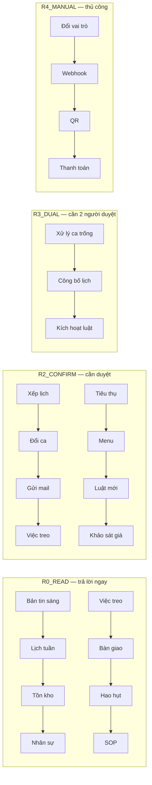

# ROADMAP AG-COPILOT — Vai trò CHỦ QUÁN (chu_quan)

> **Mục đích:** Lộ trình sử dụng AG-COPILOT cho **chủ quán** — từ việc nắm quyền điều hành
> hằng ngày đến chiến lược mở rộng. Mỗi mục ghi rõ **ra lệnh gì → Copilot làm gì → gọi agent nào**.
>
> **Ngày lập:** 2026-09-19
> **Nguồn:** `CAPABILITY_REGISTRY` + `COPILOT_ROLE_INTENT_MATRIX` trong
> `packages/contracts/src/ca_contracts/__init__.py`, `docs/COPILOT-LUONG-HOAT-DONG-TONG-QUAN.md`.
> **Quyền:** Chủ quán = toàn bộ quyền Quản lý (R0/R1/R2/R3) + thao tác thủ công R4 (đổi vai trò, webhook...).

---

## 1. Chủ quán có gì đặc biệt?

| Điểm | Giải thích |
|---|---|
| **Toàn quyền R2/R3** | Duyệt mọi đề xuất ghi dữ liệu (xếp lịch, đổi ca, gửi mail, khảo sát giá...) |
| **R4 thủ công** | Đổi vai trò nhân viên, cấu hình webhook, phát QR, thanh toán — **không qua chat** |
| **Xem toàn bộ** | Audit, vết hệ thống, báo cáo công bằng, chất lượng AI |
| **Chiến lược** | Khảo sát giá thị trường, xu hướng, quản lý luật vận hành |

> **Nguyên tắc:** Chủ quán vẫn phải **bấm Duyệt** cho mọi thao tác ghi (ADR-008 fail-closed).
> Không có intent nào cho phép chủ quán "ghi thẳng" qua chat.

---

## 2. Roadmap theo giai đoạn

### 🟢 Giai đoạn 1 — Nắm quyền điều hành hằng ngày (tuần 1)

> Mục tiêu: chủ quán dùng Copilot để **nhìn toàn cảnh** và **điều hành** quán mỗi ngày.

| # | Việc cần làm | Câu lệnh ví dụ | Copilot làm gì | Gọi agent | Cần duyệt |
|---|---|---|---|---|---|
| 1 | Xem bản tin sáng | "Bản tin hôm nay thế nào?" | Tóm tắt vận hành ngày | — | ❌ |
| 2 | Xem lịch tuần | "Lịch tuần này ra sao?" | Lịch + trạng thái xác nhận | — | ❌ |
| 3 | Xem tồn kho | "Tồn kho còn gì dưới ngưỡng?" | Tồn kho + cảnh báo | — | ❌ |
| 4 | Xem nhân sự | "Danh sách nhân sự" | Liệt kê nhân sự | — | ❌ |
| 5 | Xem việc treo | "Còn việc treo nào chưa xong?" | Việc treo đang chờ | — | ❌ |
| 6 | Xem bàn giao | "Bàn giao ca gần nhất" | Lịch sử bàn giao | — | ❌ |
| 7 | Xem hao hụt | "Hao hụt tuần này thế nào?" | Nhóm ghi chú hao hụt | **AG-WASTE** | ❌ |
| 8 | Hỏi quy trình | "Cách pha cà phê sữa đá" | Trả lời từ phiếu YAML | **AG-SOP** | ❌ |

### 🟡 Giai đoạn 2 — Điều hành & duyệt (tuần 2–3)

> Mục tiêu: chủ quán **ra lệnh ghi dữ liệu** và **duyệt** các đề xuất.

| # | Việc cần làm | Câu lệnh ví dụ | Copilot làm gì | Gọi agent | Cần duyệt |
|---|---|---|---|---|---|
| 9 | Xếp lịch tuần | "Xếp lịch tuần này" | Chạy solver tối ưu lịch | **Solver CP-SAT** | ✅ |
| 10 | Duyệt đổi ca | "Duyệt đổi ca của A và B" | Chuẩn bị duyệt đổi ca | — | ✅ |
| 11 | Gửi email | "Soạn email nhắc nhở nhân viên" | Soạn thư chuyên nghiệp | **AG-MAILWRITER** | ✅ |
| 12 | Tạo việc treo | "Tạo việc treo: kiểm kho cuối ngày" | Tạo việc treo | — | ✅ |
| 13 | Ghi tiêu thụ | "Ghi tiêu thụ 2kg sữa hôm nay" | Ghi tiêu thụ | — | ✅ |
| 14 | Cập nhật menu | "Cập nhật giá cà phê sữa đá lên 35k" | Cập nhật món/giá | — | ✅ |
| 15 | Đề xuất luật mới | "Đề xuất luật: ca đêm phụ cấp 20%" | Đề xuất luật từ lịch sử sửa | `ca_playbook` | ✅ |
| 16 | Kiểm kê & nhập kho | "Kiểm tra cần nhập kho gì" | Kiểm kê + cảnh báo | — | ✅ |

### 🔵 Giai đoạn 3 — Chiến lược & thị trường (tuần 4+)

> Mục tiêu: chủ quán dùng Copilot cho **quyết định kinh doanh**.

| # | Việc cần làm | Câu lệnh ví dụ | Copilot làm gì | Gọi agent | Cần duyệt |
|---|---|---|---|---|---|
| 17 | Khảo sát giá đối thủ | "Khảo sát giá bún bò quanh quán 3km" | Quét giá đối thủ | **AG-PRICING** + SerpApi | ✅ |
| 18 | Xem hạn ngạch SerpApi | "Còn bao nhiêu lượt khảo sát?" | Hạn ngạch + circuit breaker | — | ❌ |
| 19 | Xem kết quả khảo sát | "Kết quả khảo sát giá gần nhất" | Kết quả khảo sát | — | ❌ |
| 20 | Tra xu hướng | "Xu hướng đồ uống tháng này" | Tra cứu xu hướng | **AG-TREND** | ❌ |
| 21 | Xem chất lượng AI | "Chất lượng AI thế nào?" | Điểm chất lượng AI | — | ❌ |
| 22 | Tra audit | "Xem vết hệ thống gần đây" | Vết hệ thống (redact) | — | ❌ |

### ⚪ Giai đoạn 4 — Quản trị & thủ công (R4 — không qua chat)

> Mục tiêu: các thao tác **bảo mật/phá hủy** chủ quán phải tự làm trên UI, Copilot chỉ dẫn đường.

| # | Việc cần làm | Màn hình | Vì sao không qua chat |
|---|---|---|---|
| 23 | Đổi vai trò nhân viên | `/nguoi` | Chỉ chủ quán thao tác trực tiếp |
| 24 | Cấu hình webhook | `/page-quan` | Cấu hình bảo mật |
| 25 | Phát mã QR / check-in | `/qr` | Xác thực vật lý tại quán |
| 26 | Thanh toán / hủy đơn | `/quay` | Policy riêng, thao tác phá hủy |
| 27 | Xóa cuộc họp | `/cuoc-hop` | Thao tác phá hủy |

---

## 3. Bản đồ quyền chủ quán (R0–R4)

---

## 4. Câu lệnh mẫu nhanh (copy-paste)

### Điều hành hằng ngày
- "Bản tin hôm nay thế nào?"
- "Lịch tuần này ra sao?"
- "Tồn kho còn gì dưới ngưỡng?"
- "Còn việc treo nào chưa xong?"

### Ra lệnh ghi (nhớ bấm Duyệt)
- "Xếp lịch tuần này"
- "Soạn email nhắc nhở nhân viên"
- "Tạo việc treo: kiểm kho cuối ngày"
- "Cập nhật giá cà phê sữa đá lên 35k"

### Chiến lược
- "Khảo sát giá bún bò quanh quán 3km"
- "Còn bao nhiêu lượt khảo sát?"
- "Xu hướng đồ uống tháng này"
- "Xem vết hệ thống gần đây"

---

## 5. Lưu ý quan trọng

- **Mọi thao tác ghi đều cần bấm Duyệt** — đây là thiết kế an toàn, không phải lỗi.
- **R4 không qua chat** — đổi vai trò, webhook, QR, thanh toán phải tự làm trên UI.
- **Khảo sát giá tốn chi phí thật** (SerpApi quota) — luôn kiểm tra hạn ngạch trước khi chạy.
- **Nguồn quyền duy nhất:** `COPILOT_ROLE_INTENT_MATRIX` trong `packages/contracts/src/ca_contracts/__init__.py`.