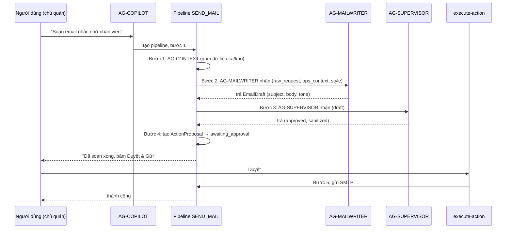
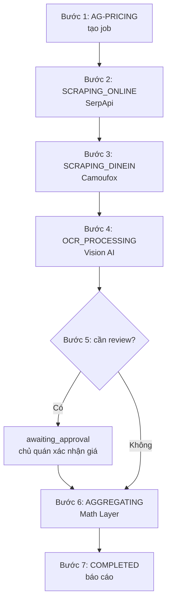
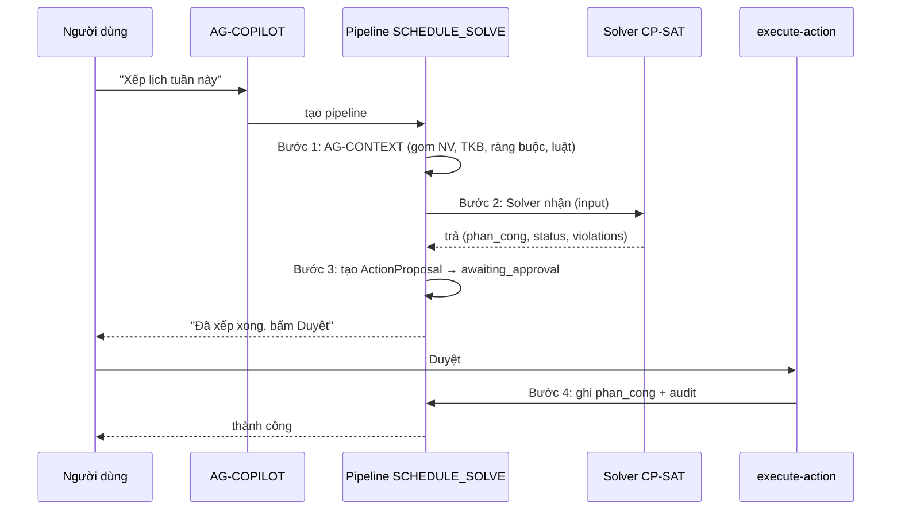

# THIẾT KẾ — AG-COPILOT Orchestrator Pipeline (agent đứng đầu → agent chuyên biệt, có nhận/trả từng bước)

> **Mục đích:** Thiết kế để **mỗi chức năng Copilot** chạy như một **pipeline** — đi qua
> **từng agent chuyên biệt**, mỗi bước **nhận input rõ ràng** và **trả output rõ ràng**,
> kết quả bước trước là input bước sau. Có thể **truy vết** từng bước.
>
> **Ngày lập:** 2026-09-19
> **Trạng thái:** 📐 Đề xuất thiết kế — chờ review
> **Tham chiếu:** `docs/COPILOT-LUONG-HOAT-DONG-TONG-QUAN.md`, `docs/ROADMAP-COPILOT-CHU-QUAN.md`

---

## 1. Vấn đề hiện tại

Hiện tại AG-COPILOT gọi agent chuyên biệt **gián tiếp qua data source inject** (`configure_data_sources`),
mỗi tool gọi **1 hàm duy nhất** và nhận **1 kết quả cuối**. Điều này có hạn chế:

| Hạn chế | Mô tả |
|---|---|
| **Không thấy từng bước** | Chỉ thấy kết quả cuối, không biết agent đã làm gì qua mấy bước |
| **Không truy vết được** | Không có log "bước 1 xong → bước 2 bắt đầu" |
| **Khó gỡ lỗi** | Agent chuyên biệt lỗi ở bước nào không rõ |
| **Khó mở rộng** | Muốn thêm bước (vd kiểm tra thêm) phải sửa cả tool |

> **Ví dụ tốt đã có:** `SurveyOrchestrator` (`ag_pricing/orchestrator_v2.py`) đã làm đúng —
> state machine `SCRAPING_ONLINE → SCRAPING_DINEIN → OCR_PROCESSING → AGGREGATING → COMPLETED`,
> mỗi bước có `_log_job` + `_advance` + `_stash` (giữ trạng thái trung gian). Thiết kế này
> **chuẩn hóa mô hình đó** cho mọi chức năng Copilot.

---

## 2. Mô hình thiết kế: Orchestrator Pipeline

### 2.1. Khái niệm cốt lõi

```
Người dùng ra lệnh
      │
      ▼
┌─────────────────────────────┐
│  AG-COPILOT (Orchestrator)  │  ← agent đứng đầu
│  - parse intent             │
│  - RBAC (VF-SCOPE)          │
│  - chọn pipeline            │
└─────────────┬───────────────┘
              │
              ▼
┌─────────────────────────────┐
│  PIPELINE (chuỗi bước)      │  ← mỗi chức năng = 1 pipeline
│  Bước 1 → Bước 2 → Bước 3   │
└─────────────┬───────────────┘
              │ mỗi bước
              ▼
┌─────────────────────────────┐
│  AGENT CHUYÊN BIỆT          │  ← AG-SOP / AG-WASTE / AG-MAILWRITER / Solver...
│  nhận input → xử lý → trả   │
└─────────────────────────────┘
```

### 2.2. Cấu trúc dữ liệu cốt lõi

```python
# ── Bước trong pipeline ─────────────────────────────────────────────
@dataclass
class PipelineStep:
    step_id: str            # "extract" / "validate" / "draft" / "approve"...
    agent: str              # "AG-SOP" / "AG-WASTE" / "AG-MAILWRITER"...
    input: dict             # input cho agent này
    output: dict | None     # output agent trả về (None = chưa chạy)
    status: StepStatus      # pending / running / done / failed / skipped
    error: str | None       # lỗi nếu failed
    started_at: str | None
    finished_at: str | None

# ── Pipeline (1 chức năng) ──────────────────────────────────────────
@dataclass
class Pipeline:
    pipeline_id: str        # "pipeline_send_mail"
    intent: str             # "SEND_MAIL"
    steps: list[PipelineStep]
    status: PipelineStatus  # queued / running / awaiting_approval / done / failed
    context: dict           # dữ liệu chia sẻ giữa các bước
    trace: list[dict]       # log từng bước (truy vết)
```

### 2.3. Nguyên tắc "có nhận có trả từng bước"

Mỗi bước tuân theo hợp đồng **nhận → xử lý → trả**:

```python
# Hợp đồng mỗi agent chuyên biệt
class AgentContract:
    def run(self, step_input: dict) -> AgentOutput:
        """Nhận input → xử lý → trả output có cấu trúc."""
        ...
        return AgentOutput(
            ok=True,
            data={...},          # kết quả
            summary="...",       # tóm tắt cho người dùng
            next_step_hint=None, # gợi ý bước tiếp theo (nếu cần)
        )
```

**Quy tắc:**
1. **Input bước sau = output bước trước** (hoặc từ `context` chia sẻ).
2. **Mỗi bước ghi trace** — ai chạy, nhận gì, trả gì, mất bao lâu.
3. **Bước lỗi → pipeline dừng** (fail-closed), trả lỗi rõ bước nào.
4. **Bước cần duyệt → pipeline dừng chờ** (`awaiting_approval`), người dùng bấm Duyệt mới chạy tiếp.

---

## 3. Ví dụ thiết kế: Pipeline "Gửi email" (SEND_MAIL)

Đây là ví dụ điển hình — đi qua **3 agent chuyên biệt**:



**Bảng các bước:**

| Bước | Agent | Nhận | Trả |
|---|---|---|---|
| 1 | AG-CONTEXT | `raw_request`, `to_nv_ids` | `ops_context`, `style_memory` |
| 2 | AG-MAILWRITER | `raw_request`, `ops_context`, `style_memory` | `EmailDraft` (subject, body, tone) |
| 3 | AG-SUPERVISOR | `EmailDraft` | `approved`, `sanitized_response` |
| 4 | AG-COPILOT | `EmailDraft` | `ActionProposal` (chờ duyệt) |
| 5 | SMTP | `ActionProposal` (đã duyệt) | `delivery_status` |

---

## 4. Ví dụ thiết kế: Pipeline "Khảo sát giá" (RUN_CATCHMENT_SURVEY)

Đây là pipeline **nhiều bước nhất** — tái sử dụng state machine `SurveyOrchestrator`:



**Mỗi bước có nhận/trả rõ ràng** (đã có trong `SurveyOrchestrator`):
- `_advance(job, status)` — chuyển trạng thái + log
- `_stash(job, ...)` — giữ dữ liệu trung gian để bước sau dùng
- `_log_job(job_id, su_kien, ...)` — truy vết từng bước

---

## 5. Ví dụ thiết kế: Pipeline "Xếp lịch tuần" (SCHEDULE_SOLVE)



---

## 6. Cấu trúc code đề xuất

```
packages/agents/src/ca_agents/ag_copilot/
├── pipeline/
│   ├── __init__.py
│   ├── base.py              # PipelineStep, Pipeline, AgentContract (dataclass)
│   ├── registry.py          # PIPELINE_REGISTRY: intent → pipeline builder
│   ├── runner.py            # chạy pipeline, quản lý trace, fail-closed
│   └── steps/
│       ├── context_step.py  # AG-CONTEXT: gom dữ liệu sống
│       ├── sop_step.py      # gọi AG-SOP
│       ├── waste_step.py    # gọi AG-WASTE
│       ├── mail_step.py     # gọi AG-MAILWRITER
│       ├── supervisor_step.py # gọi AG-SUPERVISOR
│       └── ...
├── pipelines/
│   ├── send_mail.py         # pipeline SEND_MAIL
│   ├── schedule_solve.py    # pipeline SCHEDULE_SOLVE
│   ├── catchment_survey.py  # pipeline RUN_CATCHMENT_SURVEY
│   └── ...
```

**Luồng chạy:**
1. `run_copilot()` parse intent → RBAC → tìm pipeline trong `PIPELINE_REGISTRY`.
2. `runner.run(pipeline)` chạy từng bước, mỗi bước gọi agent chuyên biệt.
3. Bước cần duyệt → pipeline dừng, trả `ActionProposal`.
4. `execute-action` duyệt → gọi `runner.resume(pipeline)` chạy các bước còn lại.

---

## 7. Lợi ích

| Lợi ích | Mô tả |
|---|---|
| **Truy vết từng bước** | `trace` ghi rõ agent nào, nhận gì, trả gì, mất bao lâu |
| **Gỡ lỗi dễ** | Lỗi ở bước nào hiện rõ, không phải đoán |
| **Tái sử dụng** | Bước AG-SUPERVISOR / AG-CONTEXT dùng chung mọi pipeline |
| **Mở rộng dễ** | Thêm bước = thêm 1 `PipelineStep`, không sửa tool cũ |
| **Fail-closed** | Bước lỗi → dừng, không chạy tiếp |
| **Nhất quán** | Mọi chức năng cùng 1 mô hình state machine |

---

## 8. Lộ trình triển khai

### Giai đoạn A — Nền tảng (0.5 ngày)
- [ ] Tạo `pipeline/base.py`: `PipelineStep`, `Pipeline`, `AgentContract`.
- [ ] Tạo `pipeline/runner.py`: chạy pipeline, trace, fail-closed.
- [ ] Tạo `pipeline/registry.py`: map intent → pipeline.

### Giai đoạn B — Pipeline đầu tiên (1 ngày)
- [ ] Pipeline `SEND_MAIL` (3 agent: AG-CONTEXT → AG-MAILWRITER → AG-SUPERVISOR).
- [ ] Test: pipeline chạy đúng, trace đầy đủ, fail-closed đúng.

### Giai đoạn C — Mở rộng (2–3 ngày)
- [ ] Pipeline `SCHEDULE_SOLVE` (Solver).
- [ ] Pipeline `RUN_CATCHMENT_SURVEY` (tái sử dụng `SurveyOrchestrator`).
- [ ] Pipeline `QUERY_SOP` (AG-SOP), `ANALYZE_WASTE` (AG-WASTE).

### Giai đoạn D — Tích hợp (1 ngày)
- [ ] `run_copilot()` dùng pipeline thay cho tool trực tiếp.
- [ ] `execute-action` gọi `runner.resume()`.
- [ ] UI hiển thị trace từng bước (nếu muốn).

---

## 9. Rủi ro & lưu ý

- **Không phá vỡ kiến trúc hexagonal hiện tại** — pipeline vẫn gọi agent qua data source inject,
  không import trực tiếp (giữ `test_architecture.py` pass).
- **Giữ fail-closed** — bước lỗi phải dừng, không tự ý bỏ qua.
- **Giữ 2 pha duyệt** — pipeline dừng ở `awaiting_approval`, không tự ghi DB.
- **Tương thích ngược** — pipeline là lớp mới phía trên tool hiện tại, không xóa tool cũ ngay.