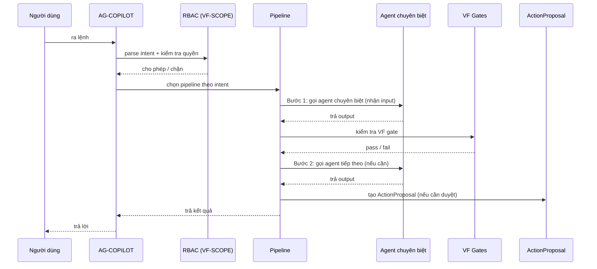
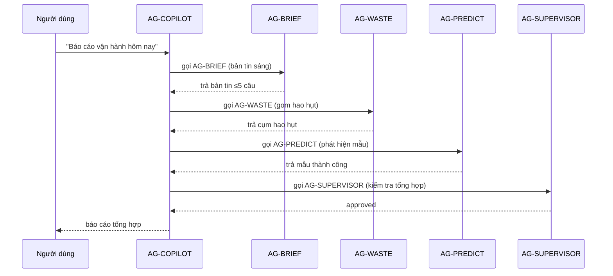

# THIẾT KẾ — Hệ sinh thái AI Agent của NHỊP QUÁN

> **Mục đích:** Định nghĩa **hệ sinh thái agent** — mỗi agent đảm nhận **1 chức năng chuyên biệt
> rõ ràng**, và **AG-COPILOT** là agent đứng đầu **gọi & điều phối** các agent chuyên biệt khi cần,
> **tuân thủ ràng buộc và thiết kế của hệ thống** (fail-closed, 2 pha duyệt, hexagonal, VF gates).
>
> **Ngày lập:** 2026-09-19
> **Nguồn:** 15 file `PHAM_VI.md` trong `packages/agents/src/ca_agents/*`, `runtime.py`,
> `docs/THIET-KE-COPILOT-ORCHESTRATOR-PIPELINE.md`.

---

## 1. Nguyên tắc thiết kế hệ sinh thái

### 1.1. Mỗi agent = 1 chuyên gia, 1 việc rõ ràng

Mỗi agent có **PHAM_VI.md** định nghĩa 5 điều bắt buộc:

| Thuộc tính | Ý nghĩa |
|---|---|
| **Nhiệm vụ** | Một câu mô tả duy nhất agent làm gì |
| **Đầu vào** | Schema JSON agent nhận |
| **Đầu ra** | Schema JSON agent trả |
| **Cấm** | Danh sách việc agent tuyệt đối không làm |
| **Cổng** | VF gates agent phải qua |

### 1.2. Quy tắc bất biến (mọi agent phải tuân)

1. **CẤM ghi DB trực tiếp** — mọi thay đổi dữ liệu qua 2 pha duyệt.
2. **CẤM gọi agent khác** — agent chuyên biệt không tự gọi agent khác (trừ module toán thuần).
3. **CẤM bịa số liệu** — mọi con số phải từ dữ liệu đầu vào (ADR-002).
4. **Fail-closed** — thiếu dữ liệu/quyền → từ chối, không đoán.
5. **Không quyết định luồng** — agent chuyên biệt không tự quyết định bước tiếp theo.

> **Chỉ AG-COPILOT (và AG-FBPAGE) mới được điều phối** — là agent đứng đầu duy nhất.

### 1.3. Mô hình điều phối: **Fan-out 1 tầng** (không cần nhiều tầng)

Hệ sinh thái dùng mô hình **fan-out 1 tầng** — **1 agent đứng đầu gọi trực tiếp NHIỀU agent
chuyên biệt** để hoàn thành 1 chức năng. Không có agent trung gian, không có nhiều tầng.

```
AG-COPILOT (đứng đầu)
   ├── gọi AG-SOP        (bước 1)
   ├── gọi AG-WASTE      (bước 2)
   ├── gọi AG-MAILWRITER (bước 3)
   └── gọi AG-SUPERVISOR (bước cuối)
```

**Điểm khác biệt so với multi-tier:**
- **Fan-out 1 tầng:** AG-COPILOT gọi trực tiếp từng agent chuyên biệt. Agent chuyên biệt **không gọi agent khác**.
- **Multi-tier:** agent chuyên biệt gọi agent chuyên biệt khác (phức tạp, khó kiểm soát).

> **Chọn fan-out 1 tầng** vì: giữ quy tắc "CẤM gọi agent khác", dễ truy vết, dễ fail-closed,
> dễ kiểm thử, giữ `test_architecture.py` pass.

---

## 2. Bản đồ hệ sinh thái agent

```mermaid
flowchart TD
    subgraph ORCH[Agent Đứng Đầu — Điều phối]
        COP[AG-COPILOT<br/>Điều hành quán]
        FBP[AG-FBPAGE<br/>Chăm sóc khách FB]
    end

    subgraph SPEC[Agent Chuyên Biệt — 1 việc rõ ràng]
        SOP[AG-SOP<br/>Hỏi đáp quy trình]
        WASTE[AG-WASTE<br/>Gom hao hụt]
        MAIL[AG-MAILWRITER<br/>Soạn email]
        RULE[AG-RULE<br/>Đề xuất luật]
        TKB[AG-TKB<br/>Trích TKB ảnh]
        HAND[AG-HANDOVER<br/>Đọc bàn giao]
        BRIEF[AG-BRIEF<br/>Bản tin sáng]
        PRICE[AG-PRICING<br/>Khảo sát giá]
        MEET[AG-MEETING<br/>Biên bản họp]
        MSG[AG-MSG<br/>Phân loại tin]
        PRED[AG-PREDICT<br/>Phát hiện mẫu]
        EXPL[AG-EXPLAIN<br/>Giải thích phân công]
        TWIN[AG-TWIN<br/>Mô phỏng kịch bản]
        VOC[AG-VOC<br/>Phân loại phản hồi]
        CONC[AG-CONCIERGE<br/>Khiếu nại/đặt bàn]
        BARI[AG-BARISTA<br/>Tư vấn đồ uống]
        SUPV[AG-SUPERVISOR<br/>Cổng an toàn]
    end

    COP --> SOP
    COP --> WASTE
    COP --> MAIL
    COP --> RULE
    COP --> TKB
    COP --> HAND
    COP --> BRIEF
    COP --> PRICE
    COP --> MEET
    COP --> MSG
    COP --> PRED
    COP --> EXPL
    COP --> TWIN
    COP --> VOC

    FBP --> CONC
    FBP --> BARI
    FBP --> SUPV
    COP --> SUPV
```



---

## 3. Danh mục agent chuyên biệt (1 việc rõ ràng)

### 3.1. Agent vận hành quán (AG-COPILOT gọi)

| Agent | Nhiệm vụ (1 việc) | Đầu vào → Đầu ra | Cấm | Cổng |
|---|---|---|---|---|
| **AG-SOP** | Hỏi đáp quy trình chỉ từ phiếu YAML + luật đã duyệt | `{question, buoc[], luat[]}` → `{cau_tra_loi, trich_dan[], chua_co}` | Trả lời không nguồn · ghi DB · gọi agent khác | VF-TRACE |
| **AG-WASTE** | Gom ghi chú hao hụt theo ngày | `[(thu, text)]` → `{cau, thu, n}[]` | Luật về thái độ người · ghi DB | VF-SCHEMA, VF-RULE |
| **AG-MAILWRITER** | Soạn email chuyên nghiệp (chỉ bản thảo) | `{raw_request, recipient, ...}` → `EmailDraft` | Tự gửi mail · bịa số liệu · import DB | VF-SCHEMA |
| **AG-RULE** | Đề xuất 1 luật từ mẫu ≥3 lần sửa | `{loai_quyet_dinh, n, bang_chung}` → `{cau_luat, dieu_kien, ...}` | Đề xuất khi <3 bằng chứng · ghi DB | VF-SCHEMA, VF-TRACE, VF-CONF, VF-RULE |
| **AG-TKB** | Trích TKB từ ảnh/SVG | `{path}` → `{rows, confidence, spans, blur}` | Gọi DB · bịa giờ khi LLM lỗi | VF-SCHEMA |
| **AG-HANDOVER** | Đọc bàn giao ca thành 4 ô SBAR | `{text}` → `{tinh_hinh, boi_canh, danh_gia, de_nghi, treo[]}` | Ghi DB · tự đóng việc treo | VF-SCHEMA, VF-TRACE, VF-CONF, VF-CONFLICT |
| **AG-BRIEF** | Viết bản tin sáng ≤5 câu | `Fact[]` → `{cac_cau, nguon_loai, so_lieu_dung, bi_loai}` | Tự tính số · nêu tên nhân viên · ghi DB | VF-SCHEMA, VF-NUM |
| **AG-PRICING** | Khảo sát giá đối thủ trong bán kính | `CatchmentSurveyRequest` → `CatchmentSurveyResponse` | Đổi giá POS · ghi DB · gọi agent khác | VF-SCHEMA, VF-STATISTICS |
| **AG-MEETING** | Đọc họp thành biên bản có cấu trúc | `{audio}` / `{text, segments}` → `{tom_tat, quyet_dinh[], action_items[]}` | Ghi đè DB · sửa cẩm nang không duyệt | VF-SCHEMA, VF-TRACE, VF-CONF |
| **AG-MSG** | Phân loại 1 tin nhắn thành 6 intent | `{text}` → `{intent}` | Ghi DB · tự duyệt đổi ca | VF-SCHEMA |
| **AG-PREDICT** | Phát hiện mẫu thành công & đề xuất luật | `{data}` → `{pattern_id, loai, do_tin_cay}` | Ghi DB · I/O mạng · bất định | VF-SCHEMA, VF-NUM |
| **AG-EXPLAIN** | Dịch mã lý do solver thành 1 câu | `{ma_list, cum_tu, so_lieu}` → `{cau, nguon_ma}` | Tự tính số · nêu tên người · ghi DB | VF-SCHEMA, VF-NUM |
| **AG-TWIN** | Mô phỏng "nếu... thì..." bằng Math Layer | `{scenario_id, tham_so}` → `{ket_qua, rui_ro}` | Ghi DB · I/O mạng · bất định | VF-SCHEMA, VF-NUM |
| **AG-VOC** | Phân loại phản hồi khách thành sự cố | `{phan_hoi}` → `{la_su_co, loai, cau_viec_treo}` | Thu thập tự động · trả lời khách · lưu định danh | VF-SCHEMA, VF-TRACE |

### 3.2. Agent chăm sóc khách (AG-FBPAGE gọi)

| Agent | Nhiệm vụ (1 việc) | Đầu vào → Đầu ra |
|---|---|---|
| **AG-CONCIERGE** | Xử lý khiếu nại (HEAR) + đặt bàn | `{text}` → `ConciergeTicket` |
| **AG-BARISTA** | Tư vấn đồ uống, khẩu vị | `{text, menu}` → `{reply}` |
| **AG-SUPERVISOR** | Cổng an toàn cuối (lọc rò rỉ, lời hứa trái phép) | `{query, response}` → `{approved, sanitized}` |

### 3.3. Agent đứng đầu (điều phối)

| Agent | Nhiệm vụ | Gọi agent nào |
|---|---|---|
| **AG-COPILOT** | Điều hành quán: parse intent, RBAC, chọn pipeline, tạo proposal | AG-SOP, AG-WASTE, AG-MAILWRITER, AG-RULE, AG-TKB, AG-HANDOVER, AG-BRIEF, AG-PRICING, AG-MEETING, AG-MSG, AG-PREDICT, AG-EXPLAIN, AG-TWIN, AG-VOC, AG-SUPERVISOR |
| **AG-FBPAGE** | Chăm sóc khách FB: triage, route intent khách | AG-CONCIERGE, AG-BARISTA, AG-SUPERVISOR |

---

## 4. AG-COPILOT điều phối như thế nào (theo ràng buộc)

### 4.1. Luồng điều phối chuẩn



### 4.2. Ràng buộc AG-COPILOT phải tuân khi điều phối

| Ràng buộc | Chi tiết |
|---|---|
| **Chỉ gọi qua data source inject** | Không import trực tiếp agent chuyên biệt (giữ `test_architecture.py` pass) |
| **RBAC trước** | Kiểm tra `COPILOT_ROLE_INTENT_MATRIX` trước khi gọi agent |
| **2 pha duyệt** | Agent chuyên biệt chỉ tạo bản thảo; ghi DB phải qua `ActionProposal` + duyệt |
| **Fail-closed** | Agent chuyên biệt lỗi → dừng pipeline, không tự bỏ qua |
| **VF gates** | Mỗi bước phải qua gate tương ứng (VF-SCHEMA, VF-TRACE, VF-NUM...) |
| **AG-SUPERVISOR cuối** | Mọi phản hồi ra ngoài phải qua AG-SUPERVISOR |
| **Không bịa số** | Kết quả agent chuyên biệt là nguồn duy nhất, không tự tính thêm |

### 4.3. Ví dụ điều phối: "Soạn email nhắc nhở nhân viên"

```
AG-COPILOT nhận lệnh
  → RBAC: quan_ly/chủ_quán được dùng SEND_MAIL ✅
  → Pipeline SEND_MAIL (fan-out 1 tầng):
      Bước 1: AG-CONTEXT (gom dữ liệu ca/kho) → ops_context
      Bước 2: AG-MAILWRITER (nhận raw_request + ops_context) → EmailDraft
      Bước 3: AG-SUPERVISOR (kiểm tra EmailDraft) → approved
      Bước 4: tạo ActionProposal → chờ duyệt
  → Người dùng bấm Duyệt
  → Bước 5: gửi SMTP + ghi audit
```

### 4.4. Ví dụ fan-out: "Báo cáo vận hành hôm nay" (gọi NHIỀU agent)

Đây là chức năng **1 agent đứng đầu gọi nhiều agent chuyên biệt** — mỗi agent làm 1 phần,
kết quả gom lại thành báo cáo tổng hợp:



**AG-COPILOT gọi 4 agent chuyên biệt** (AG-BRIEF, AG-WASTE, AG-PREDICT, AG-SUPERVISOR) —
tất cả **1 tầng**, không agent nào gọi agent khác. Kết quả từng agent là input cho bước tổng hợp.

### 4.5. Ví dụ fan-out: "Khảo sát giá thị trường" (gọi nhiều agent)

```
AG-COPILOT nhận lệnh "Khảo sát giá bún bò quanh quán 3km"
  → RBAC: quan_ly/chủ_quán được dùng RUN_CATCHMENT_SURVEY ✅
  → Pipeline RUN_CATCHMENT_SURVEY (fan-out 1 tầng):
      Bước 1: AG-PRICING (cào giá online + dine-in) → dữ liệu thô
      Bước 2: Vision AI (OCR ảnh menu) → giá từ ảnh
      Bước 3: AG-PREDICT (phát hiện mẫu giá) → nhận định
      Bước 4: AG-SUPERVISOR (kiểm tra) → approved
      Bước 5: tạo ActionProposal → chờ duyệt
  → Người dùng bấm Duyệt
  → Bước 6: ghi kết quả + audit
```

---

## 5. Ma trận "Intent Copilot → Agent chuyên biệt"

| Intent Copilot | Agent chuyên biệt | Số agent | Loại |
|---|---|---|---|
| `QUERY_SOP` | AG-SOP | 1 | Đọc |
| `ANALYZE_WASTE` | AG-WASTE | 1 | Đọc |
| `SEND_MAIL` | AG-MAILWRITER + AG-SUPERVISOR | 2 | Ghi (2 pha) |
| `CREATE_RULE_PROPOSAL` | AG-RULE | 1 | Ghi (2 pha) |
| `SCHEDULE_SOLVE` | Solver CP-SAT + AG-EXPLAIN | 2 | Ghi (2 pha) |
| `GENERATE_DAILY_BRIEF` | AG-BRIEF | 1 | Đọc |
| `RUN_CATCHMENT_SURVEY` | AG-PRICING + Vision AI + AG-PREDICT + AG-SUPERVISOR | 4 | Ghi (2 pha) |
| `PROPOSE_HANDOVER` | AG-HANDOVER | 1 | Ghi (2 pha) |
| `PROPOSE_TKB_CONFIRM` | AG-TKB | 1 | Ghi (2 pha) |
| `PROPOSE_TIME_OFF` | AG-MSG | 1 | Ghi (2 pha) |
| `QUERY_AUDIT` | AG-EXPLAIN | 1 | Đọc |
| `GET_SCHEDULE` | AG-EXPLAIN | 1 | Đọc |
| `GENERATE_DAILY_BRIEF` (báo cáo tổng hợp) | AG-BRIEF + AG-WASTE + AG-PREDICT + AG-SUPERVISOR | 4 | Đọc |

> **Fan-out:** `RUN_CATCHMENT_SURVEY` và báo cáo tổng hợp là ví dụ **1 agent đứng đầu gọi
> nhiều agent chuyên biệt** — nhưng vẫn **1 tầng** (AG-COPILOT gọi trực tiếp, không agent trung gian).

---

## 6. Cách thêm agent mới vào hệ sinh thái

Khi muốn thêm 1 agent chuyên biệt mới, phải đủ 5 bước:

1. **Tạo thư mục** `packages/agents/src/ca_agents/ag_xxx/`.
2. **Viết `PHAM_VI.md`** — định nghĩa nhiệm vụ, đầu vào/ra, cấm, cổng.
3. **Viết hàm chuyên biệt** — nhận input → trả output, không ghi DB, không gọi agent khác.
4. **Inject qua `configure_data_sources()`** — API layer tiêm hàm vào AG-COPILOT.
5. **Đăng ký pipeline** — map intent → pipeline trong `PIPELINE_REGISTRY`.

> **Kiểm tra:** `test_architecture.py` đảm bảo agent chuyên biệt không import agent khác,
> không import DB/FastAPI.

---

## 7. Lợi ích của hệ sinh thái này

| Lợi ích | Mô tả |
|---|---|
| **Chuyên môn hóa** | Mỗi agent giỏi 1 việc, dễ kiểm thử, dễ cải thiện |
| **Điều phối tập trung** | Chỉ AG-COPILOT/AG-FBPAGE điều phối, không hỗn loạn |
| **An toàn** | Fail-closed + 2 pha duyệt + VF gates + AG-SUPERVISOR |
| **Mở rộng** | Thêm agent mới không phá vỡ agent cũ |
| **Truy vết** | Pipeline ghi trace từng bước, ai làm gì rõ ràng |
| **Nhất quán** | Mọi agent cùng 1 mô hình PHAM_VI + VF gates |

---

## 8. Lộ trình triển khai

### Giai đoạn A — Chuẩn hóa (0.5 ngày)
- [ ] Rà soát 15 agent hiện có, đảm bảo mỗi agent có PHAM_VI đầy đủ.
- [ ] Lập `AGENT_REGISTRY` — map agent → nhiệm vụ, input, output, cấm, cổng.

### Giai đoạn B — Pipeline (1–2 ngày)
- [ ] Triển khai `pipeline/base.py` + `runner.py` (từ `THIET-KE-COPILOT-ORCHESTRATOR-PIPELINE.md`).
- [ ] Pipeline đầu tiên: `SEND_MAIL` (AG-CONTEXT → AG-MAILWRITER → AG-SUPERVISOR).

### Giai đoạn C — Mở rộng (2–3 ngày)
- [ ] Pipeline `SCHEDULE_SOLVE`, `RUN_CATCHMENT_SURVEY`, `QUERY_SOP`, `ANALYZE_WASTE`.
- [ ] Tích hợp `run_copilot()` dùng pipeline.

### Giai đoạn D — Hoàn thiện (1 ngày)
- [ ] UI hiển thị trace từng bước (nếu muốn).
- [ ] Test toàn bộ + đảm bảo `test_architecture.py` pass.