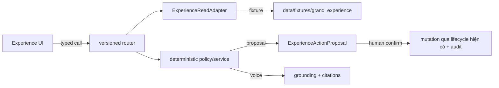

# Kiến trúc — Grand AI Experience Portfolio

## Bố cục module

```text
apps/web/src/app/quanverse/            route entry (experience register)
├── war-room/  shift-rescue/  rules/  spatial-memory/  page.tsx (living)
apps/web/src/ui/experience/            product UI modules (theme riêng)
├── experience-api.ts                  typed API client
├── war-room/ shift-rescue/ rules/ spatial/ quanverse/
apps/api/.../http/                     versioned API routers (boundary only)
├── experience.py (Phase 01)
├── war_room.py shift_rescue.py experience_rules.py
├── spatial_memory.py quanverse.py
packages/contracts/.../grand_experience.py + spatial_memory.py
packages/agents/.../ag_war_room ag_shift_rescue ag_rule_learning
                ag_spatial_memory ag_quanverse grand_experience(replay/adapter)
packages/opsengine/.../shift_rescue_policy.py
data/fixtures/grand_experience/*.json
```

## Luồng dữ liệu (một request)



## Ranh giới (bắt buộc)

| Ranh giới | Quy tắc |
|---|---|
| Đọc dữ liệu | qua `ExperienceReadAdapter` (protocol) — không import DB internals |
| AI | LLM chỉ wording/voice; số do math layer deterministic |
| Memory | owner/consent/visibility/retention/evidence/revocation bắt buộc |
| Render | 2D canonical; WebGL/3D/AR progressive (ADR-018) |
| Action | mọi mutation là proposal trước; confirm là người (ADR-008) |
| Capability | UI button không phải auth; server check `experience_role_can` |

## Fail-closed

- Event type lạ → reject tại write boundary.
- Proposal thiếu snapshot hash / evidence → reject.
- Consent revoked / memory deleted / retention hết hạn → không retrieve.
- Role lạ → rỗng capability.
- Stale baseline → 409 confirm.
- Không candidate an toàn → escalation, không broadcast.
- WebGL/mic/camera/Live LLM lỗi → 2D/text/replay.

## Replay determinism

- `CA_AGENT_MODE=replay` cách ly mạng; fixture fingerprint ổn định khi thay
  đổi JSON key order; cùng input → byte-equivalent output.

## Docs liên quan

- `docs/adr/ADR-016-*`, `ADR-017-*`, `ADR-018-*`
- `docs/runbook-grand-ai-experience.md`
- `docs/design-guidelines.md` (experience register dùng Fraunces/Source Sans 3/
  IBM Plex Mono + copper/charcoal)