# Kế hoạch hoàn thiện và kiểm thử AG-COPILOT

> Ngày lập: 2026-09-04
>
> Phạm vi: AG-COPILOT là đầu hội thoại điều hành của NHỊP QUÁN, từ nhận diện ý định đến đề xuất, phê duyệt, thực thi, đính chính, audit và UI. Kế hoạch này thay thế tiêu chí nghiệm thu bề mặt của kế hoạch `260901-copilot-bo-data-cung` và mở rộng AG-COPILOT thành lớp điều phối thống nhất cho mọi miền nghiệp vụ trong dự án, bao gồm các agent chuyên trách như AG-FBPAGE, AG-MAILWRITER, AG-MEETING, AG-TKB, AG-SOP và AG-WASTE.
>
> Hiện trạng kết luận: chưa đủ điều kiện production cho hành động ghi. Các intent đọc có thể tiếp tục ở replay/demo; mọi hành động ghi phải giữ human-in-the-loop và không được coi là an toàn cho live cho đến khi hoàn tất PR 0-5.

## 1. Mục tiêu và định nghĩa thành công

AG-COPILOT hoàn thành khi chứng minh được toàn tuyến:

```text
message + session
  -> parse có ngữ cảnh
  -> tool đọc đúng dữ liệu store
  -> proposal hợp lệ + snapshot nguồn
  -> transition trạng thái hợp lệ
  -> kiểm tra lại dữ liệu nguồn
  -> executor nguyên tử/idempotent
  -> kết quả thật quyết định trạng thái
  -> audit tenant-scoped
  -> UI hiển thị đúng trạng thái
```

Các mục tiêu bắt buộc:

1. Không side effect nào xảy ra từ proposal không ở `ready_for_approval`, đã hết hạn, sai tenant, sai role, stale hoặc có correction không hợp lệ.
2. Hash stale được tính từ dữ liệu nguồn có version rõ ràng, không từ `payload_diff` đã lưu.
3. Mỗi intent ghi có schema đầu vào, snapshot provider và executor riêng; không merge dictionary tùy ý.
4. Một action chỉ có một kết quả nghiệp vụ; retry cùng idempotency key trả cùng kết quả, retry khác key không thực thi lần hai.
5. `executed` chỉ có nghĩa side effect đã commit thành công. Lỗi mail, solver, persistence hoặc quality gate phải có trạng thái/lý do đúng.
6. Lịch được Copilot duyệt xuất hiện ngay trên cùng nguồn dữ liệu mà roster, brief và swap đang đọc.
7. Mọi endpoint action/audit xác thực session, role và tenant; client không thể chọn store khác để đọc hay ghi.
8. Conversation follow-up sử dụng tối đa ba lượt gần nhất và không biến câu làm rõ thành `OUT_OF_SCOPE`.
9. Replay suite chạy tất định, không network; test live tách riêng và không là điều kiện unit CI.
10. Mọi chức năng nghiệp vụ có trên web/API đều phải được AG-COPILOT hỗ trợ theo một trong bốn cách rõ ràng: đọc, tạo bản nháp, thực thi có duyệt hoặc hướng người dùng tới thao tác bảo mật bắt buộc; không còn chức năng “vô hình” với agent.
11. AG-COPILOT không gọi route HTTP nội bộ tùy ý. Agent chỉ chọn intent; code registry quyết định contract, role, policy, snapshot, approval và domain executor được phép chạy.

## 1.1. Mô hình quyền thao tác toàn dự án

“Thao tác mọi chức năng” không có nghĩa cấp quyền quản trị hệ thống trực tiếp cho mô hình AI. AG-COPILOT phải bao phủ toàn bộ nhu cầu người dùng nhưng quyền thực thi được chia thành năm cấp:

| Cấp | Cách hoạt động | Ví dụ |
|---|---|---|
| `R0_READ` | Đọc trực tiếp sau auth, tenant scope và redaction; không cần duyệt | Lịch của tôi, SOP, tồn kho, việc treo, trạng thái kênh |
| `R1_DRAFT` | AI phân tích/tạo bản nháp, tuyệt đối chưa ghi domain | Xếp lịch nháp, trích TKB, biên bản họp, bài Facebook |
| `R2_CONFIRM` | Một người đúng role xem diff chính xác và xác nhận | Ghi hao hụt, nhận/trả ca, cập nhật menu, gửi email |
| `R3_DUAL_APPROVAL` | Người khởi tạo và người có thẩm quyền khác cùng duyệt | Công bố lịch, thay luật vận hành, gửi nội dung nhạy cảm, thay cấu hình quán |
| `R4_MANUAL_ONLY` | Agent giải thích/deep-link nhưng không nhận hoặc thực thi bí mật/hành động | Đăng nhập, đổi quyền, webhook, check-in vật lý, token QR, thao tác phá hủy |

Luồng bắt buộc cho mọi intent từ `R1` trở lên:

```text
chat -> intent contract -> load current sources -> policy/rule gates
   -> deterministic preview/diff -> human approval
   -> re-load + stale/scope/rule gates -> domain executor
   -> transaction/idempotency -> audit/outcome -> UI
```

Rule gate phải là code tất định và versioned. LLM được hiểu yêu cầu, tổng hợp và soạn nháp; LLM không tự quyết quyền, không tự bỏ qua hard constraint và không tự xây URL để gọi API.

## 1.2. Bản đồ chức năng còn thao tác tay

Hiện AG-COPILOT chỉ có 8 intent: 3 intent đọc và 5 intent tạo proposal. Kiểm kê route/web cho thấy các nhóm sau chưa được điều phối đầy đủ:

| Miền chức năng | Bề mặt hiện tại | AG-COPILOT hiện tại | Đích cần bổ sung | Cấp mặc định |
|---|---|---|---|---|
| Tài khoản/cá nhân | đăng nhập, đăng ký, xem hồ sơ, cập nhật email | Không | `GET_MY_PROFILE`, `PROPOSE_MY_EMAIL_UPDATE`; auth vẫn thao tác bảo mật | `R0/R2/R4` |
| Nhân sự và vai trò | danh sách người, nâng/hạ vai | Không | `LIST_STAFF`; thay role chỉ giải thích và deep-link owner | `R0/R4` |
| Lịch tuần | xem lịch, khung giờ, pin, lifecycle, ICS | Chỉ solve/ghi chưa cùng nguồn | `GET_SCHEDULE`, `DRAFT_SCHEDULE`, `PROPOSE_SHIFT_FRAME_CHANGE`, `PROPOSE_PIN`, `PROPOSE_SCHEDULE_TRANSITION`, `EXPORT_SCHEDULE` | `R0/R1/R2/R3` |
| Hôm nay/công bằng | dashboard vận hành và báo cáo phân ca | Daily brief một phần | `GET_TODAY_OPERATIONS`, `GET_FAIRNESS_SUMMARY`, `EXPLAIN_ASSIGNMENT` | `R0` |
| Điểm danh/QR | check-in, phát và dùng QR | Không | Chỉ đọc trạng thái/hướng dẫn; phát/dùng QR và check-in giữ ngoài chat | `R0/R4` |
| Phiếu/checklist | mở phiếu, hoàn thành bước, minh chứng, treo việc | Không | `GET_MY_CHECKLIST`, `DRAFT_CHECKLIST_UPDATE`, `PROPOSE_EVIDENCE`, `PROPOSE_HANGING_TASK` | `R0/R1/R2` |
| Việc treo | xem, dispatch, đánh dấu xong, ghi nhận sửa | Không | `GET_HANGING_TASKS`, `PROPOSE_TASK_DISPATCH`, `PROPOSE_TASK_COMPLETE` | `R0/R2` |
| TKB và inbox ràng buộc | upload/extract/confirm TKB, classify, smart approve | Không, dù có AG-TKB/AG-MSG | `EXTRACT_TKB`, `CONFIRM_TKB`, `CLASSIFY_CONSTRAINT`, `GET_CONSTRAINT_CANDIDATES`, `PROPOSE_CONSTRAINT_DECISION` | `R1/R2` |
| Ca cá nhân | lịch tôi, nhả/nhận ca | Swap approval một phần | `GET_MY_SHIFTS`, `PROPOSE_RELEASE_SHIFT`, `PROPOSE_TAKE_SHIFT`; consent các bên vẫn bắt buộc | `R0/R2` |
| Đổi ca | tạo, đồng ý, từ chối, duyệt | Chỉ chuẩn bị/duyệt quản lý và có nguy cơ bypass consent | `GET_SHIFT_SWAPS`, `PROPOSE_SHIFT_SWAP`, `CONSENT_SHIFT_SWAP`, `REJECT_SHIFT_SWAP`, `FINALIZE_SHIFT_SWAP` | `R0/R2/R3` |
| Menu | xem/sửa món, BOM, giá, ẩn món, ảnh | Không | `QUERY_MENU`, `DRAFT_MENU_ITEM`, `PROPOSE_MENU_UPDATE`, `PROPOSE_MENU_IMAGE` | `R0/R1/R2` |
| Quầy/POS | tạo đơn, đổi trạng thái, chỉnh/hủy, báo cáo | Không | `GET_COUNTER_STATUS`, `DRAFT_COUNTER_ORDER`, `PROPOSE_ORDER_TRANSITION`; thanh toán/hủy giữ manual đến khi có policy | `R0/R1/R2/R4` |
| Tiêu thụ/tồn kho | xem/ghi tiêu thụ, cảnh báo | Chỉ restock draft | `GET_INVENTORY`, `PROPOSE_CONSUMPTION_RECORD`, `PROPOSE_STOCK_ADJUSTMENT`, `PROPOSE_RESTOCK_DRAFT` | `R0/R2` |
| Hao hụt | xem/ghi hao hụt | Chỉ phân tích đọc | `ANALYZE_WASTE`, `PROPOSE_WASTE_RECORD` | `R0/R2` |
| Bàn giao | xem/ghi SBAR và sinh việc | Không, dù có AG-HANDOVER | `GET_HANDOVERS`, `DRAFT_HANDOVER`, `APPLY_HANDOVER` | `R0/R1/R2` |
| SOP/cẩm nang/luật | hỏi SOP, pipeline 8 bước, duyệt/go | Query và rule proposal một phần | `QUERY_SOP`, `GET_PLAYBOOK`, `RUN_RULE_PIPELINE`, `REVIEW_RULE_PROPOSAL`, `ACTIVATE_PAUSE_ROLLBACK_RULE` | `R0/R1/R3` |
| Cuộc họp | ghi âm, transcribe, analyze, apply, xóa | Không, dù có AG-MEETING | `TRANSCRIBE_MEETING`, `DRAFT_MEETING_MINUTES`, `APPLY_MEETING_ACTIONS`; xóa giữ manual | `R1/R2/R4` |
| Email | xem recipient, soạn/gửi | Có nhưng outcome chưa đúng | `DRAFT_EMAIL`, `SEND_APPROVED_EMAIL`, `GET_MAIL_DELIVERY_STATUS` | `R1/R2` |
| Liên kết kênh | cấp mã bind, bind, xem trạng thái | Không | `GET_CHANNEL_STATUS`, `ISSUE_MY_BIND_CODE`; mapping người khác giữ manual | `R0/R2/R4` |
| Facebook inbox | xem thread/inbox, soạn reply, duyệt moderation | Không, dù có AG-FBPAGE | `GET_FB_INBOX`, `DRAFT_FB_REPLY`, `SEND_APPROVED_FB_REPLY`, `DECIDE_FB_MODERATION` | `R0/R1/R2/R3` |
| Facebook Page | sync, policy, profile quán, khuyến mãi | Không | `GET_PAGE_STATUS`, `SYNC_PAGE`, `DRAFT_FB_POLICY`, `PROPOSE_STORE_PROFILE`, `PROPOSE_PROMOTION_UPDATE` | `R0/R2/R3` |
| Nội dung Page | draft, AI-generate, duyệt/đăng, việc treo | Không | `DRAFT_FB_POST`, `REVIEW_FB_POST`, `PUBLISH_APPROVED_FB_POST` | `R1/R2/R3` |
| Xu hướng | radar, chi tiết, Apify usage | Không, dù có AG-TREND | `SEARCH_TRENDS`, `GET_TREND_DETAIL`, `GET_SCRAPER_USAGE` | `R0` |
| AI-learning | feedback, generation/evaluation, reflection | Không | `GET_AI_QUALITY`, `SUBMIT_AI_FEEDBACK`, `RUN_REFLECTION`, `REVIEW_LEARNED_RULE` | `R0/R1/R2` |
| AI governance | circuit breaker, approve/activate/pause/rollback rule | Không | `PROPOSE_AI_CIRCUIT_CHANGE`, `PROPOSE_LEARNED_RULE_TRANSITION` | `R3` |
| Audit/chẩn đoán | audit, A/B, VF conflict, permissions, action | Một phần và scope chưa kín | `QUERY_AUDIT`, `GET_ACTION_STATUS`, `GET_MY_PERMISSIONS`, `EXPLAIN_CONFLICT` | `R0` |
| Điều hướng/tour/hướng dẫn | trang thêm, bản đồ hướng dẫn, tour | Không | `NAVIGATE_TO_FEATURE`, trả deep-link và lý do; không giả vờ đã thao tác | `R0` |

Các route webhook Telegram/Zalo/Facebook, replay ingestion, secrets, login/register, nâng/hạ vai, remote attendance, dùng QR, xóa meeting và hành động thanh toán/hủy đơn không được đăng ký executor hội thoại. AG-COPILOT vẫn “bao phủ” bằng cách nhận biết yêu cầu, giải thích vì sao cần thao tác bảo mật và mở đúng màn hình cho người có quyền.

## 1.3. Kiến trúc điều phối agent đứng đầu

AG-COPILOT là orchestrator, không thay thế các agent chuyên môn:

| Chuyên gia | AG-COPILOT giao việc | Kết quả được phép |
|---|---|---|
| AG-TKB | OCR/trích khoảng bận | Draft có confidence và provenance |
| AG-MSG | Phân loại tin/ràng buộc | Structured constraint draft |
| AG-MEETING | Transcript và biên bản | Minutes/action/SOP proposal chưa áp dụng |
| AG-SOP/AG-RULE | Tra cứu và đề xuất luật | Citation hoặc rule proposal |
| AG-WASTE | Phân cụm hao hụt | Insight, không tự ghi dữ liệu mới |
| AG-HANDOVER | Trích SBAR/việc treo | Draft để tác giả/quản lý duyệt |
| AG-FBPAGE | Triage, soạn trả lời/bài đăng | Exact-content draft; external send qua executor riêng |
| AG-MAILWRITER | Soạn email | Exact-content draft qua quality gate |
| AG-TREND | Thu thập xu hướng | Read model có source/freshness |
| AG-SUPERVISOR | Kiểm tra nội dung đầu ra | Có quyền block/downgrade, không có quyền tự approve side effect |

`CapabilityRegistry` là catalog duy nhất và phải chứa cho mỗi intent:

```python
CapabilityDefinition(
  intent=...,
  risk_tier=...,
  request_model=...,
  result_model=...,
  allowed_roles=...,
  source_provider=...,
  specialist=...,
  policy_gates=(...),
  snapshot_provider=...,
  executor=...,
  approval_policy=...,
  feature_flag=...,
)
```

Registry phải hỗ trợ `GET_MY_PERMISSIONS` để UI/agent chỉ quảng bá chức năng user thật sự có quyền. Mọi route web đang ghi dữ liệu phải được refactor gọi cùng domain service với executor của Copilot; không nhân đôi logic route và agent.

## 2. Hiện trạng đã xác minh và khoảng trống

| Mức | Khoảng trống | Hậu quả | Bằng chứng kiểm thử cần có |
|---|---|---|---|
| P0 | Exception hết hạn bị `except Exception` nuốt | Proposal hết hạn vẫn có thể được duyệt | Clock cố định, draft quá hạn trả lỗi và không đổi dữ liệu nguồn |
| P0 | Không chặn transition từ `draft`, `rejected`, `expired`, `stale_rejected` sang approve | Vượt state machine | Bảng transition đầy đủ, mọi cạnh không hợp lệ đều fail closed |
| P0 | VF-STALE hash lại chính `payload_diff` | Không phát hiện dữ liệu sống đã đổi | Sửa `phan_cong`/swap/tồn kho sau propose rồi approve phải trả `409` |
| P0 | `correction_diff` merge sau stale check, không schema | Chèn trường hoặc thay đổi phạm vi hành động sau phê duyệt | Extra field, đổi recipient, đổi store, payload sai kiểu đều bị chặn |
| P0 | Các KV và action không commit trong một transaction chung | Partial write và trạng thái giả thành công | Fault injection ở từng bước chứng minh rollback toàn bộ |
| P0 | Action/audit read thiếu scope đầy đủ | Rò dữ liệu tenant/action | Anonymous, staff và cross-store đều bị chặn đúng `401/403/404` |
| P1 | Schedule ghi `lich_tuan`, luồng sống đọc `phan_cong` | Duyệt xong nhưng roster/brief/swap không nhất quán | Duyệt lịch rồi đọc endpoint roster và brief thấy cùng assignment |
| P1 | Solver có thể dùng fixture/default thay dữ liệu store | Proposal không phản ánh vận hành thật | Fixture DB hai store tạo hai kết quả khác nhau, không fallback im lặng |
| P1 | Swap conflict thiếu metadata thì fail open | Duyệt ca không đủ dữ kiện an toàn | Thiếu/ lỗi `ca_meta` phải không tạo proposal duyệt được |
| P1 | Mail lỗi vẫn đánh dấu `executed` | UI báo gửi thành công sai thực tế | SMTP/quality fail giữ trạng thái thất bại có thể retry, không `executed` |
| P1 | Amend chỉ tạo record `executed`, không áp correction nghiệp vụ | Audit nói đã sửa nhưng dữ liệu không đổi | Đính chính phải qua proposal mới và executor tương ứng |
| P1 | Tool mail thiếu email vẫn tạo proposal duyệt được | Có action không thể thực thi | Không recipient hợp lệ thì chỉ trả draft/clarification, không approve |
| P2 | Parser bỏ qua `context.recent_messages` | Follow-up “tuần sau” bị mất intent | Test hội thoại hai lượt cho schedule/mail/swap |
| P2 | Daily brief lấy mọi assignment dạng list | Báo sai ngày | Seed hai ngày, brief chỉ chứa ngày yêu cầu |
| P2 | `nguong_canh_bao` không tác động | Tham số công khai nhưng vô hiệu | Boundary test dưới/bằng/trên ngưỡng |
| P2 | UI tin `status=executed` mà không diễn giải outcome | Trạng thái và lỗi không rõ | Component/E2E test cho stale, expired, blocked, failed, retryable |
| P2 | CI có cổng giả: integration `|| true`, web test `echo test-ok`, mypy `|| true` | Main xanh dù kiểm thử không chạy/thất bại | Loại bỏ soft-pass cho phạm vi Copilot, có test thực sự được đếm |

## 3. Các invariant phải khóa bằng code

### 3.1. State machine

Trạng thái đề xuất:

```text
draft -> ready_for_approval -> executing -> executed
  |              |                |
  |              |                +-> execution_failed -> executing
  |              +-> rejected
  |              +-> expired
  |              +-> stale_rejected
  +-> cancelled

executed -> amendment_ready -> amending -> amended
                                +-> amendment_failed
```

Quy tắc:

- Chỉ `ready_for_approval` được approve/reject.
- Claim `ready_for_approval -> executing` phải atomic bằng compare-and-set.
- `executed`, `rejected`, `expired`, `stale_rejected`, `cancelled`, `amended` là terminal đối với action gốc.
- Retry chỉ được phép cho `execution_failed` khi executor xác nhận chưa commit hoặc có idempotency key ở adapter ngoài hệ thống.
- Không dùng cùng `executed` để biểu diễn “đã ghi nhận yêu cầu”, “đã qua quality gate” và “đã gửi mail”.

### 3.2. Contract theo intent

Mỗi intent ghi phải đăng ký một `ActionDefinition`:

```python
ActionDefinition(
    intent=...,
    payload_model=...,
    correction_model=...,
    snapshot_provider=...,
    executor=...,
    allowed_roles=...,
    ttl_seconds=...,
)
```

Registry là single source of truth cho schema, scope, snapshot và executor. API không dùng chuỗi `if/elif` để tự suy diễn shape payload. Các model phải `extra="forbid"` và có validation nghiệp vụ.

### 3.3. Snapshot nguồn

Snapshot phải tối thiểu chứa:

```json
{
  "store_id": "quan_01",
  "intent": "SCHEDULE_SOLVE",
  "source_versions": {"phan_cong": 17, "ca_meta": 4, "constraints": 9},
  "canonical_data": {},
  "hash_algorithm": "sha256-canonical-json-v1"
}
```

Nguồn cần snapshot:

| Intent | Dữ liệu nguồn bắt buộc |
|---|---|
| `SCHEDULE_SOLVE` | ca, nhân viên, availability/ràng buộc, luật hiệu lực, lịch hiện tại, tuần đích |
| `APPROVE_SHIFT_SWAP` | swap record, assignment ca đích, metadata giờ ca, consent/version liên quan |
| `CREATE_RULE_PROPOSAL` | evidence IDs/version và tập luật hiện tại |
| `INVENTORY_RESTOCK_CHECK` | inventory records/version, threshold policy, open restock orders |
| `SEND_MAIL` | recipient IDs/email version, nội dung draft, ops context version, quality policy |

Canonicalization phải ổn định trước thứ tự dictionary/list không mang nghĩa. Không hash secret hoặc dữ liệu không cần thiết.

### 3.4. Transaction và idempotency

- Persistence cung cấp một hàm transaction cấp use case để claim action, ghi domain data, trạng thái và audit cùng commit.
- KV dùng namespace theo store hoặc chuyển bảng domain có cột `store_id`; không tiếp tục key toàn cục cho dữ liệu nhiều quán.
- Idempotency lưu `(store_id, action_id, idempotency_key, request_hash, outcome)` với unique constraint.
- Cùng key và cùng request trả outcome cũ; cùng key khác request trả `409`; key khác trên action terminal không chạy lại.
- External mail adapter nhận idempotency key; kết quả không chắc chắn phải là `delivery_unknown`, không tự coi thành công.

## 4. Lộ trình triển khai theo PR

### PR 0 - Runtime và baseline đáng tin

**Mục tiêu:** tạo môi trường có thể chứng minh thay đổi.

**Công việc**

- Chuẩn hóa Python 3.12 cho Windows và CI; cài workspace theo `pyproject.toml`/package metadata.
- Thêm target hẹp `test-copilot`, `test-copilot-api`, `test-copilot-e2e` hoặc script tương đương chạy được trên Windows PowerShell và CI.
- Neo `CA_AGENT_MODE=replay`, DB/temp paths, clock và env; cấm dùng credential/network thật.
- Chạy baseline rồi lưu số pass/fail cùng commit SHA trong journal của plan.
- Sửa CI để test integration Copilot không có `|| true`; thay `echo test-ok` bằng component test thật khi PR UI bắt đầu. Không buộc sửa toàn bộ cảnh báo mypy ngoài phạm vi, nhưng job Copilot mới phải fail thật.

**Cổng merge**

- Interpreter báo Python 3.12+.
- Import `fastapi`, `pydantic`, `pytest`, `ortools` thành công trong đúng environment.
- Suite hẹp chạy được từ máy sạch và CI, không skip/soft-pass âm thầm.

### PR 1 - Contracts và state machine

**Mục tiêu:** không còn transition tùy ý.

**Công việc**

- Mở rộng `ActionProposalStatus`; định nghĩa transition table và domain errors.
- Tạo Pydantic payload/correction model cho năm intent ghi.
- Validate proposal trước khi persist và validate lại khi load dữ liệu cũ.
- Thêm optimistic version hoặc compare-and-set vào draft persistence.
- Chỉ cho approve từ `ready_for_approval`; reject cũng chỉ từ trạng thái này.
- Tách lỗi parse thời gian khỏi `HTTPException`; thời gian không hợp lệ phải fail closed và audit.

**Tests bắt buộc**

- Parameterized test toàn ma trận transition hợp lệ/không hợp lệ.
- Expiry với clock cố định: trước, đúng và sau deadline.
- Hai request approve đồng thời: đúng một request claim executor.
- Legacy draft sai schema không thực thi được và có audit migration/error.

**Cổng merge:** chưa nối executor thật vẫn phải chứng minh state machine atomic và fail closed.

### PR 2 - Snapshot providers và correction validation

**Mục tiêu:** VF-STALE phản ánh dữ liệu sống.

**Công việc**

- Tạo snapshot provider theo từng intent và dùng cùng provider ở propose/approve.
- Lưu metadata nguồn/version bên cạnh hash để debug được lý do stale.
- Canonicalize dữ liệu và thêm contract test hash ổn định.
- Validate correction bằng model theo intent trước stale check cuối cùng; correction chỉ sửa field được phép.
- Tính “effective action” sau correction, rồi kiểm tra scope, schema, snapshot và business rules trên effective action.
- Correction làm thay đổi nguồn/phạm vi đáng kể phải tạo proposal mới, không duyệt trong action cũ.

**Tests bắt buộc**

- Thay đổi thật từng nguồn liên quan làm approve trả `409 stale_rejected`.
- Thay đổi nguồn không liên quan không làm stale.
- Đổi thứ tự JSON không mang nghĩa giữ nguyên hash.
- Extra fields, đổi `store_id`, intent, recipient, ca ngoài scope và type sai trả `422/409`, không side effect.

**Cổng merge:** bỏ test “tamper stored hash” làm bằng chứng chính; giữ nó chỉ như test corruption.

### PR 3 - Executor nguyên tử và nguồn sự thật thống nhất

**Mục tiêu:** trạng thái và dữ liệu domain commit cùng nhau.

**Công việc**

- Tách executor theo intent khỏi route HTTP.
- `SCHEDULE_SOLVE`: lấy input từ provider dữ liệu store/tuần thật; ghi nguồn lịch canonical mà roster, brief và swap cùng đọc. Nếu cần tương thích, tạo adapter đọc cũ trong migration có thời hạn, không dual-write vô thời hạn.
- `APPROVE_SHIFT_SWAP`: thiếu swap/assignment/ca metadata hoặc source lỗi phải fail closed; cập nhật consent, swap và assignment trong một transaction.
- `CREATE_RULE_PROPOSAL`: chọn một nguồn luật canonical, bỏ fallback ghi nguồn thứ hai khi lỗi.
- `INVENTORY_RESTOCK_CHECK`: áp threshold thật, chống tạo đơn trùng cho cùng snapshot/item và ghi order theo store.
- `SEND_MAIL`: kiểm recipient trước proposal; map outcome `sent`, `quality_blocked`, `transport_failed`, `delivery_unknown`; chỉ `sent` mới chuyển action sang `executed`.
- Audit ghi outcome sau cùng; lỗi giữa chừng rollback domain state và action thành `execution_failed` với error code đã redaction.

**Tests bắt buộc**

- Contract test mỗi executor với payload hợp lệ/không hợp lệ.
- Fault injection trước/sau từng write chứng minh không partial commit.
- Approve lịch rồi đọc roster, daily brief và swap đều thấy cùng assignment.
- Mail quality block/SMTP fail/timeout không báo executed; retry không gửi trùng.
- Hai store dùng cùng ca/item/swap ID không nhìn hoặc sửa dữ liệu nhau.

**Cổng merge:** năm intent ghi có executor tests và ít nhất một integration flow qua HTTP cho mỗi intent.

### PR 4 - Authorization, tenant isolation và audit

**Mục tiêu:** mọi bề mặt đọc/ghi được scope từ session.

**Công việc**

- `/action/{id}` bắt buộc auth; trả dữ liệu chỉ khi đúng store và role.
- `/audit` không tin `store_id` query; manager/owner chỉ đọc store trong session, staff bị chặn.
- Áp VF-SCOPE trước idempotent replay để không tiết lộ action tồn tại/trạng thái của tenant khác.
- Namespace/migrate draft, audit và domain records theo `store_id`; thêm index/constraint cần thiết.
- Redact recipient/body hoặc dữ liệu nhạy cảm theo vai trò trong audit response.
- Thêm rate limit cho propose/execute nếu hạ tầng hiện có hỗ trợ; tối thiểu giới hạn solver theo store/user.

**Tests bắt buộc**

- Ma trận anonymous/staff/manager/owner x same-store/cross-store cho message, action, execute, amend, audit.
- Cross-store action ID trả `404` hoặc `403` theo policy thống nhất, không lộ payload.
- Idempotent replay cross-store vẫn bị chặn.
- Query `?store_id=quan_02` không đổi tenant hiệu lực.

**Cổng merge:** isolation đạt 100% trên ma trận; không endpoint nhạy cảm dùng guest fallback.

### PR 5 - Amendment đúng nghĩa

**Mục tiêu:** đính chính là một hành động nghiệp vụ có thể kiểm chứng, không phải audit giả.

**Công việc**

- Định nghĩa intent nào hỗ trợ amendment và loại correction hợp lệ.
- Amend tạo action mới ở `amendment_ready`, tham chiếu action gốc, snapshot trạng thái hiện tại và yêu cầu confirm nếu có side effect.
- Executor amendment cập nhật dữ liệu domain/queue thông báo trong transaction; action gốc giữ nguyên audit bất biến và được liên kết `amended_by_action_id`.
- Mail đã gửi không “undo”; chỉ cho tạo correction mail mới. Lịch/swap chỉ amend nếu chưa bị thay đổi tiếp hoặc nhân viên chưa xác nhận theo policy.
- Cửa sổ 15 phút dùng clock inject được; timestamp lỗi fail closed.

**Tests bắt buộc**

- Amend trong/ngoài cửa sổ, stale sau action gốc, unsupported intent và cross-tenant.
- Dữ liệu domain thực sự đổi sau confirm amendment.
- Lỗi executor amendment không thay đổi action gốc/dữ liệu.
- Chuỗi audit truy được original -> amendment proposal -> outcome.

### PR 6 - Parser và tool đọc đúng dữ liệu

**Mục tiêu:** hoàn thiện chất lượng hội thoại sau khi đường ghi đã an toàn.

**Công việc**

- Dùng `recent_messages` để resolve follow-up theo state tối thiểu: pending clarification intent + missing slots; không đưa toàn bộ lịch sử tự do vào quyền quyết định.
- Date/week resolution dựa trên `active_date`/timezone của store, không `date.today()` của server.
- Daily brief lọc assignment, việc treo, sự cố và tồn kho theo ngày/scope đúng schema nguồn.
- Inventory dùng `nguong_canh_bao` hoặc policy per-item; định nghĩa rõ bằng ngưỡng là cảnh báo hay không.
- Swap metadata/source lỗi trả structured error, không fail open.
- Mail thiếu recipient hợp lệ trả clarification/non-approvable draft.
- Thêm citation/provenance cho mọi direct answer quan trọng.

**Tests bắt buộc**

- Bộ hội thoại 1-3 lượt: schedule week, swap target, mail recipient, đổi ý và hủy.
- Timezone và boundary ISO week/year.
- Seed hai ngày/hai store, brief không lẫn ngày/store.
- Inventory boundary và per-item threshold.
- Property test parser: input rỗng/dài/Unicode/tiếng lóng không gọi tool ngoài whitelist.

**Cổng merge:** intent accuracy >= 90% trên golden set; mutating precision phải ưu tiên fail closed, không tối ưu recall bằng cách đoán.

### PR 7 - Web UX và E2E

**Mục tiêu:** UI phản ánh đúng domain state, không suy đoán thành công.

**Công việc**

- Sinh TypeScript types từ contract; không duy trì union trạng thái thủ công lệch backend.
- Action card hiển thị riêng: ready, executing, executed, rejected, expired, stale, validation error, execution failed, delivery unknown và amended.
- Disable double click khi executing; gửi idempotency key ổn định cho một thao tác.
- Khi stale/expired, cung cấp command tạo proposal mới; không tái dùng draft cũ.
- Chỉ hiện “đã gửi” khi mail outcome là `sent`; quality block/transport fail có hướng xử lý đúng.
- Hội thoại gửi context mà backend thực sự sử dụng; xóa hoặc sửa cả hai implementation chat bị trùng để tránh hành vi lệch.
- Thêm component tests thực, bỏ `echo test-ok`.

**Tests bắt buộc**

- Component tests cho state rendering, buttons, error body và countdown.
- Playwright desktop/mobile: login, clarify, propose, approve, double-click, stale, expired, reject, mail fail và amendment.
- SSE/JSON fallback cho cùng một input phải tạo/persist proposal tương đương và không trùng action.

**Cổng merge:** không có UI state nào gọi thất bại là thành công; Playwright dùng API/DB tạm, không credential thật.

### PR 8 - CI, quan sát và rollout

**Mục tiêu:** biến invariants thành cổng release lâu dài.

**Công việc**

- Tách CI: contracts, agent unit, API state/executor, integration SQLite, integration Postgres nếu production dùng Postgres, web component, Playwright, no-network và migration.
- Không `|| true`, `echo test-ok` hay skip không có lý do trên cổng Copilot.
- Metrics: proposal theo intent/status, stale/expired/reject rate, executor latency, failure code, idempotent replay, cross-tenant denial, mail outcome; không log secret/body thô.
- Feature flag per intent ghi; mặc định off trong production cho đến shadow sign-off.
- Runbook bật/tắt intent, xử lý `execution_failed`/`delivery_unknown`, re-propose stale và rollback release.
- Cập nhật tài liệu cũ: đánh dấu claim “475 tests pass = hoàn thành” không còn là tiêu chí đủ; ghi rõ phạm vi đã thay thế.

**Cổng merge:** một pipeline xanh từ môi trường sạch, dashboard/structured log đủ chẩn đoán action bằng `action_id` mà không lộ nội dung nhạy cảm.

### PR 9 - Catalog đọc toàn dự án

**Mục tiêu:** AG-COPILOT trả lời được mọi câu hỏi vận hành mà user có quyền xem trước khi mở thêm side effect.

**Công việc**

- Triển khai `CapabilityRegistry`, discovery/permission response và read providers tenant-scoped.
- Bổ sung các intent `GET_*`, `QUERY_*`, `SEARCH_TRENDS`, `EXPLAIN_*` trong bảng 1.2.
- Chuẩn hóa provenance gồm source, thời điểm đọc, store/date scope và freshness.
- Thêm deep-link tới đúng màn hình khi dữ liệu cần xem trực quan hoặc hành động là `R4_MANUAL_ONLY`.
- Không gọi endpoint loopback; provider đọc domain repository/service trực tiếp qua interface inject.

**Cổng merge:** mỗi trang web nghiệp vụ có ít nhất một read/navigation intent; ma trận role/store/redaction và no-network replay xanh.

### PR 10 - Self-service và vận hành nội bộ

**Mục tiêu:** giảm thao tác tay cho nhân viên và quản lý ở các hành động nội bộ có thể đảo ngược.

**Công việc**

- Thêm checklist, việc treo, TKB confirm, ca cá nhân, consent đổi ca, ghi tiêu thụ/hao hụt và bàn giao.
- Refactor route web và Copilot dùng chung domain service, contract và policy gate.
- Áp ownership gate cho hành động “của tôi”; manager không được dùng chat để giả danh consent nhân viên.
- Preview diff rõ dữ liệu cũ/mới, nguồn trích xuất và confidence trước confirm.

**Cổng merge:** integration test chứng minh thao tác từ UI và Copilot có cùng invariant/outcome; retry không tạo record hoặc task trùng.

### PR 11 - Quản trị lịch, menu, họp và POS giới hạn

**Mục tiêu:** đưa các thao tác quản lý thường ngày vào proposal pipeline.

**Công việc**

- Thêm khung giờ, pin, lifecycle lịch, menu/BOM/ảnh và apply meeting actions.
- POS chỉ mở draft order và transition đã có policy rõ; thanh toán, hủy và chỉnh phá hủy giữ `R4_MANUAL_ONLY`.
- Lifecycle công bố/đóng/mở lại lịch và rule activation dùng `R3_DUAL_APPROVAL` khi ảnh hưởng nhiều người.
- Meeting apply chỉ áp các action/SOP proposal được tick chọn; chống duplicate theo meeting/version.

**Cổng merge:** stale/concurrency/fault-injection pass cho từng domain; meeting/menu/schedule audit truy được actor, approver và diff.

### PR 12 - Kênh ngoài và cấu hình quán

**Mục tiêu:** AG-COPILOT điều phối email, Facebook Page và cấu hình customer-facing với kiểm duyệt nội dung chính xác.

**Công việc**

- Thêm exact-content preview cho email, Messenger reply và Facebook post; một approval chỉ khớp một hash nội dung/recipient/channel.
- Áp AG-FBPAGE moderation policy, cửa sổ nhắn tin, role assignment, live/replay flag và circuit breaker trước external send.
- Thêm page sync, profile quán, promotions và policy dưới feature flag riêng; thay đổi policy/profile quan trọng dùng dual approval.
- Không cho agent gọi webhook/replay route; channel binding chỉ self-service issue code, không lộ external ID.
- Lưu external delivery ID/outcome và reconcile trạng thái `delivery_unknown` thay vì gửi lại mù.

**Cổng merge:** sandbox E2E và failure injection xanh; không external call khi thiếu exact-content approval, policy version hoặc idempotency key.

### PR 13 - AI-learning governance và độ phủ 100%

**Mục tiêu:** agent đứng đầu quan sát được chất lượng AI nhưng không tự nới luật kiểm soát chính nó.

**Công việc**

- Thêm quality/evaluation/generation reads, feedback submission và reflection draft.
- Learned rule luôn qua owner dual approval; activation/pause/rollback và circuit breaker có immutable audit.
- Sinh báo cáo coverage từ web routes, API routes và `CapabilityRegistry`; CI fail khi thêm chức năng user-facing mà không khai báo capability hoặc explicit exclusion.
- Thêm eval chống privilege escalation, prompt injection yêu cầu bypass duyệt và agent tự sửa policy/circuit breaker.

**Cổng merge:** 100% bề mặt user-facing được map vào capability hoặc explicit exclusion có lý do; không rule do AI học được tự kích hoạt.

## 5. Ma trận kiểm thử tổng thể

| Tầng | Mục đích | Bộ kiểm thử chính | Điều kiện pass |
|---|---|---|---|
| Contract | Model/status/payload tương thích Python-TS-JSON | schema round-trip, `extra=forbid`, generated TS diff | 100% schema cases pass |
| Agent unit | Parse, context, role, whitelist, tool read | `test_ag_copilot*` + golden conversations | Accuracy >= 90%; unsafe false positive = 0 |
| Gate unit | Scope, stale, expiry, transition | matrix + clock + source mutation | 100% negative cases fail closed |
| Persistence | CAS, transaction, idempotency, migration | concurrency/fault injection | Không double execution/partial write |
| Executor | Side effect đúng cho từng intent | one suite per executor | Outcome khớp state và audit |
| API integration | Auth -> propose -> execute -> read | TestClient/real DB temp | Năm mutating flows + negative matrix pass |
| Cross-module | Schedule/brief/swap/roster cùng nguồn | seed + read-after-write | Không lệch key/shape/date/store |
| Web component | State và lỗi hiển thị đúng | React test runner thực | Không success giả, controls đúng |
| E2E | Workflow người dùng | Playwright desktop/mobile | Critical flows pass không flaky |
| Security | Tenant, injection, mass assignment, replay | adversarial requests | Không đọc/ghi chéo tenant, không bypass |
| Reliability | Race, timeout, retry, crash recovery | parallel approve + adapter faults | At-most-once side effect |
| Migration | DB cũ/draft cũ | snapshot DB trước migration | Start được, legacy action không chạy sai |
| Replay/no-network | CI tất định | socket deny + fixed fixtures | 0 network call |

## 6. Test scenarios tối thiểu theo intent

| Intent | Happy path | Negative/stale | Cross-module assertion |
|---|---|---|---|
| `SCHEDULE_SOLVE` | Propose từ store/week thật, approve | availability/constraint đổi, solver infeasible, race approve | roster + brief + swap đọc lịch mới |
| `APPROVE_SHIFT_SWAP` | Đủ consent, không chồng giờ | thiếu metadata, consent rút, assignment đổi | swap status + assignment cùng commit |
| `CREATE_RULE_PROPOSAL` | Evidence hợp lệ tạo rule pending | evidence stale/cross-store/duplicate | playbook đọc đúng nguồn canonical |
| `INVENTORY_RESTOCK_CHECK` | Item dưới threshold tạo draft order | stock đổi, open order trùng, threshold sai | inventory/order cùng store và snapshot |
| `SEND_MAIL` | Recipient hợp lệ, quality pass, adapter sent | thiếu email, blocked, timeout, SMTP fail, duplicate retry | action state + generation/feedback/audit khớp |
| `GENERATE_DAILY_BRIEF` | Đúng ngày/store | ngày không dữ liệu, malformed source | phản ánh lịch canonical vừa duyệt |
| `QUERY_SOP` | Trả câu và citation | source unavailable/no match | không bịa, không lẫn store |
| `ANALYZE_WASTE` | Tóm tắt khoảng ngày | ngoài khoảng, source unavailable | count/citation truy được dữ liệu nguồn |

## 7. Dữ liệu test và nguyên tắc fixture

- Một factory tạo `quan_01` và `quan_02` với ID domain cố tình trùng nhau để bắt lỗi thiếu tenant scope.
- Có ít nhất hai ngày, hai tuần qua ranh giới năm, ca chồng một phần, consent thay đổi, tồn kho bằng ngưỡng và recipient thiếu email.
- Clock inject được; không phụ thuộc ngày hiện tại của máy CI.
- Mail/LLM/channel dùng fake adapter có outcome điều khiển được; socket bị chặn trong replay.
- Golden conversation lưu input, context, expected intent, missing slots và expected tool/no-tool; không chỉ assert câu chữ toàn phần.
- Không dùng production DB, `.env` thật, token hoặc PII thật.

## 8. Trình tự phụ thuộc và cách chia việc

```mermaid
flowchart LR
    P0[PR 0 Runtime] --> P1[PR 1 Contracts + State]
    P1 --> P2[PR 2 Snapshots + Corrections]
    P2 --> P3[PR 3 Executors + Canonical Data]
    P3 --> P4[PR 4 Auth + Tenant]
    P4 --> P5[PR 5 Amendment]
    P5 --> P6[PR 6 Parser + Read Tools]
    P4 --> P7[PR 7 Web + E2E]
    P6 --> P7
    P7 --> P8[PR 8 CI + Rollout]
    P8 --> P9[PR 9 Read Catalog]
    P9 --> P10[PR 10 Self-service]
    P10 --> P11[PR 11 Internal Admin]
    P11 --> P12[PR 12 External Channels]
    P12 --> P13[PR 13 AI Governance + Coverage]
```



Phân công phù hợp ownership hiện có:

| Nhóm | Sở hữu | Điểm đồng bộ |
|---|---|---|
| B - API/Orchestration | state machine, snapshot orchestration, transaction, auth, migration, CI | Chốt interface `ActionDefinition` với C trước PR 1 |
| C - Agents/Eval | parser context, tool providers, executor contracts, golden eval | Không import ngược `ca_api`; provider được inject |
| A - Solver/Gates/Ops | solver input adapter, VF tests, domain invariants | Xác nhận nguồn lịch canonical và hard constraints |
| D - Web | generated types, proposal UI, component/E2E | Bắt đầu sau contract PR 1, merge sau API PR 4/6 |

Mỗi PR nên nhỏ hơn ba ngày làm việc, có migration/test cùng code và không trộn refactor ngoài AG-COPILOT.

## 9. Rollout và rollback

### Pha A - Test-only

- Tất cả mutating intent production off.
- Replay unit/integration/E2E xanh; migration chạy trên bản sao DB.

### Pha B - Shadow

- Cho tạo proposal từ dữ liệu thật nhưng nút execute bị flag chặn.
- So proposal với thao tác quản lý hiện tại trong tối thiểu 7 ngày hoặc 30 proposal/intent có phát sinh.
- Theo dõi stale rate, correction rate, solver feasibility và tenant denial.

### Pha C - Canary nội bộ

- Bật từng intent theo thứ tự: inventory draft -> rule proposal -> schedule -> swap -> mail.
- Chỉ một store nội bộ, owner approval bắt buộc, 10% traffic action đủ điều kiện.
- Dừng ngay khi có cross-tenant leak, execution không audit, partial write, duplicate side effect hoặc success giả.

### Pha D - Mở rộng

- 10% -> 50% -> 100% theo store, mỗi bước tối thiểu 48 giờ không có P0/P1.
- Mail mở cuối cùng vì có side effect ngoài hệ thống.

Rollback:

- Tắt feature flag theo intent, không rollback schema phá hủy.
- Giữ audit và idempotency records.
- Action đang `executing` được reconcile trước khi deploy lại; không tự retry mail outcome `delivery_unknown`.
- Migration luôn forward-compatible; rollback app vẫn đọc được trạng thái mới ở chế độ read-only/fail closed.

## 9.1. Theo dõi tiến độ triển khai

Quy ước: chỉ đánh dấu `[x]` sau khi code và validation tập trung của hạng mục đã hoàn tất. Mục `Đang làm` là lát triển khai hiện tại; checklist này phải được cập nhật sau mỗi lần hoàn thành một hạng mục.

- [x] Khôi phục môi trường Python 3.12.
- [x] Hoàn thiện proposal state machine với `executing` và `execution_failed`.
- [x] Kiểm tra live snapshot cho tồn kho.
- [x] Khóa correction schema theo từng intent.
- [x] Lưu durable idempotency receipt, replay cùng request và conflict khác request/key.
- [ ] **Đang làm:** Gom transaction cho thực thi nội bộ.
- [ ] Xử lý mail `delivery_unknown` và chống gửi trùng ở adapter.
- [ ] Bổ sung live snapshot cho lịch và đổi ca.
- [ ] Bổ sung live snapshot cho rule và mail.
- [ ] Siết tenant isolation, authorization và audit matrix.
- [ ] Sửa parser follow-up context.
- [ ] Hoàn thiện UI retry, `executing` và `execution_failed`.
- [ ] Thêm fault-injection và rollback tests.
- [ ] Chạy E2E và no-network replay.
- [ ] Chạy toàn bộ lint, typecheck và test.
- [ ] Cập nhật runbook migration, canary và rollout.
- [ ] Triển khai Universal Orchestration PR9-13 sau khi Core Safety PR0-8 đạt cổng phát hành.

## 10. Cổng phát hành

Không phát hành live nếu thiếu bất kỳ điều kiện nào:

- [ ] Python 3.12+ local/CI và dependencies đầy đủ.
- [ ] Không còn soft-pass trong cổng Copilot CI.
- [ ] State transition matrix, expiry và concurrent approve pass.
- [ ] Stale test thay đổi dữ liệu nguồn thật pass cho mọi mutating intent.
- [ ] Correction schema/mass-assignment negative tests pass.
- [ ] Fault injection chứng minh không partial commit.
- [ ] Schedule dùng một nguồn canonical, roster/brief/swap read-after-write pass.
- [ ] Mail outcome không tạo success giả và retry không gửi trùng.
- [ ] Auth/tenant matrix đạt 100%.
- [ ] Amendment thay đổi domain thật hoặc bị từ chối rõ ràng.
- [ ] Golden conversation accuracy >= 90%, unsafe bypass = 0.
- [ ] Component + Playwright critical flows xanh trên desktop/mobile.
- [ ] Replay suite không network/credential.
- [ ] Migration rehearsal, backup và rollback runbook đã diễn tập.
- [ ] Owner ký xác nhận canary; mutating feature flags mặc định off.
- [ ] Mỗi route/page user-facing có capability hoặc explicit exclusion được kiểm thử trong CI.
- [ ] Các agent chuyên trách chỉ trả structured result cho AG-COPILOT; không tự tạo side effect ngoài executor registry.
- [ ] Mọi chức năng `R2/R3` hiển thị exact diff, rule checks, actor và approver trước khi chạy.
- [ ] Các chức năng `R4_MANUAL_ONLY` được nhận diện và deep-link đúng, không có executor hội thoại.

## 11. Definition of Done

Một hạng mục chỉ được đánh dấu xong khi có đủ code, test dương, test âm, audit assertion, tài liệu contract và validation trong CI. Số lượng test pass không thay thế kiểm chứng invariant.

AG-COPILOT chỉ được gọi là hoàn thiện khi một test end-to-end có thể:

1. Seed hai store và dữ liệu lịch/tồn kho/swap/mail độc lập.
2. Thực hiện hội thoại có một lượt làm rõ.
3. Tạo proposal bằng dữ liệu store hiện tại.
4. Chứng minh stale bằng cách sửa nguồn thật.
5. Tạo lại proposal, approve đồng thời hai request và chỉ commit một lần.
6. Đọc lại roster/brief/domain data thấy cùng kết quả.
7. Gây lỗi executor và chứng minh rollback + trạng thái/audit đúng.
8. Thử đọc/duyệt từ tenant khác và bị chặn.
9. Hiển thị đúng outcome trên UI.
10. Chạy toàn bộ trong replay mode từ môi trường sạch.
11. Chứng minh mỗi miền nghiệp vụ trong bảng 1.2 có read/draft/action/deep-link đúng role và risk tier.
12. Chứng minh thêm một route user-facing mới mà không đăng ký capability/exclusion sẽ làm CI thất bại.

Chỉ sau khi kịch bản này và checklist phát hành đều xanh mới cập nhật tài liệu trạng thái thành `Completed`.
