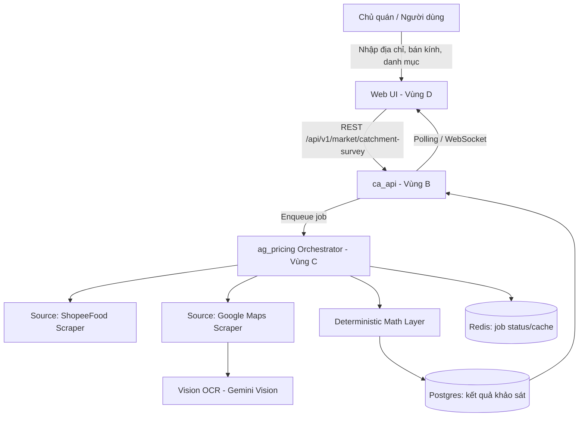
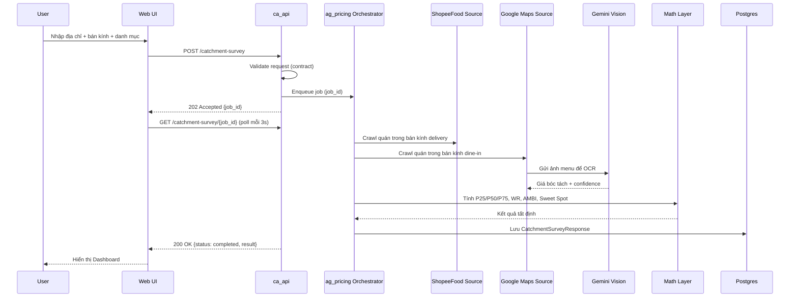
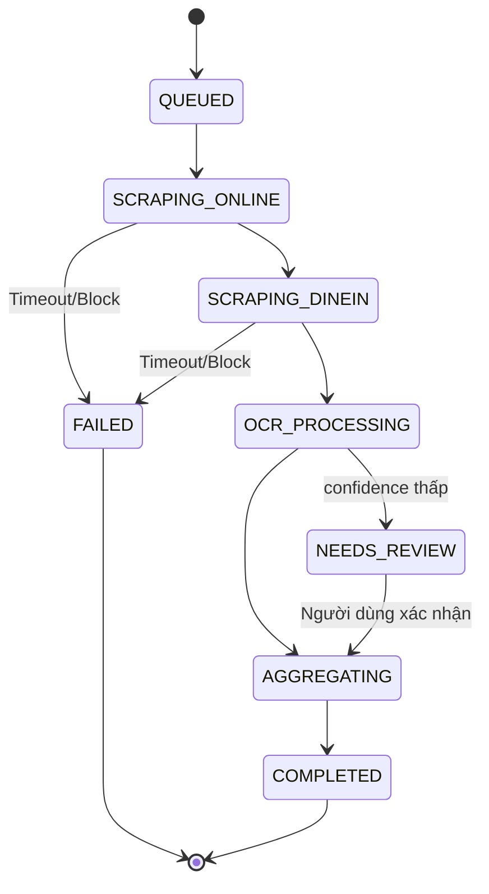

# Kế hoạch Kỹ thuật — Hệ thống Khảo sát Giá & Định vị Thị trường F&B theo Bán kính

## (Catchment Pricing & Market Radar)

> **Mã kế hoạch:** `260913-1455-khao-sat-gia-fb-online-dinein-substitutes`
> **Phiên bản:** v2.1 (Bổ sung nghiệp vụ chuyên sâu F&B — soát xét lại từ v2.0)
> **Ngày soát xét:** 2026-09-13
> **Bản gốc v1.0:** lưu tại [`plan-v1.0.md`](plan-v1.0.md)
> **Vai trò soát xét:** Senior Software Engineer (kiến trúc/kỹ thuật, v2.0) + Chuyên gia nghiệp vụ F&B (chuẩn hoá logic định giá, v2.1) — chuẩn hoá kiến trúc, hợp đồng dữ liệu, thuật toán, kiểm thử, vận hành và **tính đúng đắn nghiệp vụ định giá** theo thông lệ ngành F&B.
>
> **Tuân thủ ADR:**
> - **ADR-002** — Điều phối tất định: mọi số liệu ($P_{25}, P_{50}, P_{75}$, AMBI, Sweet Spot, WR) phải là hàm toán học thuần tuý, có thể unit-test, LLM **không** được phép tự sinh con số.
> - **ADR-003** — Contracts-first: schema/hợp đồng dữ liệu phải merge trước khi có bất kỳ PR triển khai nào.
> - **ADR-008** — Agent chỉ trích xuất dữ liệu khách quan; con người (chủ quán) là người quyết định giá cuối cùng — hệ thống **không** tự động áp giá.
>
> **Vùng sở hữu:** C (`ag_pricing`, `sources`) · B (`ca_api`) · D (Web UI Khảo sát thị trường)

> ⚠️ **Quy ước đọc tài liệu:** Các mục được đánh dấu **[GIỮ NGUYÊN v1.0]** là quyết định nghiệp vụ gốc, không thay đổi. Các mục đánh dấu **[MỞ RỘNG]** là chi tiết hoá thêm từ ý tưởng gốc. Các mục đánh dấu **[ĐỀ XUẤT MỚI]** là bổ sung kỹ thuật từ bản soát xét này (cần chủ dự án duyệt trước khi coi là quyết định chính thức).

---

## MỤC LỤC

1. [Tóm tắt điều hành](#0-tóm-tắt-điều-hành)
2. [Bối cảnh nghiệp vụ F&B](#1-bối-cảnh-nghiệp-vụ-fb)
   - 1.5. [Giới hạn & lớp nghiệp vụ bổ sung (góc nhìn chuyên gia F&B)](#15-giới-hạn--lớp-nghiệp-vụ-bổ-sung-góc-nhìn-chuyên-gia-fb)
3. [Kiến trúc giải pháp](#2-kiến-trúc-giải-pháp)
4. [Hợp đồng dữ liệu (Contracts-First)](#3-hợp-đồng-dữ-liệu-contracts-first)
5. [Tầng thuật toán định lượng (Deterministic Math Layer)](#4-tầng-thuật-toán-định-lượng-deterministic-math-layer)
6. [Thiết kế API & Backend](#5-thiết-kế-api--backend)
7. [UI/UX Web Dashboard](#6-uiux-web-dashboard)
8. [Chiến lược kiểm thử (QA Strategy)](#7-chiến-lược-kiểm-thử-qa-strategy)
9. [Ràng buộc pháp lý & đạo đức dữ liệu](#8-ràng-buộc-pháp-lý--đạo-đức-dữ-liệu)
10. [Vận hành & Giám sát (Observability)](#9-vận-hành--giám-sát-observability)
11. [Roadmap triển khai theo giai đoạn](#10-roadmap-triển-khai-theo-giai-đoạn)
12. [Ma trận rủi ro & kiểm soát](#11-ma-trận-rủi-ro--kiểm-soát)
13. [Chỉ số thành công (KPI)](#12-chỉ-số-thành-công-kpi)
14. [Phụ lục](#13-phụ-lục)

---

## 0. TÓM TẮT ĐIỀU HÀNH

**Vấn đề:** Chủ quán F&B định giá menu theo cảm tính hoặc theo giá app giao đồ ăn — hai loại giá này lệch nhau 20–27.5% do phí sàn, dẫn đến định giá sai kênh (quán ngồi bị coi là đắt, quán online bị lỗ biên).

**Giải pháp:** Một hệ thống agent tự động khảo sát giá theo bán kính địa lý, tách biệt giá **online (ShopeeFood)** và giá **tại quầy (Google Maps + Vision OCR)**, đối chiếu với **nhóm món thay thế** cùng nhu cầu (Jobs-to-be-Done), rồi tổng hợp thành một **ngưỡng ngân sách khu vực (AMBI)** và một **vùng giá đề xuất (Sweet Spot)** — thuần tuý mang tính tham chiếu, quyết định cuối cùng luôn thuộc về chủ quán (ADR-008).

**Phạm vi (in-scope):**

- Thu thập dữ liệu công khai, hiển thị cho người dùng cuối (không phải giao dịch tự động).
- 3 phân hệ: Delivery Radar, Dine-in Vision Radar, Substitute Matrix Engine.
- Một thành phố/khu vực thí điểm trước khi mở rộng đa vùng.

**Ngoài phạm vi (out-of-scope) ở v2.0:**

- Tự động thay đổi giá trên ShopeeFood/POS của chủ quán.
- Theo dõi giá realtime liên tục (ban đầu chỉ khảo sát theo yêu cầu — on-demand).
- Các nền tảng giao đồ ăn khác ngoài ShopeeFood (GrabFood, BeFood) — để dành Phase sau.

**Thay đổi lớn so với v1.0:** bổ sung mô hình xử lý bất đồng bộ (async job), hợp đồng dữ liệu đầy đủ dạng Pydantic, định nghĩa chính thức cho "Sweet Spot", chiến lược chống phát hiện bot có kiểm soát rủi ro pháp lý, chiến lược kiểm thử OCR có golden dataset, và cơ chế giám sát chi phí AI Vision.

---

## 1. BỐI CẢNH NGHIỆP VỤ F&B

### 1.1. Phân tầng giá Online vs Dine-in **[GIỮ NGUYÊN v1.0 — mở rộng bảng minh hoạ]**

| Kênh | Cấu phần chi phí cộng thêm | Bán kính so sánh của khách | Rủi ro nếu định giá sai |
|---|---|---|---|
| Dine-in (tại quầy) | Mặt bằng, điều hoà, phục vụ, chén dĩa | 500 m – 1.5 km (đi bộ/xe máy gần) | Bị coi là "đắt" nếu lấy giá ShopeeFood |
| Delivery (trên sàn) | Hoa hồng sàn 20–27.5% + 2.000–4.000đ bao bì | 3 km – 7 km (sau mã giảm giá + ship) | Lỗ biên nếu lấy giá tại bàn đem lên app |

> **[ĐỀ XUẤT MỚI]** Bán kính không nên hard-code cứng mà nên là **tham số cấu hình theo mật độ đô thị** (`radius_profile`): khu trung tâm dày đặc (Q1, Q3 TP.HCM) dùng bán kính nhỏ hơn (300m–1km dine-in) so với vùng ven (1–2.5km), vì mật độ quán ăn/km² khác biệt lớn. Giá trị mặc định giữ theo v1.0, nhưng field này để mở rộng không phải sửa code khi vào thành phố mới.

### 1.2. Lý thuyết "Chiếc dạ dày" & Jobs-to-be-Done **[GIỮ NGUYÊN v1.0]**

Khách hàng không chọn theo tên món mà theo nhu cầu: *"Trưa nay ăn gì cho no, sạch, dưới 45.000đ?"* — nên món chính (VD: Cơm sườn) cạnh tranh trực tiếp với toàn bộ nhóm thay thế cùng nhu cầu.

**Ma trận nhu cầu → nhóm món thay thế:**

| Nhu cầu (JTBD) | Món lõi ví dụ | Nhóm thay thế |
|---|---|---|
| Bữa trưa no bụng | Cơm | Bún, Phở, Hủ tiếu, Bánh canh, Mì Quảng, Bánh mì |
| Thức uống / làm việc | Cà phê | Trà trái cây, Trà sữa, Nước ép/sinh tố |
| Ăn xế / ăn vặt | Bánh tráng trộn | Chè, Kem, Cá viên chiên, Gà rán |
| Tụ tập / bữa tối | Lẩu | BBQ nướng, Quán ốc, Quán nhậu bình dân |

> **[ĐỀ XUẤT MỚI]** Ma trận này nên là **dữ liệu cấu hình (YAML/DB)**, không hard-code trong logic nghiệp vụ, để đội vận hành có thể thêm nhóm nhu cầu mới (VD: "Ăn chay", "Ăn kiêng low-carb") mà không cần release code — xem mục 3.4.

### 1.3. Chỉ số AMBI (Area Meal Budget Index) **[GIỮ NGUYÊN công thức v1.0]**

$$\text{AMBI} = 0.5 \cdot \text{Median}_{\text{Core}} + 0.5 \cdot \overline{\text{Median}}_{\text{Substitutes}}$$

- Giá $\le$ AMBI → vùng giá an toàn.
- Giá $>$ AMBI $\times 1.2$ → vùng giá rủi ro, cần yếu tố bù đắp (không gian, dịch vụ).

### 1.4. Bộ lọc kiểm chứng thị trường **[GIỮ NGUYÊN v1.0]**

- **Gate 1 (Volume):** $v \ge 50$ lượt đánh giá, hoặc có nhãn "Quán yêu thích"/"Đã bán 1k+".
- **Gate 2 (Quality):** $R \ge 4.2$★ **và** $WR \ge 4.0$★.
- **Bayesian Weighted Rating:**

$$\text{WR} = \left(\frac{v}{v+50}\right) R + \left(\frac{50}{v+50}\right) \cdot 4.2$$

> **[ĐỀ XUẤT MỚI]** Cần xử lý rõ trường hợp biên: quán có nhãn "Quán yêu thích" nhưng $v < 50$ (Gate 1 dùng OR nên qua được), nhưng nếu $v$ quá thấp (VD $v=3$) thì $WR$ gần như hội tụ về $4.2$ mặc định — hệ thống nên gắn cờ `low_confidence=True` cho các bản ghi này thay vì loại bỏ hoàn toàn, để tầng tổng hợp AMBI có thể áp trọng số thấp hơn thay vì nhị phân loại bỏ/giữ.

---

## 1.5. GIỚI HẠN & LỚP NGHIỆP VỤ BỔ SUNG (GÓC NHÌN CHUYÊN GIA F&B)

**[ĐỀ XUẤT MỚI — v2.1]** Các thuật toán ở Phần I–IV trả lời đúng câu hỏi *"thị trường đang chấp nhận giá bao nhiêu?"*, nhưng một chỉ số giá chỉ dựa trên thống kê thị trường thuần tuý có thể **gây hiểu lầm nguy hiểm** nếu thiếu các lớp đối chiếu nghiệp vụ dưới đây. Đây là các bổ sung bắt buộc phải cân nhắc trước khi coi AMBI/Sweet Spot là "khuyến nghị đáng tin cậy".

### 1.5.1. Đối chiếu giá vốn (Cost-Plus Sanity Check) — 🔴 Bắt buộc

Hệ thống hiện chỉ so sánh quán với **thị trường**, không so sánh quán với **chính cấu trúc chi phí của nó**. Một quán có thể định giá bằng đúng AMBI nhưng vẫn lỗ nếu food cost của họ cao hơn chuẩn ngành (thường 28–33% doanh thu cho quán ăn, 25–30% cho đồ uống).

- Cho phép chủ quán **nhập tuỳ chọn** giá vốn nguyên liệu ước tính/phần ăn (`estimated_cogs_vnd`).
- Nếu có giá vốn, hệ thống tính thêm **điểm hoà vốn có biên lợi nhuận mục tiêu**:

$$\text{MinViablePrice} = \frac{\text{estimated\_cogs\_vnd}}{1 - \text{target\_margin\_ratio}}$$

(mặc định `target_margin_ratio = 0.30`, có thể chỉnh).

- Nếu $\text{SweetSpot}_{high} < \text{MinViablePrice}$ → cảnh báo rõ trên UI: *"Vùng giá thị trường thấp hơn ngưỡng có lời tối thiểu của bạn — cân nhắc giảm giá vốn, tăng khẩu phần cảm nhận, hoặc định vị lại phân khúc thay vì giảm giá theo thị trường."*

### 1.5.2. Giá gốc vs Giá hiệu lực (Strike-through vs Effective Price) — 🔴 Bắt buộc

Trên ShopeeFood, phần lớn giá hiển thị là **giá đã áp khuyến mãi** (giảm 20–50% để cạnh tranh vị trí hiển thị), không phải giá bán thực chất. Nếu hệ thống lấy giá hiển thị làm mẫu tính AMBI, chỉ số sẽ bị **kéo thấp giả tạo** so với sức chi trả thật của thị trường.

- Bóc tách riêng `original_price_vnd` (giá gốc, thường có gạch ngang) và `effective_price_vnd` (giá sau giảm).
- **Dùng `original_price_vnd` làm cơ sở chính** để tính AMBI/Sweet Spot; `effective_price_vnd` chỉ hiển thị tham khảo mức độ khuyến mãi phổ biến trong khu vực (một tín hiệu cạnh tranh riêng, không trộn vào phân vị giá).

### 1.5.3. Phân tầng theo định vị thương hiệu (Positioning Tier) — 🔴 Bắt buộc

Gộp chung quán vỉa hè không máy lạnh với chuỗi thương hiệu vào một rổ tính trung vị là sai về bản chất cạnh tranh — hai nhóm này có cấu trúc chi phí và tệp khách khác hẳn nhau, không thực sự "so giá" với nhau trong đầu người tiêu dùng.

| Tầng (`positioning_tier`) | Đặc điểm nhận diện (heuristic) |
|---|---|
| `street_food` | Không mặt bằng cố định/quán vỉa hè, giá thấp, không thương hiệu chuỗi |
| `casual_dine_in` | Có mặt bằng, máy lạnh hoặc không, quán độc lập/gia đình |
| `branded_chain` | Thuộc chuỗi có ≥3 chi nhánh nhận diện được qua tên trùng lặp trên Maps/ShopeeFood |

AMBI và Sweet Spot **phải tính riêng theo từng tầng**; quán tự chọn tầng phù hợp khi khảo sát, hệ thống chỉ gợi ý tầng dựa trên heuristic để chủ quán xác nhận (giữ đúng tinh thần ADR-008 — con người quyết định).

### 1.5.4. Chuẩn hoá theo khẩu phần (Portion Normalization) — 🟠 Nên có

So 40.000đ vs 45.000đ vô nghĩa nếu không biết phần nào nhiều hơn. Tận dụng chính Vision OCR đã đọc menu để bắt thêm từ khoá khẩu phần ("phần đặc biệt", "phần lớn", "size L") vào `portion_note` (trường tự do, không ép chuẩn hoá định lượng ở giai đoạn đầu vì độ tin cậy chưa đủ).

### 1.5.5. Loại khu vực theo đối tượng khách (Area Type) — 🟠 Nên có

Cùng bán kính 1km nhưng khu văn phòng, khu dân cư, gần trường học hay khu du lịch có sức chi trả khác hẳn nhau. Suy ra `area_type` (`office`/`residential`/`mixed`/`tourist`) từ mật độ loại hình POI lân cận (đã có sẵn trong dữ liệu Google Maps crawl được) để **diễn giải AMBI theo đúng ngữ cảnh**, tránh áp một ngưỡng "vùng an toàn" chung cho mọi loại khu vực.

### 1.5.6. Chỉ số bão hoà thị trường (Competitive Intensity) — 🟠 Nên có

AMBI cho biết *mức giá* nhưng không cho biết *mức độ cạnh tranh*. Một khu vực AMBI cao nhưng chỉ có 2 đối thủ đạt Dual-Gate là cơ hội hoàn toàn khác so với khu vực có 20 đối thủ cùng mức giá đó.

$$\text{CompetitiveIntensity} = \frac{\text{Số quán đạt Dual-Gate cùng core\_category}}{\text{Diện tích bán kính khảo sát (km}^2\text{)}}$$

Hiển thị song song với AMBI trên Dashboard, không gộp vào công thức giá.

### 1.5.7. Làm tròn giá theo tâm lý thị trường Việt Nam — 🟠 Nên có

Một Sweet Spot ra số như 42.350đ vô nghĩa với thực tế kinh doanh — người Việt định giá theo các mốc quen thuộc. Trước khi hiển thị, làm tròn `SweetSpot_low`/`SweetSpot_high` về bội số gần nhất theo cấu hình phân khúc (VD: bội số 1.000đ cho đồ uống, 5.000đ cho món ăn chính), **không làm tròn trong dữ liệu lưu trữ**, chỉ làm tròn ở tầng hiển thị.

### 1.5.8. Giới hạn theo thời điểm khảo sát (Temporal Snapshot Caveat) — 🟡 Cân nhắc

Khảo sát hiện tại là ảnh chụp một thời điểm — không phản ánh biến động trưa/tối, ngày thường/cuối tuần, hay theo mùa (hậu Tết, mùa mưa tăng đơn online). UI phải ghi rõ thời điểm khảo sát và giới hạn này, tránh chủ quán hiểu nhầm số liệu là "luôn đúng, mọi lúc".

### 1.5.9. Combo/set món vs món lẻ — 🟡 Cân nhắc

Giá combo (kèm canh, nước, tráng miệng) không so sánh trực tiếp được với giá món đơn. Gắn cờ `is_combo` khi bóc tách, tách kênh so sánh riêng cho nhóm combo thay vì trộn chung vào phân vị món lẻ.

---

## 2. KIẾN TRÚC GIẢI PHÁP

### 2.1. Sơ đồ ngữ cảnh hệ thống (System Context)



### 2.2. Ba phân hệ chức năng

#### Phân hệ 1 — Delivery Radar (ShopeeFood) **[GIỮ NGUYÊN v1.0, bổ sung kỹ thuật]**

- Camoufox (trình duyệt chống fingerprint) mở ShopeeFood theo toạ độ, bắt các request JSON nội bộ (network interception) thay vì scrape DOM để giảm rủi ro bị đổi UI phá vỡ selector.
- Bóc tách: danh mục món, giá niêm yết, số lượt bán, best-sellers, tên quán, số sao, số lượt đánh giá.
- **[ĐỀ XUẤT MỚI]** Chuẩn hoá tên món qua lớp *normalization* (bỏ dấu, lowercase, ánh xạ từ đồng nghĩa "Cơm sườn bì chả" ≈ "Cơm sườn bì" ≈ "Cơm tấm sườn bì") trước khi group theo `core_category`, tránh việc một món bị tính lệch nhóm vì khác tên gọi.

#### Phân hệ 2 — Dine-in Vision Radar (Google Maps) **[GIỮ NGUYÊN v1.0, bổ sung kỹ thuật]**

- Camoufox tìm quán uy tín lân cận trên Google Maps, mở album ảnh "Thực đơn/Menu".
- Gemini Vision OCR đọc ảnh bảng giá, bóc tách tên món + giá VNĐ.
- **Fallback:** nếu không có ảnh menu → áp dụng chiết khấu ngược $-20\%$ từ giá ShopeeFood cùng quán (nếu quán đó có bán online), hoặc từ giá trung vị ShopeeFood của khu vực nếu quán chỉ bán tại chỗ.
- **[ĐỀ XUẤT MỚI] Guardrail chống ảo giác OCR:**
  1. Prompt yêu cầu Gemini Vision trả về **kèm bounding-box/toạ độ vùng ảnh** đã đọc giá, không chỉ trả số — giúp truy vết khi sai.
  2. Bắt buộc trả `confidence` tự đánh giá (low/medium/high) theo hướng dẫn rõ tiêu chí (ảnh mờ, chữ viết tay → low).
  3. Giá trị nào có `confidence=low` hoặc lệch $>2\sigma$ so với trung vị nhóm cùng danh mục → đưa vào hàng đợi **review thủ công** thay vì tự động đưa vào AMBI (tuân thủ ADR-008 — con người xác nhận dữ liệu bất thường).
  4. Không được phép để Vision model "đoán" giá khi ảnh không rõ — chỉ được trả `null` + lý do.

#### Phân hệ 3 — Substitute Matrix Engine **[GIỮ NGUYÊN v1.0]**

- Mở rộng từ khoá theo nhóm nhu cầu (cấu hình, không hard-code — xem 3.4).
- Tính phân vị độc lập cho từng nhóm (core + từng substitute), sau đó tổng hợp AMBI.

### 2.3. Sơ đồ trình tự (Sequence) cho một lượt khảo sát đầy đủ



### 2.4. Trạng thái xử lý job (State Machine)



> **[ĐỀ XUẤT MỚI]** Xử lý phải là **bất đồng bộ (async job)** chứ không phải request-response đồng bộ, vì một lượt khảo sát có thể mất 30s–3 phút (crawl nhiều quán + OCR nhiều ảnh). Dùng job queue (Celery/RQ/Arq trên Redis) với `job_id` để Web UI poll trạng thái, tránh timeout HTTP.

---

## 3. HỢP ĐỒNG DỮ LIỆU (CONTRACTS-FIRST)

Vị trí chuẩn **[GIỮ NGUYÊN v1.0]**:
`packages/contracts/src/ca_contracts/catchment_survey.py`
`packages/contracts/schema/CatchmentPriceSurvey.json`

### 3.1. Request Contract

```python
from enum import Enum
from pydantic import BaseModel, Field, confloat, conint

class ChannelMode(str, Enum):
    DINE_IN_VISION = "dine_in_vision"
    DELIVERY_PLATFORM = "delivery_platform"
    HYBRID = "hybrid"

class RadiusProfile(BaseModel):
    dine_in_km: confloat(gt=0, le=3) = 1.0
    delivery_km: confloat(gt=0, le=10) = 5.0

class PositioningTier(str, Enum):
    STREET_FOOD = "street_food"
    CASUAL_DINE_IN = "casual_dine_in"
    BRANDED_CHAIN = "branded_chain"

class AreaType(str, Enum):
    OFFICE = "office"
    RESIDENTIAL = "residential"
    MIXED = "mixed"
    TOURIST = "tourist"

class CostPlusCheck(BaseModel):
    """[v2.1] Tuỳ chọn — chỉ tính nếu chủ quán cung cấp giá vốn."""
    estimated_cogs_vnd: conint(ge=0) | None = None
    target_margin_ratio: confloat(gt=0, lt=1) = 0.30

class CatchmentSurveyRequest(BaseModel):
    schema_version: str = "2.1"
    latitude: float
    longitude: float
    core_category: str                     # VD: "com_suon_bi_cha"
    positioning_tier: PositioningTier | None = None   # None = hệ thống gợi ý, chủ quán xác nhận
    channel_mode: ChannelMode = ChannelMode.HYBRID
    include_substitutes: bool = True
    radius_profile: RadiusProfile = RadiusProfile()
    max_menu_images_per_store: conint(ge=1, le=20) = 5
    min_review_count: conint(ge=0) = 50     # Gate 1 mặc định
    min_rating: confloat(ge=0, le=5) = 4.2  # Gate 2 mặc định
    cost_plus_check: CostPlusCheck | None = None       # mục 1.5.1
    idempotency_key: str | None = None
```

### 3.2. Store & Menu Contracts

```python
class MenuItemPrice(BaseModel):
    item_name_raw: str
    item_name_normalized: str
    original_price_vnd: conint(ge=0)        # [v2.1] giá gốc — cơ sở tính AMBI (mục 1.5.2)
    effective_price_vnd: conint(ge=0)       # [v2.1] giá sau khuyến mãi — chỉ tham khảo
    is_promotional: bool = False            # [v2.1]
    is_combo: bool = False                  # [v2.1] mục 1.5.9 — tách kênh so sánh riêng
    portion_note: str | None = None         # [v2.1] mục 1.5.4, VD "phần đặc biệt"
    source_channel: ChannelMode
    confidence: str = Field(pattern="^(low|medium|high)$")
    is_fallback_derived: bool = False       # True nếu suy ra từ chiết khấu ngược -20%

class MenuSnapshot(BaseModel):
    store_id: str
    image_url: str
    ocr_model: str = "gemini-vision"
    extracted_items: list[MenuItemPrice]
    captured_at: str                        # ISO 8601

class StoreRecord(BaseModel):
    store_id: str
    name: str
    lat: float
    lng: float
    review_count: conint(ge=0)
    rating: confloat(ge=0, le=5)
    weighted_rating: confloat(ge=0, le=5)   # WR đã tính
    passed_gate1: bool
    passed_gate2: bool
    low_confidence: bool = False
    positioning_tier_suggested: PositioningTier | None = None  # [v2.1] mục 1.5.3 — gợi ý, không tự quyết
    menu_items: list[MenuItemPrice]
```

### 3.3. Aggregation Contracts (Kết quả tất định)

```python
class PercentileStats(BaseModel):
    p25: float
    p50: float
    p75: float
    sample_size: conint(ge=0)

class SubstituteCategoryStats(BaseModel):
    category_name: str                      # VD: "bun_bo_hue"
    stats: PercentileStats

class SubstitutePriceComparison(BaseModel):
    core_category: str
    positioning_tier: PositioningTier       # [v2.1] mục 1.5.3 — tính riêng theo tầng, không trộn
    core_stats: PercentileStats
    substitutes: list[SubstituteCategoryStats]
    ambi: float
    sweet_spot_low_raw: float                # [v2.1] giá trị toán học chưa làm tròn (lưu trữ)
    sweet_spot_high_raw: float
    sweet_spot_low_display: float            # [v2.1] đã làm tròn theo mục 1.5.7 — chỉ dùng hiển thị
    sweet_spot_high_display: float
    min_viable_price: float | None = None    # [v2.1] mục 1.5.1, chỉ có nếu request kèm cost_plus_check
    cost_plus_warning: bool = False          # [v2.1] True nếu sweet_spot_high_raw < min_viable_price

class AreaContext(BaseModel):
    """[v2.1] mục 1.5.5, 1.5.6 — ngữ cảnh diễn giải, không phải công thức giá."""
    area_type: AreaType
    competitive_intensity: float             # số quán đạt Dual-Gate / km²

class CatchmentSurveyResponse(BaseModel):
    schema_version: str = "2.1"
    job_id: str
    status: str                             # xem State Machine mục 2.4
    online_stats: PercentileStats | None
    dinein_stats: PercentileStats | None
    substitute_comparison: SubstitutePriceComparison | None
    area_context: AreaContext | None = None
    stores_flagged_for_review: list[str] = []
    survey_captured_at: str                 # [v2.1] mục 1.5.8 — bắt buộc hiển thị trên UI
    generated_at: str
```

### 3.4. Cấu hình động (không hard-code) **[ĐỀ XUẤT MỚI]**

Ma trận nhu cầu → nhóm thay thế (mục 1.2) và `radius_profile` theo mật độ đô thị (mục 1.1) nên nằm trong bảng cấu hình (`substitute_taxonomy` table hoặc file YAML versioned), có API nội bộ để đội vận hành cập nhật mà không cần deploy lại `ag_pricing`. Contract cần thêm:

```python
class SubstituteTaxonomyEntry(BaseModel):
    jtbd_group: str                         # "lunch_meal_replacement"
    core_categories: list[str]
    substitute_categories: list[str]
    version: int
```

### 3.5. Versioning & tương thích ngược

- Mọi contract có field `schema_version` (semver rút gọn `MAJOR.MINOR`).
- `ca_api` từ chối request có `schema_version` MAJOR không khớp (HTTP 409) thay vì cố parse sai.
- Thay đổi breaking (xoá field, đổi kiểu dữ liệu) → bump MAJOR + giữ endpoint version cũ (`/api/v1/` → `/api/v2/`) tối thiểu 1 chu kỳ release song song.

---

## 4. TẦNG THUẬT TOÁN ĐỊNH LƯỢNG (DETERMINISTIC MATH LAYER)

> Toàn bộ mục này phải nằm trong module thuần Python không phụ thuộc LLM (ADR-002), có unit test 100% nhánh rẽ, không network call.

### 4.1. Phương pháp tính phân vị

- Dùng phương pháp nội suy tuyến tính chuẩn (`numpy.percentile(..., method="linear")`), ghi rõ trong docstring — tránh mỗi engineer chọn một phương pháp phân vị khác nhau gây lệch số liệu giữa các lần chạy.
- $n < 5$ mẫu → không tính phân vị, trả `sample_size` và cờ `insufficient_data=True` thay vì trả số liệu không đáng tin.

### 4.2. Dual-Gate Qualification — xử lý ca biên **[MỞ RỘNG]**

```python
def passes_gates(store: StoreRecord, min_v=50, min_r=4.2, min_wr=4.0) -> tuple[bool, bool]:
    gate1 = store.review_count >= min_v or store.has_favorite_badge
    gate2 = store.rating >= min_r and store.weighted_rating >= min_wr
    return gate1, gate2
```

Quán có `gate1=True` nhờ badge nhưng `review_count < 10` → gắn `low_confidence=True`, vẫn được tính nhưng với **trọng số giảm** trong bước tổng hợp trung vị theo trọng số (không loại bỏ tuyệt đối), tránh xoá dữ liệu ít nhưng vẫn có tín hiệu thật.

### 4.3. AMBI — ví dụ tính bằng số

Giả sử: $\text{Median}_{\text{Core}}$ (Cơm sườn) $= 40.000đ$; trung bình các median nhóm thay thế (Bún bò, Phở, Hủ tiếu) $= 44.000đ$.

$$\text{AMBI} = 0.5 \times 40.000 + 0.5 \times 44.000 = 42.000đ$$

Vùng rủi ro bắt đầu từ: $42.000 \times 1.2 = 50.400đ$.

### 4.4. Sweet Spot Pricing Zone **[ĐỀ XUẤT MỚI — chưa có công thức chính thức ở v1.0]**

v1.0 nhắc đến "Sweet Spot" trong tiêu đề tài liệu nhưng chưa định nghĩa công thức. Đề xuất định nghĩa tường minh để bảo đảm ADR-002 (không để LLM tự suy diễn con số này). **[v2.1]** Công thức tính trên dữ liệu **cùng một `positioning_tier`** (mục 1.5.3) và dùng **`original_price_vnd`**, không dùng giá khuyến mãi (mục 1.5.2):

$$\text{SweetSpot}_{low,raw} = P_{40}(\text{Core} \cup \text{Substitutes} \mid \text{cùng tier})$$

$$\text{SweetSpot}_{high,raw} = \min(\text{AMBI},\ P_{60}(\text{Core} \cup \text{Substitutes} \mid \text{cùng tier}))$$

**Diễn giải:** vùng giá vừa nằm trong nhóm "phổ biến, không rẻ bất thường" ($P_{40}$) vừa không vượt ngưỡng tâm lý khu vực (AMBI). Đây là **gợi ý tham khảo**, không phải khuyến nghị bắt buộc — hiển thị kèm chú thích rõ ràng trên UI theo đúng ADR-008.

> Cần chủ dự án duyệt chính thức công thức này ở Phase 1 trước khi code hoá, vì đây là điểm mấu chốt hiển thị cho người dùng cuối.

#### 4.4.1. Làm tròn theo tâm lý giá thị trường (mục 1.5.7) **[v2.1]**

Chỉ áp dụng ở **tầng hiển thị**, không ghi đè giá trị `_raw` dùng để lưu trữ/tính toán tiếp:

```python
def round_to_market_convention(price: float, category_group: str) -> int:
    step = 1_000 if category_group == "beverage" else 5_000
    return round(price / step) * step
```

#### 4.4.2. Đối chiếu giá vốn (mục 1.5.1) **[v2.1]**

```python
def min_viable_price(estimated_cogs_vnd: int, target_margin_ratio: float = 0.30) -> float:
    return estimated_cogs_vnd / (1 - target_margin_ratio)

def check_cost_plus_warning(sweet_spot_high_raw: float, min_viable: float | None) -> bool:
    if min_viable is None:
        return False
    return sweet_spot_high_raw < min_viable
```

Nếu `cost_plus_warning=True`, UI **bắt buộc** hiển thị cảnh báo mục 1.5.1 — không được ẩn đi để giao diện "gọn" hơn.

### 4.5. Chỉ số bão hoà thị trường (mục 1.5.6) **[v2.1]**

```python
def competitive_intensity(qualified_store_count: int, radius_km: float) -> float:
    area_km2 = 3.14159 * (radius_km ** 2)
    return qualified_store_count / area_km2 if area_km2 > 0 else 0.0
```

Chỉ mang tính diễn giải ngữ cảnh (`AreaContext`), **không đưa vào công thức AMBI/Sweet Spot** — tránh làm phức tạp hoá một công thức giá vốn cần đơn giản, dễ giải thích cho chủ quán.

### 4.6. Property-based test cho tầng toán

**[ĐỀ XUẤT MỚI]** Dùng `hypothesis` để sinh ngẫu nhiên hàng nghìn tổ hợp giá/rating, kiểm tra bất biến (invariants) thay vì chỉ test vài ca cố định:

- $P_{25} \le P_{50} \le P_{75}$ luôn đúng.
- $\text{WR}$ luôn nằm trong $[\min(R, 4.2), \max(R, 4.2)]$.
- AMBI luôn nằm trong khoảng $[\min(\text{Core}, \text{Substitutes}), \max(\text{Core}, \text{Substitutes})]$ theo trung vị.
- **[v2.1]** `sweet_spot_low_display`/`high_display` sau làm tròn luôn lệch `sweet_spot_*_raw` trong biên độ $\pm \text{step}/2$ (không được lệch quá bước làm tròn).

---

## 5. THIẾT KẾ API & BACKEND

### 5.1. Endpoint chính (mô hình Async Job) **[MỞ RỘNG từ v1.0]**

| Method | Endpoint | Mô tả |
|---|---|---|
| `POST` | `/api/v1/market/catchment-survey` | Tạo job khảo sát mới, trả `202 Accepted` + `job_id` |
| `GET` | `/api/v1/market/catchment-survey/{job_id}` | Trạng thái job (theo State Machine mục 2.4) |
| `GET` | `/api/v1/market/catchment-survey/{job_id}/result` | Kết quả đầy đủ khi `status=completed` |
| `POST` | `/api/v1/market/catchment-survey/{job_id}/review` | Người dùng xác nhận/sửa các mục `NEEDS_REVIEW` (ADR-008) |

### 5.2. Idempotency & Rate limiting

- Header `Idempotency-Key` bắt buộc cho `POST` — tránh tạo trùng job khi người dùng bấm submit nhiều lần hoặc mạng chập chờn.
- Rate limit theo IP + theo tài khoản (VD 10 job/giờ) — vì mỗi job tốn chi phí thật (proxy + Gemini Vision API).

### 5.3. Bảng mã lỗi (Error taxonomy)

| HTTP Code | Mã lỗi | Nguyên nhân |
|---|---|---|
| 400 | `INVALID_RADIUS` | Bán kính vượt giới hạn cấu hình |
| 409 | `SCHEMA_VERSION_MISMATCH` | Request dùng schema cũ không tương thích |
| 422 | `INSUFFICIENT_MARKET_DATA` | Số quán đạt Dual-Gate quá ít để tính AMBI (`sample_size < 5`) |
| 429 | `RATE_LIMITED` | Vượt hạn mức job/giờ |
| 502 | `SOURCE_BLOCKED` | ShopeeFood/Google Maps chặn crawler (captcha/anti-bot) |
| 503 | `VISION_QUOTA_EXCEEDED` | Vượt hạn mức Gemini Vision API |

---

## 6. UI/UX WEB DASHBOARD

### 6.1. Luồng người dùng chính

1. **Màn hình nhập liệu:** địa chỉ (autocomplete Google Places), bán kính (slider có preset theo `radius_profile`), danh mục món chính, **[v2.1]** chọn/xác nhận `positioning_tier` (mục 1.5.3, hệ thống gợi ý sẵn dựa trên heuristic quán lân cận), và ô **tuỳ chọn** nhập giá vốn nguyên liệu/phần ăn (`estimated_cogs_vnd`, mục 1.5.1) — ghi rõ là tuỳ chọn, không bắt buộc để tránh cản trở người dùng mới.
2. **Màn hình tiến trình:** progress bar theo State Machine (đang quét online → đang quét tại chỗ → đang OCR → đang tổng hợp), ước lượng thời gian còn lại.
3. **Màn hình review (nếu có `NEEDS_REVIEW`):** hiển thị ảnh menu gốc cạnh giá OCR đọc được, cho phép chủ quán sửa tay trước khi tính vào AMBI — **đây là điểm chạm bắt buộc theo ADR-008**, không được bỏ qua để "tự động hoá cho nhanh".
4. **Dashboard kết quả:**
   - Bảng đối chiếu Online vs Tại chỗ (P25/P50/P75) theo từng quán, **cùng `positioning_tier`** đã chọn.
   - Biểu đồ cột nhóm món thay thế (core vs substitutes), có phân biệt giá gốc vs giá khuyến mãi (mục 1.5.2).
   - Đồng hồ đo (gauge) vị trí giá hiện tại của quán so với AMBI và Sweet Spot (`sweet_spot_*_display` đã làm tròn theo mục 1.5.7).
   - **[v2.1]** Chỉ số bão hoà thị trường (`competitive_intensity`) và loại khu vực (`area_type`) hiển thị cạnh AMBI để người dùng diễn giải đúng ngữ cảnh (mục 1.5.5, 1.5.6).
   - **[v2.1]** Nếu `cost_plus_warning=True`: banner cảnh báo nổi bật màu vàng/cam (không phải đỏ báo lỗi) — *"Vùng giá thị trường thấp hơn ngưỡng có lời tối thiểu của bạn — cân nhắc giảm giá vốn, tăng khẩu phần cảm nhận, hoặc định vị lại phân khúc."*
   - **[v2.1]** Luôn hiển thị `survey_captured_at` và dòng chú thích giới hạn thời điểm (mục 1.5.8).
   - Chú thích rõ: *"Đây là mức giá **thị trường chấp nhận**, không phải là mức giá **đảm bảo có lời**. Vui lòng đối chiếu với giá vốn thực tế của quán trước khi quyết định."*

### 6.2. Nguyên tắc thiết kế

- Không dùng màu đỏ/xanh nhị phân đơn giản kiểu "rẻ = tốt / đắt = xấu" — dùng thang liên tục (gradient) vì giá cao hơn AMBI có thể vẫn hợp lý nếu có yếu tố bù đắp (đã nêu ở mục 1.3).
- Luôn hiển thị `sample_size` cạnh mọi con số thống kê để người dùng tự đánh giá độ tin cậy.
- **[v2.1]** Không bao giờ hiển thị Sweet Spot như một con số đơn lẻ, tuyệt đối — luôn hiển thị dưới dạng khoảng (`low_display`–`high_display`) kèm cảnh báo cost-plus nếu có, để tránh chủ quán hiểu nhầm đây là "giá đúng duy nhất".

---

## 7. CHIẾN LƯỢC KIỂM THỬ (QA STRATEGY)

| Loại test | Phạm vi | Công cụ đề xuất |
|---|---|---|
| Unit test | Công thức AMBI, WR, phân vị, Sweet Spot | `pytest` + `hypothesis` (property-based) |
| Contract test | Request/Response khớp Pydantic/JSON Schema | `pydantic` validation + `schemathesis` |
| Integration test (fixture) | Scraper ShopeeFood/Google Maps chạy trên HTML/JSON đã ghi lại (recorded fixtures), **không gọi mạng thật trong CI** | `pytest` + fixture `.json`/`.har` |
| OCR evaluation | Bộ ảnh menu đã gán nhãn tay (golden dataset ~100–200 ảnh), đo accuracy/precision theo từng mức độ rõ ảnh | Script đánh giá riêng, ngưỡng chấp nhận ví dụ $\ge 90\%$ đúng giá ở ảnh rõ, $\ge 70\%$ ở ảnh mờ |
| Architecture compliance | Đảm bảo `ag_pricing` không gọi thẳng DB của `ca_api`, không LLM nào được import vào Math Layer | `import-linter` hoặc test kiến trúc tự viết (kiểm tra AST/import graph) |
| E2E test | Toàn bộ luồng từ Web UI → API → kết quả hiển thị | Playwright (Camoufox chỉ dùng cho crawler thật, không dùng để test E2E nội bộ) |

> **[ĐỀ XUẤT MỚI]** Vì scraper phụ thuộc cấu trúc trang bên thứ ba có thể đổi bất kỳ lúc nào, cần **test canary hàng ngày chạy riêng** (không nằm trong CI chặn merge) để cảnh báo sớm khi ShopeeFood/Google Maps đổi UI, tách biệt khỏi test suite chính để không block release vì lỗi bên ngoài.

---

## 8. RÀNG BUỘC PHÁP LÝ & ĐẠO ĐỨC DỮ LIỆU

**[ĐỀ XUẤT MỚI — cần rà soát trước khi triển khai Phase 2]**

- Việc tự động hoá truy cập ShopeeFood và Google Maps bằng trình duyệt giả lập (Camoufox) cần được đối chiếu với **Điều khoản dịch vụ (ToS)** của từng nền tảng; nhiều nền tảng cấm scraping tự động trong ToS dù dữ liệu là công khai. Khuyến nghị:
  - Giới hạn tần suất truy cập ở mức tương đương hành vi người dùng thật (rate limiting, jitter ngẫu nhiên giữa các request).
  - Ưu tiên dùng **API chính thức** nếu nền tảng có cung cấp (VD: Google Places API cho dữ liệu địa điểm) thay vì scrape giao diện, dù chi phí cao hơn.
  - Không lưu trữ/tái phân phối toàn bộ nội dung crawl được (ảnh, văn bản) ra ngoài mục đích phân tích giá nội bộ.
  - Tham vấn bộ phận pháp lý/compliance trước khi mở rộng ra sản phẩm thương mại có thu phí dựa trên dữ liệu này.
- Dữ liệu thu thập là thông tin kinh doanh công khai (tên quán, giá, đánh giá công khai), không chứa PII cá nhân — nhưng vẫn cần tránh crawl thông tin định danh chủ quán ngoài phạm vi cần thiết.

---

## 9. VẬN HÀNH & GIÁM SÁT (OBSERVABILITY)

- **Logging có cấu trúc (JSON logs)** cho từng bước trong State Machine, gắn `job_id` xuyên suốt để truy vết.
- **Metrics** cần theo dõi: tỷ lệ job `FAILED` do `SOURCE_BLOCKED`, thời gian trung bình mỗi job, tỷ lệ ảnh OCR rơi vào `NEEDS_REVIEW`.
- **Cost dashboard riêng** cho chi phí Gemini Vision API (số lượt gọi × chi phí/ảnh) và chi phí proxy/anti-detect — vì đây là chi phí biến đổi theo lượng khảo sát, dễ vượt ngân sách nếu không giám sát.
- **Alerting:** cảnh báo khi tỷ lệ `SOURCE_BLOCKED` vượt ngưỡng (VD >15% trong 1 giờ) — dấu hiệu nền tảng đã siết chống bot, cần điều chỉnh chiến lược crawl trước khi tiếp tục chạy ồ ạt.

---

## 10. ROADMAP TRIỂN KHAI THEO GIAI ĐOẠN

| Giai đoạn | Nội dung | Tiêu chí nghiệm thu (Acceptance Criteria) | Phụ thuộc | Vùng sở hữu |
|---|---|---|---|---|
| **Phase 1 — Contracts & Domain Logic** | Định nghĩa đầy đủ Pydantic contracts (mục 3), module toán tất định (AMBI, WR, phân vị, Sweet Spot, cost-plus check, competitive intensity), cấu hình `substitute_taxonomy` | 100% unit test cho Math Layer pass; contract review được chủ dự án duyệt; công thức Sweet Spot **và** ngưỡng `target_margin_ratio` mặc định, heuristic `positioning_tier`, bội số làm tròn theo mục 1.5.7 được chốt chính thức | Không | C |
| **Phase 2 — Data Sources & Vision OCR** | Engine crawl ShopeeFood (network interception), crawl ảnh menu Google Maps, prompt Gemini Vision OCR có guardrail chống ảo giác (mục 2.2) | Golden dataset OCR đạt ngưỡng accuracy đã định; fixture test không gọi mạng thật pass trong CI | Phase 1 | C |
| **Phase 3 — Orchestrator & Backend API** | State machine job bất đồng bộ, endpoint `ca_api` (mục 5), rate limiting, idempotency | E2E test từ POST job → GET result pass; error taxonomy trả đúng mã lỗi cho từng ca lỗi giả lập | Phase 1, 2 | C + B |
| **Phase 4 — UI Dashboard** | Màn hình nhập liệu, tiến trình, review thủ công, dashboard kết quả (mục 6) | Người dùng thử nghiệm hoàn thành được luồng review một mục `NEEDS_REVIEW` mà không cần hướng dẫn | Phase 3 | D |
| **Phase 5 — Kiểm thử toàn diện & Vận hành thí điểm** | Test kiến trúc (import-linter), canary test hàng ngày, dashboard chi phí/observability, chạy thí điểm 1 khu vực thật | Chạy thí điểm 2 tuần không có sự cố `SOURCE_BLOCKED` liên tục >1 ngày; chi phí Vision API nằm trong ngân sách dự kiến | Phase 1–4 | C + B + D |

---

## 11. MA TRẬN RỦI RO & KIỂM SOÁT

| Rủi ro | Xác suất | Tác động | Ưu tiên | Biện pháp giảm thiểu |
|---|---|---|---|---|
| ShopeeFood/Google Maps chặn crawler (anti-bot) | Cao | Cao | 🔴 Cao | Camoufox chống fingerprint, rate limiting theo hành vi người thật, canary test hàng ngày, cơ chế fallback giữa các nguồn |
| Rủi ro pháp lý/ToS khi scraping tự động | Trung bình | Cao | 🔴 Cao | Rà soát pháp lý trước Phase 2, ưu tiên API chính thức khi có, giới hạn mục đích sử dụng dữ liệu |
| Gemini Vision đọc sai giá (ảo giác OCR) | Trung bình | Cao | 🔴 Cao | Guardrail confidence + bounding-box, ngưỡng lệch $2\sigma$ đẩy vào review thủ công (ADR-008) |
| Chi phí Vision API vượt ngân sách khi mở rộng | Trung bình | Trung bình | 🟠 Trung bình | Dashboard chi phí realtime, rate limit job/giờ, cache kết quả theo TTL để tránh khảo sát trùng lặp |
| Dữ liệu lỗi thời (quán đổi menu, đóng cửa) | Cao | Trung bình | 🟠 Trung bình | Gắn `captured_at` mọi bản ghi, hiển thị "dữ liệu cập nhật lúc..." trên UI, TTL cache ngắn (VD 7 ngày) |
| Sai lệch chuẩn hoá tên món dẫn đến so sánh nhầm nhóm | Trung bình | Trung bình | 🟠 Trung bình | Lớp normalization + bảng ánh xạ từ đồng nghĩa được review định kỳ |
| Mở rộng đa thành phố làm phình cấu hình bán kính/taxonomy | Thấp | Trung bình | 🟡 Thấp | `radius_profile` và `substitute_taxonomy` là dữ liệu cấu hình versioned, không hard-code |
| **[v2.1]** Trộn lẫn giá khuyến mãi và giá gốc làm sai lệch AMBI | Cao | Cao | 🔴 Cao | Tách `original_price_vnd`/`effective_price_vnd` (mục 1.5.2), chỉ dùng giá gốc để tính AMBI |
| **[v2.1]** Chủ quán định giá theo AMBI mà không đối chiếu giá vốn, dẫn đến lỗ | Trung bình | Cao | 🔴 Cao | Cost-Plus Sanity Check + banner cảnh báo bắt buộc (mục 1.5.1) |
| **[v2.1]** Gộp sai quán khác tầng định vị vào cùng rổ tính giá | Trung bình | Trung bình | 🟠 Trung bình | Tính AMBI/Sweet Spot riêng theo `positioning_tier` (mục 1.5.3) |

---

## 12. CHỈ SỐ THÀNH CÔNG (KPI)

| KPI | Định nghĩa | Mục tiêu thí điểm |
|---|---|---|
| Độ chính xác OCR giá (ảnh rõ) | % giá OCR khớp giá thật trên golden dataset | $\ge 90\%$ |
| Tỷ lệ job hoàn tất không lỗi | `COMPLETED` / tổng job | $\ge 85\%$ |
| Thời gian trung bình mỗi job | Từ `QUEUED` đến `COMPLETED` | $\le 3$ phút |
| Tỷ lệ cần review thủ công | `NEEDS_REVIEW` / tổng số bản ghi giá | $\le 15\%$ |
| Chi phí trung bình/khảo sát | Tổng chi phí Vision API + proxy / số job | Trong ngân sách đã duyệt (đội tài chính chốt số cụ thể) |

---

## 13. PHỤ LỤC

### 13.1. Bảng thuật ngữ

| Thuật ngữ | Giải thích |
|---|---|
| AMBI | Area Meal Budget Index — ngưỡng ngân sách bữa ăn khu vực |
| WR | Weighted Rating — điểm đánh giá đã hiệu chỉnh Bayesian |
| JTBD | Jobs-to-be-Done — nhu cầu cốt lõi của khách hàng |
| Sweet Spot | Vùng giá đề xuất tham khảo, xem công thức mục 4.4 |
| Dual-Gate | Bộ lọc 2 tầng (khối lượng + chất lượng đánh giá) để loại quán không đáng tin |

### 13.2. Changelog v2.0 → v2.1 (góc nhìn chuyên gia nghiệp vụ F&B)

- Thêm mục 1.5 với 9 lớp nghiệp vụ bổ sung: Cost-Plus Sanity Check, tách giá gốc/giá khuyến mãi, phân tầng định vị thương hiệu, chuẩn hoá khẩu phần, loại khu vực, chỉ số bão hoà cạnh tranh, làm tròn giá theo tâm lý thị trường, giới hạn thời điểm khảo sát, và tách combo/món lẻ.
- Cập nhật contracts: thêm `positioning_tier`, `area_type`, `cost_plus_check`, `original_price_vnd`/`effective_price_vnd`, `is_combo`, `portion_note`, `AreaContext`.
- Cập nhật công thức Sweet Spot: tính riêng theo `positioning_tier`, dùng giá gốc, tách rõ giá trị `_raw` (lưu trữ) và `_display` (đã làm tròn).
- Thêm công thức `MinViablePrice` (điểm hoà vốn có biên lợi nhuận mục tiêu) và cảnh báo `cost_plus_warning` bắt buộc hiển thị trên UI.
- Thêm chỉ số `CompetitiveIntensity` (mật độ đối thủ đạt Dual-Gate/km²) hiển thị song song AMBI, không gộp vào công thức giá.
- Cập nhật ma trận rủi ro và tiêu chí nghiệm thu Phase 1 để phản ánh các quyết định nghiệp vụ cần chốt trước khi code hoá.

### 13.3. Changelog v1.0 → v2.0

- Bổ sung mô hình xử lý bất đồng bộ (async job + state machine).
- Định nghĩa chính thức công thức Sweet Spot (chưa có ở v1.0).
- Chi tiết hoá đầy đủ Pydantic contracts thay vì chỉ liệt kê tên.
- Thêm guardrail chống ảo giác OCR và luồng review thủ công (ADR-008).
- Thêm mục ràng buộc pháp lý/ToS cho hoạt động scraping.
- Thêm chiến lược kiểm thử golden-dataset cho OCR và property-based test cho tầng toán.
- Thêm quan sát vận hành (observability) và giám sát chi phí AI Vision.
- Thêm ma trận rủi ro mở rộng và bảng KPI đo lường thí điểm.

### 13.4. Ghi chú hiện trạng code (đối chiếu WIP chưa track)

Bản v2.1 thay đổi contract so với code WIP hiện có — cần đồng bộ trước khi vào Phase 1:

| Hạng mục v2.1 | Hiện trạng WIP | Việc cần làm |
|---|---|---|
| `schema_version`, `radius_profile`, `positioning_tier`, `cost_plus_check`, `idempotency_key` | `CatchmentSurveyRequest` (v1.0) dùng `radius_km`, `category_keyword`, `min_reviews` | ✅ **ĐÃ XONG Phase 1** — `catchment_survey_v2.py` (`SCHEMA_VERSION = "2.1"`), module v1.0 giữ nguyên để tương thích ngược |
| `original_price_vnd` / `effective_price_vnd` / `is_combo` / `portion_note` | `MenuItemPrice` chưa tách giá gốc – giá khuyến mãi | ✅ **ĐÃ XONG Phase 2** — `shopeefood_v2_parser.py` tách cặp giá từ giá gạch ngang; `original_price_vnd` nullable để OCR được phép từ chối đoán giá trên ảnh mờ |
| Async job + State Machine (mục 2.4) | `pricing_radar.py` là `POST /catchment-survey` đồng bộ | ✅ **ĐÃ XONG Phase 3** — `POST /catchment-survey` trả `202 Accepted` + `job_id`; `orchestrator_v2.py` chạy State Machine; thêm `GET /{job_id}`, `GET /{job_id}/result`, `POST /{job_id}/review` |
| `AreaContext` (area_type, competitive_intensity) | Chưa có | ✅ **ĐÃ XONG Phase 1** — model `AreaContext` trong contract + hàm suy ra `area_type` ở math layer |
| Gate PR13 — route mới phải khai báo capability | `/catchment-survey` đang bị gate chặn (xem `plans/260913-1151-kiem-thu-toan-dien-v3/bao-cao.md`) | ✅ **ĐÃ XONG Phase 3** — 6 entry `CAPABILITY_REGISTRY` (`RUN_CATCHMENT_SURVEY` R2_CONFIRM, `GET_SURVEY_STATUS`/`GET_SURVEY_RESULT`/`GET_SURVEY_METRICS`/`GET_SERPAPI_QUOTA` R0_READ, `REVIEW_SURVEY_ITEMS` R2_CONFIRM) cùng `deep_link` `/khao-sat-gia`; `test_capability_coverage.py` **4 passed** |

---

*Hết tài liệu — mọi mục đánh dấu [ĐỀ XUẤT MỚI]/[v2.1] cần được chủ dự án phê duyệt chính thức trước khi đưa vào Phase 1, đặc biệt là các quyết định nghiệp vụ tại mục 1.5 (ngưỡng biên lợi nhuận mặc định, heuristic phân tầng định vị, bội số làm tròn giá).*
