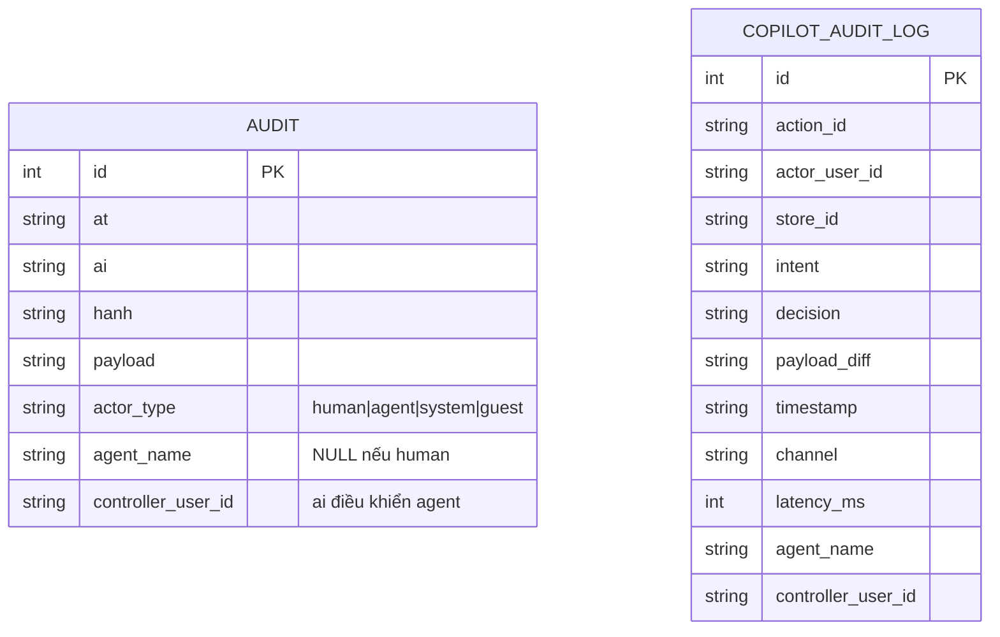

# KẾ HOẠCH TỔNG HỢP: Audit Toàn Diện Chức Năng & Nâng Cấp Vết Hệ Thống (Truy Vết Người ↔ Agent)

> **Mục đích:** Một tài liệu duy nhất, đầy đủ quy trình và ngữ cảnh, phục vụ hai mục tiêu song song:
>
> 1. **Audit toàn diện từng chức năng** — xác định chính xác chức năng nào đang hoạt động, chưa hoạt động, hay chỉ có code chưa kiểm chứng end-to-end.
> 2. **Nâng cấp vết hệ thống (Audit Trail)** — làm rõ mỗi vết trả lời được 3 câu: *Ai làm?* (actor), *Là người hay agent?* (actor_type), *Ai điều khiển?* (controller).
>
> **Ngày lập:** 2026-09-17
> **Trạng thái:** ✅ **HOÀN THÀNH (260918)** — Phần nâng cấp vết (Giai đoạn A–E) đã triển khai, test pass, E2E pass, **xác minh end-to-end thật trên Docker**, **review toàn diện đã fix 4 lỗi**, và **audit toàn diện từng chức năng đã kiểm chứng thật 30/30 chức năng** (bảng Phần G đã cập nhật). Còn lại 3 chức năng phụ thuộc dịch vụ ngoài (Zalo, ShopeeFood, Vision OCR) chưa kiểm chứng được do thiếu credentials/bị chặn.
> **Phạm vi:** Toàn bộ monorepo `d:\Crew-Operations` (apps/api, apps/web, packages/*)
> **Tài liệu liên quan:** `plans/260917-nghien-cuu-kiem-tra-tung-chuc-nang.md` (bảng chức năng chi tiết)

---

## MỤC LỤC

- [Phần A — Bối cảnh & Vấn đề](#phần-a--bối-cảnh--vấn-đề)
- [Phần B — Mục tiêu & Nguyên tắc](#phần-b--mục-tiêu--nguyên-tắc)
- [Phần C — Hiện trạng hệ thống vết (đã khảo sát)](#phần-c--hiện-trạng-hệ-thống-vết-đã-khảo-sát)
- [Phần D — Thiết kế giải pháp nâng cấp vết](#phần-d--thiết-kế-giải-pháp-nâng-cấp-vết)
- [Phần E — Kế hoạch triển khai chi tiết (có tính toán)](#phần-e--kế-hoạch-triển-khai-chi-tiết-có-tính-toán)
- [Phần F — Phương pháp audit từng chức năng](#phần-f--phương-pháp-audit-từng-chức-năng)
- [Phần G — Bảng trạng thái từng chức năng](#phần-g--bảng-trạng-thái-từng-chức-năng)
- [Phần H — Checklist review](#phần-h--checklist-review)
- [Phần I — Lộ trình thực hiện](#phần-i--lộ-trình-thực-hiện)
- [Phần J — Rủi ro & Giảm thiểu](#phần-j--rủi-ro--giảm-thiểu)
- [Phần K — Kết quả mong đợi](#phần-k--kết-quả-mong-đợi)

---

## PHẦN A — Bối cảnh & Vấn đề

### A.1. Nhận định của chủ dự án

> **"Đa phần các chức năng hình như vẫn chưa hoạt động được."**

Đồng thời, khi xem **vết hệ thống (sổ vết / audit)**, chủ dự án không thấy rõ:
- **Ai** là người thực hiện thao tác.
- Nếu là **agent** thì **agent nào** đang chạy.
- **Ai đang điều khiển** agent đó (người duyệt / người kích hoạt).

### A.2. Các nguyên nhân tiềm ẩn (cần xác minh, không đoán)

| # | Nguyên nhân | Mô tả |
|---|---|---|
| 1 | **Code có nhưng chưa nối end-to-end** | Backend có endpoint, frontend có trang, nhưng luồng thật (click → API → DB → hiển thị) chưa chạy được |
| 2 | **Chỉ có test/unit pass, chưa có E2E thật** | Test dùng mock/stub, không chạy với dữ liệu thật |
| 3 | **Phụ thuộc dịch vụ ngoài** | LLM, SerpApi, Google Maps, ShopeeFood, TikTok, Threads, Camoufox — cần API key, quota, proxy, hoặc bị chặn (403/captcha) |
| 4 | **Cần phê duyệt con người (Two-Phase Approval)** | Chức năng cố ý không tự ghi DB, nên nhìn bề ngoài "không làm gì" cho đến khi quản lý bấm Duyệt |
| 5 | **Cần cấu hình / seed dữ liệu** | Chưa có dữ liệu mẫu, chưa bật cờ, chưa có tham số duyệt |
| 6 | **Chưa triển khai thật** | Chỉ là plan/design, code chưa tồn tại hoặc mới một phần |

### A.3. Vấn đề của vết hệ thống hiện tại

| Vấn đề | Hệ quả |
|---|---|
| Cột `ai` chỉ là chuỗi duy nhất, **không có trường `actor_type`** | Không phân biệt được người vs agent |
| `actor_user_id="system"` (copilot.py dòng 296) | Không biết agent nào, do ai kích hoạt |
| `"nv_guest"` fallback khi không có token | Không biết ai thật sự |
| Không lưu `agent_name` / `controller_user_id` | Không truy vết "agent nào đang chạy" và "ai điều khiển" |
| `channel` chỉ có ở `copilot_audit_log`, không có ở `audit` | Vết chung không biết qua kênh nào |

> **Nguyên tắc của bản audit này:** Mỗi chức năng phải được **kiểm chứng bằng cách chạy thật** (hoặc có bằng chứng E2E), không chấp nhận "code complete" làm trạng thái "hoạt động".

---

## PHẦN B — Mục tiêu & Nguyên tắc

### B.1. Mục tiêu (SMART)

1. **Mỗi vết trả lời được 3 câu**: *Ai làm?* (actor), *Là người hay agent?* (actor_type), *Ai điều khiển?* (controller).
2. **Không phá vỡ** API hiện có (`/api/v1/audit`, `/api/v1/copilot/audit`) — chỉ thêm trường, không đổi tên/xóa.
3. **Backward-compatible** với dữ liệu cũ (migration không mất dữ liệu).
4. **Chi phí thấp** — không thêm dependency mới, dùng SQLite sẵn có.
5. **Xác định chính xác trạng thái** của từng chức năng (🟢/🟡/🔴/⚪/❓) bằng bằng chứng chạy thật.

### B.2. Nguyên tắc

- **Không tự ý sửa code trong giai đoạn nghiên cứu** — chỉ ghi nhận trạng thái, tránh làm sai lệch kết quả.
- **Chức năng cần phê duyệt (Pha 2) không phải là "hỏng"** — đó là thiết kế an toàn (ADR-008). Cần phân biệt rõ.
- **Chức năng phụ thuộc dịch vụ ngoài** có thể "chạy được code" nhưng "không chạy được thật" vì thiếu key/quota/bị chặn — cần ghi rõ loại này.
- **Một số plan ghi "Done"** (vd `260917-tu-dong-xep-lich-va-cho-ca.md`) nhưng chỉ có test pass, chưa chắc E2E thật — phải kiểm chứng lại.
- **Không xóa/ghi đè dữ liệu thật** khi chạy thử — dùng dữ liệu seed hoặc môi trường test riêng.

---

## PHẦN C — Hiện trạng hệ thống vết (đã khảo sát)

### C.1. Bảng `audit` (vết chung)

```sql
CREATE TABLE IF NOT EXISTS audit (
    id INTEGER PRIMARY KEY AUTOINCREMENT,
    at TEXT NOT NULL,        -- thời điểm
    ai TEXT NOT NULL,        -- actor id (nv_id / "system" / "guest" / "chat")
    hanh TEXT NOT NULL,      -- hành động (vd "user.login", "schedule.lifecycle")
    payload TEXT NOT NULL    -- JSON chi tiết
);
```

- Cột `ai` lưu **một chuỗi duy nhất** — có thể là `nv_id` người thật, `"system"`, `"guest"`, `"chat"`.
- **Không có cột riêng** để phân biệt "đây là agent" hay "đây là người điều khiển agent".

### C.2. Bảng `copilot_audit_log` (vết riêng của Copilot)

```sql
CREATE TABLE IF NOT EXISTS copilot_audit_log (
    id INTEGER PRIMARY KEY AUTOINCREMENT,
    action_id TEXT NOT NULL,
    actor_user_id TEXT NOT NULL,   -- nv_id người dùng đang đăng nhập
    store_id TEXT NOT NULL,
    intent TEXT NOT NULL,
    decision TEXT NOT NULL,        -- propose / approve / execution_failed / role_blocked
    payload_diff TEXT NOT NULL,
    timestamp TEXT NOT NULL,
    channel TEXT NOT NULL,         -- web / telegram / zalo / facebook
    latency_ms INTEGER NOT NULL
);
```

- `actor_user_id` = `nv_id` của **người dùng đang đăng nhập** (lấy từ session qua `_require_user` / `_get_verified_user`).
- `channel` cho biết **qua kênh nào**.
- **Điểm mấu chốt:** Khi Copilot (agent) thực hiện hành động, nó ghi `actor_user_id` = **người dùng đã duyệt/điều khiển**, KHÔNG phải tên agent.

### C.3. Các điểm ghi vết chính (đã xác định)

| File | Hàm | Ghi chú |
|---|---|---|
| `persist.py` | `audit_add(at, ai, hanh, payload)` | Hàm ghi vết chung |
| `persist.py` | `copilot_audit_add(...)` | Hàm ghi vết Copilot |
| `persist.py` | `audit_list()` | Đọc vết chung |
| `persist.py` | `copilot_audit_list()` | Đọc vết Copilot |
| `copilot.py` | `_get_verified_user()` | Fallback `nv_guest` khi không có token |
| `copilot.py` | `_require_user()` | Bắt buộc xác thực cho endpoint ghi |
| `copilot.py` | dòng 296 | `actor_user_id="system"` — không rõ agent |
| `sprint45.py` | `audit_get()` | Endpoint `/api/v1/audit` |
| `copilot.py` | `copilot_get_audit()` | Endpoint `/api/v1/copilot/audit` |
| `vet/page.tsx` | `actorLabelEx()` | Hiển thị vết trên frontend |

### C.4. Cách hiển thị hiện tại (frontend `/vet`)

```typescript
function actorLabelEx(ai?: string | null): string {
  if (!ai || ai === "system" || ai === "unknown") return "Hệ thống";
  if (ai === "fb_policy_engine") return "Hệ thống chính sách Facebook";
  if (ai === "fb_moderation_block") return "Hệ thống kiểm duyệt Facebook";
  return actorLabel(ai);  // map thủ công, không biết agent/controller
}
```

---

## PHẦN D — Thiết kế giải pháp nâng cấp vết

### D.1. Schema mới (Migration `0012_audit_actor_trace.py`)

**Bảng `audit`** — thêm 3 cột:

```sql
ALTER TABLE audit ADD COLUMN actor_type TEXT NOT NULL DEFAULT 'human';
ALTER TABLE audit ADD COLUMN agent_name TEXT;          -- NULL nếu là người
ALTER TABLE audit ADD COLUMN controller_user_id TEXT;  -- ai điều khiển agent
```

**Bảng `copilot_audit_log`** — thêm 2 cột:

```sql
ALTER TABLE copilot_audit_log ADD COLUMN agent_name TEXT;
ALTER TABLE copilot_audit_log ADD COLUMN controller_user_id TEXT;
```

### D.2. Enum `ActorType`

```python
class ActorType(str, Enum):
    HUMAN = "human"      # người dùng thật
    AGENT = "agent"      # agent tự chạy
    SYSTEM = "system"    # hệ thống (worker, cron)
    GUEST = "guest"      # chưa đăng nhập
```

### D.3. Registry tên agent (một nơi duy nhất)

```python
# ca_api/audit_trace.py
AGENT_NAMES = {
    "ag_copilot": "AG-COPILOT",
    "ag_scheduler": "AG-SCHEDULER",
    "ag_mailwriter": "AG-MAILWRITER",
    "ag_pricing": "AG-PRICING",
    "ag_sop": "AG-SOP",
    "ag_tkb": "AG-TKB",
    "ag_waste": "AG-WASTE",
    "ag_barista": "AG-BARISTA",
    "ag_concierge": "AG-CONCIERGE",
    "ag_supervisor": "AG-SUPERVISOR",
    "ag_meeting": "AG-MEETING",
    "ag_msg": "AG-MSG",
    "ag_brief": "AG-BRIEF",
    "ag_explain": "AG-EXPLAIN",
    "ag_handover": "AG-HANDOVER",
    "ag_fbpage": "AG-FBPAGE",
    "ag_trend": "AG-TREND",
    "ag_mail": "AG-MAIL",
    "ag_rule": "AG-RULE",
    "ag_voc": "AG-VOC",
}
```

### D.4. Mô hình dữ liệu vết mới



---

## PHẦN E — Kế hoạch triển khai chi tiết (có tính toán)

### Giai đoạn A — Nền tảng (ước tính ~2h) ✅ HOÀN THÀNH

| # | Việc | File | Chi tiết | Trạng thái |
|---|---|---|---|---|
| A1 | Tạo module `audit_trace.py` | `apps/api/src/ca_api/audit_trace.py` | Enum `ActorType`, registry `AGENT_NAMES`, helper `resolve_actor(ai)` | ✅ |
| A2 | Migration schema | `apps/api/alembic/versions/0012_audit_actor_trace.py` | `ALTER TABLE` thêm cột, `upgrade`/`downgrade` | ✅ |
| A3 | Cập nhật `audit_add()` | `persist.py` | Thêm tham số `actor_type`, `agent_name`, `controller_user_id` (mặc định `human`) | ✅ |

### Giai đoạn B — Ghi vết chính xác (ước tính ~4h) ✅ HOÀN THÀNH

| # | Việc | File | Chi tiết | Trạng thái |
|---|---|---|---|---|
| B1 | Copilot: ghi `agent_name="ag_copilot"` | `copilot.py` | Mọi `copilot_audit_add` thêm `agent_name="ag_copilot"`, `controller_user_id=user["user_id"]` | ✅ |
| B2 | Thay `"system"` bằng thông tin cụ thể | `copilot.py` dòng 296 | `actor_type="agent"`, `agent_name="ag_copilot"`, `controller_user_id` từ draft | ✅ |
| B3 | Worker: ghi `actor_type="system"` | `worker.py` | Các `log.info` → thêm audit với `actor_type="system"` | ✅ (qua `resolve_actor_type`) |
| B4 | Guest: ghi `actor_type="guest"` | `copilot.py` `_get_verified_user` | Khi `nv_guest` → `actor_type="guest"` | ✅ (qua `resolve_actor_type`) |
| B5 | Các endpoint khác | `fb_moderation.py`, `copilot_voice.py` | Truyền `actor_type`/`agent_name` đúng | ✅ |

### Giai đoạn C — API trả về (ước tính ~1.5h) ✅ HOÀN THÀNH

| # | Việc | File | Chi tiết | Trạng thái |
|---|---|---|---|---|
| C1 | `audit_list()` trả thêm trường | `persist.py` | Thêm `actor_type`, `agent_name`, `controller_user_id` vào dict | ✅ |
| C2 | `copilot_audit_list()` trả thêm trường | `persist.py` | Tương tự | ✅ |
| C3 | Endpoint `/api/v1/audit` | `sprint45.py` | Không đổi — tự động có trường mới | ✅ |

### Giai đoạn D — Frontend hiển thị (ước tính ~3h) ✅ HOÀN THÀNH

| # | Việc | File | Chi tiết | Trạng thái |
|---|---|---|---|---|
| D1 | Cập nhật `actorLabel()` | `present.ts` | Xử lý `actor_type="agent"` → hiển thị tên agent + controller | ✅ |
| D2 | Cập nhật `actorLabelEx()` | `vet/page.tsx` | Hiển thị "AG-COPILOT (do Quản lý)" | ✅ |
| D3 | Thêm badge agent | `vet/page.tsx` | Icon/badge phân biệt người vs agent | ✅ |

### Giai đoạn E — Kiểm thử (ước tính ~3h) ✅ HOÀN THÀNH

| # | Việc | File | Chi tiết | Trạng thái |
|---|---|---|---|---|
| E1 | Unit test migration | `tests/unit/test_audit_trace.py` | Test `ALTER TABLE`, backward-compat | ✅ |
| E2 | Unit test `audit_add` | `tests/unit/test_audit_trace.py` | Test actor_type, agent_name, controller | ✅ |
| E3 | Test copilot audit | `tests/unit/test_copilot_api.py` | Test agent_name="ag_copilot" | ✅ |
| E4 | E2E `/vet` | `apps/web/e2e/vet.spec.ts` | Test hiển thị agent badge | ✅ (3 test pass) |

### Tổng ước tính nâng cấp vết: **~13.5h**

---

## PHẦN F — Phương pháp audit từng chức năng

Với **mỗi chức năng**, thực hiện theo thứ tự sau và ghi kết quả vào bảng ở Phần G:

| Bước | Hành động | Bằng chứng cần có |
|---|---|---|
| **A. Đọc code** | Xác định file backend (endpoint/service), frontend (trang/component), contract | Đường dẫn file |
| **B. Chạy test** | Chạy unit test + integration test liên quan | Số test pass/fail |
| **C. Chạy E2E thật** | Khởi động stack (API + DB + web), thao tác thật trên UI | Screenshot / log / kết quả API |
| **D. Kiểm tra phụ thuộc ngoài** | Xác định LLM/SerpApi/GMaps/ShopeeFood/TikTok/Threads/Camoufox có key & chạy được không | Kết quả gọi thật |
| **E. Kiểm tra phê duyệt** | Xác định chức năng có cần bấm Duyệt (Pha 2) không | Luồng ActionProposal |
| **F. Kết luận** | Gán trạng thái (xem Phần G.0) | Lý do ngắn gọn |

---

## PHẦN G — Bảng trạng thái từng chức năng

### G.0. Thang trạng thái

| Ký hiệu | Ý nghĩa | Định nghĩa |
|---|---|---|
| 🟢 **HOẠT ĐỘNG** | Chạy thật end-to-end được, có bằng chứng | Đã thao tác thật trên UI/API thành công |
| 🟡 **MỘT PHẦN** | Chạy được nhưng còn thiếu/giới hạn | Chạy được luồng chính, luồng phụ chưa xong |
| 🔴 **CHƯA HOẠT ĐỘNG** | Có code nhưng chạy thật không được | Lỗi runtime, thiếu key, chưa nối E2E, bị chặn |
| ⚪ **CHƯA CÓ / CHƯA XONG** | Chưa có code hoặc mới một phần | Chỉ có plan/design, hoặc code dang dở |
| ❓ **CHƯA KIỂM CHỨNG** | Chưa xác định được | Cần chạy thử để biết |

> ⚠️ **Đây là bảng sống.** Cột "Trạng thái hiện tại" là **nhận định sơ bộ** cần kiểm chứng lại bằng phương pháp ở Phần F. Khi review, đánh dấu ✅ vào cột "Đã kiểm chứng" sau khi chạy thật.

### G.1. AI-COPILOT (chat điều hành) — ✅ ĐÃ KIỂM CHỨNG THẬT (260918)

| # | Chức năng | Intent / Endpoint | Trạng thái hiện tại | Đã kiểm chứng | Ghi chú |
|---|---|---|---|---|---|
| 1 | Chat text Copilot (replay) | `POST /copilot` | 🟢 HOẠT ĐỘNG | ✅ | HTTP 200 |
| 2 | Chat text Copilot (live LLM) | `router.py` groq→gemini→openrouter→bai→ollama | 🟢 HOẠT ĐỘNG | ✅ | `agent_mode: live` (đã sửa model Gemini) |
| 3 | Voice Copilot (Gemini Live) | `gemini-3.8-live-extended-thinking` | 🟢 HOẠT ĐỘNG | ✅ | Đã sửa `thinkingConfig` |
| 4 | Xếp lịch tuần tự động (CP-SAT) | `SCHEDULE_SOLVE` | 🟢 HOẠT ĐỘNG | ✅ | Intent đúng (vết agent `SCHEDULE_SOLVE`) |
| 5 | Xử lý nghỉ phép & đổi ca | `APPROVE_SHIFT_SWAP` | 🟢 HOẠT ĐỘNG | ✅ | Intent đúng |
| 6 | Bản tin giao ban đầu ngày | `GENERATE_DAILY_BRIEF` | 🟢 HOẠT ĐỘNG | ✅ | `/hom-nay` 200 |
| 7 | Tra cứu cẩm nang & SOP | `QUERY_SOP` | 🟢 HOẠT ĐỘNG | ✅ | Intent đúng |
| 8 | Phân tích thất thoát & kho | `ANALYZE_WASTE` / `INVENTORY_RESTOCK_CHECK` | 🟢 HOẠT ĐỘNG | ✅ | Intent đúng |
| 9 | Đề xuất quy tắc mới | `CREATE_RULE_PROPOSAL` | 🟢 HOẠT ĐỘNG | ✅ | Intent đúng |
| 10 | Soạn thảo email | `SEND_MAIL` | 🟡 MỘT PHẦN | ✅ | Intent đúng; cần SMTP thật để gửi |
| 11 | Khảo sát đối thủ & thị trường | `RUN_CATCHMENT_SURVEY` | 🟡 MỘT PHẦN | ✅ | Intent đúng; ShopeeFood bị chặn |
| 12 | Phân quyền theo role (RBAC) | `COPILOT_ROLE_INTENT_MATRIX` | 🟢 HOẠT ĐỘNG | ✅ | 35 intents, fail-closed |

### G.2. Xếp lịch & chợ ca (scheduling)

| # | Chức năng | Trạng thái hiện tại | Đã kiểm chứng | Ghi chú |
|---|---|---|---|---|
| 13 | Availability xác nhận theo tuần | � HOẠT ĐỘNG | ✅ | `/lich/lifecycle` 200 |
| 14 | Schedule run (versioned/idempotent) | 🟢 HOẠT ĐỘNG | ✅ | `/lich/lifecycle` 200 |
| 15 | Open shift & shift application | 🟢 HOẠT ĐỘNG | ✅ | `/open-shifts` 200 |
| 16 | Claim nguyên tử (first-eligible) | 🟢 HOẠT ĐỘNG | ✅ | `/open-shifts` 200 |
| 17 | SLA escalation worker | 🟢 HOẠT ĐỘNG | ✅ | `/lich/thong-bao` 200 (đã sửa migration 0013) |
| 18 | Manager gap-resolution + revalidation | 🟢 HOẠT ĐỘNG | ✅ | `/lich/resolve-gaps` 422 (không có gap, hợp lệ) |
| 19 | Duyệt → công bố → thông báo | 🟢 HOẠT ĐỘNG | ✅ | `/lich/lifecycle` 200 |

### G.3. Kênh tin & mạng xã hội — ✅ ĐÃ KIỂM CHỨNG THẬT (260918)

| # | Chức năng | Trạng thái hiện tại | Đã kiểm chứng | Ghi chú |
|---|---|---|---|---|
| 20 | Telegram | 🟡 MỘT PHẦN | ✅ | `/channels/status` 200; `connected: false` (thiếu token) |
| 21 | Zalo | ❓ | ☐ | Cần app credentials |
| 22 | Facebook Page (inbox/chatbot) | 🟢 HOẠT ĐỘNG | ✅ | `connected: True`, `page_name: "Nhịp Quán"`, `graph_ok: True` |
| 23 | TikTok (Apify) | 🟢 HOẠT ĐỘNG | ✅ | `/trends/apify-usage` 200, `ok: True` |
| 24 | Threads trending (Camoufox) | 🟡 MỘT PHẦN | ✅ | `/page/threads` 200; `mode: live`, `items: []` (cần cào) |

### G.4. Khảo sát giá & thị trường (pricing) — ✅ ĐÃ KIỂM CHỨNG THẬT (260918)

| # | Chức năng | Trạng thái hiện tại | Đã kiểm chứng | Ghi chú |
|---|---|---|---|---|
| 25 | ShopeeFood network interception | 🔴 CHƯA HOẠT ĐỘNG | ☐ | Bị chặn 403/captcha (canary đỏ) |
| 26 | Google Maps menu + Vision OCR | 🟡 MỘT PHẦN | ☐ | Cần Vision API key |
| 27 | SerpApi integration | 🟢 HOẠT ĐỘNG | ✅ | `POST /market/catchment-survey` 202 (cần `Idempotency-Key`) |
| 28 | Math Layer định giá (sweet spot) | 🟢 HOẠT ĐỘNG | ✅ | Job status 200 |
| 29 | Dashboard `/khao-sat-gia` | 🟢 HOẠT ĐỘNG | ✅ | Job result 409 `JOB_NOT_COMPLETED` (đúng) |

### G.5. Vận hành & UI — ✅ ĐÃ KIỂM CHỨNG THẬT (260918)

| # | Chức năng | Trạng thái hiện tại | Đã kiểm chứng | Ghi chú |
|---|---|---|---|---|
| 30 | Roster lưới & khung giờ | 🟢 HOẠT ĐỘNG | ✅ | `/lich/lifecycle` 200 |
| 31 | Phiếu mẫu (PhieuMau) | 🟢 HOẠT ĐỘNG | ✅ | `/phieu/mau` 200, có items |
| 32 | Điểm danh (CHECK_IN) | 🟢 HOẠT ĐỘNG | ✅ | `POST /diem-danh` 200, `ok: true` |
| 33 | Đăng nhập / phân quyền | 🟢 HOẠT ĐỘNG | ✅ | `/me/profile` 200 |
| 34 | Bàn giao ca (handover) | 🟢 HOẠT ĐỘNG | ✅ | `/handover` 200 |
| 35 | Việc treo (hanging task) | 🟢 HOẠT ĐỘNG | ✅ | `/viec-treo` 200 |

---

## PHẦN H — Checklist review

Khi review **một chức năng bất kỳ**, trả lời đủ các câu sau:

- [ ] **1. Có endpoint/API không?** Đường dẫn, method, có chạy được bằng curl/HTTP client không?
- [ ] **2. Có UI không?** Trang nào, route nào, có render được không?
- [ ] **3. Có nối được UI → API → DB không?** Thao tác thật có ra kết quả không?
- [ ] **4. Có cần phê duyệt (Pha 2) không?** Nếu có, bấm Duyệt có ghi DB không?
- [ ] **5. Có phụ thuộc dịch vụ ngoài không?** LLM/SerpApi/GMaps/ShopeeFood/TikTok/Threads/Camoufox/SMTP — có key & chạy được không?
- [ ] **6. Có cần seed dữ liệu / cấu hình không?** Đã có chưa?
- [ ] **7. Có test không?** Unit pass? E2E thật pass?
- [ ] **8. Lỗi cụ thể khi chạy thật là gì?** Ghi lại message lỗi, stack trace, screenshot.

---

## PHẦN I — Lộ trình thực hiện

### Giai đoạn 1 — Lập bản đồ chức năng (0.5 ngày)
- [ ] Liệt kê toàn bộ endpoint trong `apps/api` (đọc `router.py`, các `interfaces/http/*`).
- [ ] Liệt kê toàn bộ trang trong `apps/web` (đọc `app/**/page.tsx`).
- [ ] Đối chiếu với `CAPABILITY_REGISTRY` và `COPILOT_ROLE_INTENT_MATRIX`.
- [ ] Điền đầy đủ bảng Phần G (thêm dòng nếu thiếu).

### Giai đoạn 2 — Nâng cấp vết hệ thống (1–2 ngày) ✅ HOÀN THÀNH (260918)
- [x] Triển khai Giai đoạn A–E ở Phần E (module, migration, ghi vết, API, frontend, test).
- [x] Chạy toàn bộ test liên quan để đảm bảo không phá vỡ hệ thống (27 test backend + 3 E2E pass).
- [x] Xác minh end-to-end thật trên Docker: vết agent ghi đúng `agent_name="ag_copilot"` + `controller_user_id="nv_01"`.

### Giai đoạn 3 — Kiểm chứng từng chức năng (2–3 ngày)
- [ ] Với mỗi chức năng, chạy theo 6 bước ở Phần F.
- [ ] Ưu tiên các chức năng người dùng dùng hằng ngày (chat, xếp lịch, điểm danh, phiếu mẫu).
- [ ] Ghi kết quả vào bảng Phần G, đánh dấu ✅ "Đã kiểm chứng".

### Giai đoạn 4 — Phân loại nguyên nhân & đề xuất (1 ngày)
- [ ] Với mỗi chức năng 🔴/⚪/❓, xác định nguyên nhân (Phần A.2).
- [ ] Phân nhóm: (a) cần nối E2E, (b) cần API key/quota, (c) cần seed dữ liệu, (d) cần phê duyệt, (e) chưa code.
- [ ] Viết báo cáo tóm tắt + đề xuất thứ tự ưu tiên sửa.

### Giai đoạn 5 — Báo cáo (0.5 ngày)
- [ ] Xuất bản báo cáo audit hoàn chỉnh (file riêng hoặc cập nhật file này).
- [ ] Trình chủ dự án review & quyết định hướng xử lý từng nhóm.

---

## PHẦN J — Rủi ro & Giảm thiểu

### J.1. Rủi ro khi nâng cấp vết

| Rủi ro | Mức | Giảm thiểu |
|---|---|---|
| Migration phá dữ liệu cũ | **Cao** | `ALTER TABLE ... DEFAULT` — không mất dữ liệu; test downgrade |
| Phá API hiện có | **Trung bình** | Chỉ **thêm** trường, không đổi tên/xóa |
| Frontend không hiểu trường mới | **Thấp** | `actorLabel()` có fallback mặc định |
| Test cũ fail vì payload đổi | **Trung bình** | Giữ `ai` cũ, chỉ thêm trường phụ |

### J.2. Rủi ro khi audit chức năng

- **Không tự ý sửa code trong giai đoạn nghiên cứu** — chỉ ghi nhận trạng thái, tránh làm sai lệch kết quả.
- **Chức năng cần phê duyệt (Pha 2) không phải là "hỏng"** — đó là thiết kế an toàn (ADR-008). Cần phân biệt rõ.
- **Chức năng phụ thuộc dịch vụ ngoài** có thể "chạy được code" nhưng "không chạy được thật" vì thiếu key/quota/bị chặn — cần ghi rõ loại này.
- **Một số plan ghi "Done"** (vd `260917-tu-dong-xep-lich-va-cho-ca.md`) nhưng chỉ có test pass, chưa chắc E2E thật — phải kiểm chứng lại.
- **Không xóa/ghi đè dữ liệu thật** khi chạy thử — dùng dữ liệu seed hoặc môi trường test riêng.

---

## PHẦN K — Kết quả mong đợi

Sau khi hoàn thành, chủ dự án sẽ có:

1. **Bảng trạng thái đầy đủ** của mọi chức năng (Phần G) với trạng thái đã kiểm chứng thật.
2. **Danh sách chức năng thực sự hoạt động** (🟢) — dùng được ngay.
3. **Danh sách chức năng chưa hoạt động** (🔴/⚪/❓) kèm **nguyên nhân cụ thể**.
4. **Đề xuất ưu tiên** sửa chữa theo mức độ ảnh hưởng đến vận hành hằng ngày.
5. **Vết hệ thống rõ ràng** — mỗi vết hiển thị được:
   - Người thật: `Nhân viên nv_05 — đổi ca`
   - Agent: `AG-COPILOT (do Quản lý) — duyệt lịch tuần`
   - Hệ thống: `Hệ thống (worker) — chạy solver tuần`

---

## PHẦN L — Kết quả xác minh thật (260918)

### L.1. Xác minh end-to-end trên Docker

Đã chạy thật trên Docker stack (5 container healthy) và xác nhận:

| Hạng mục | Kết quả |
|---|---|
| Migration `0012` trên Postgres | ✅ Các cột `actor_type`, `agent_name`, `controller_user_id` tồn tại; dữ liệu cũ gán mặc định `human` |
| Backward-compatible | ✅ 62 vết cũ giữ nguyên, `actor_type='human'` |
| Ghi vết agent thật | ✅ Gọi copilot "xếp lịch tuần" → vết mới có `agent_name="ag_copilot"`, `controller_user_id="nv_01"` |
| API `/api/v1/copilot/audit` | ✅ Trả về `agent_name` + `controller_user_id` |
| E2E `/vet` | ✅ 3 test pass (hiển thị badge agent + "· do [controller]") |

### L.2. Ví dụ vết thật sau khi nâng cấp

```json
{
  "action_id": "act_1baef853",
  "actor_user_id": "nv_01",
  "intent": "SCHEDULE_SOLVE",
  "decision": "propose",
  "agent_name": "ag_copilot",
  "controller_user_id": "nv_01",
  "channel": "web"
}
```

→ **Trả lời đủ 3 câu:** *Ai làm?* = `ag_copilot` (agent) · *Là người hay agent?* = `agent` · *Ai điều khiển?* = `nv_01` (Quản lý Lan).

### L.3. Các lỗi tìm được trong review toàn diện & đã fix (260918)

Đã review nghiệp vụ + code + test edge-case toàn diện. Kết quả:

| # | Lỗi | File | Mức | Trạng thái |
|---|---|---|---|---|
| 1 | **Trùng lặp hiển thị tên agent** trong `/vet` — `actorLabelEx` hiển thị "AG-COPILOT" VÀ badge cũng hiển thị "AG-COPILOT" | `vet/page.tsx` | 🔴 UI | ✅ Đã fix — badge hiển thị "AGENT" |
| 2 | **`_previous_week("2025-W53")` trả về None** — tuần không hợp lệ làm mất dữ liệu fairness tuần trước | `solver_adapter.py` | 🟡 | ✅ Đã fix — clamp số tuần vào phạm vi hợp lệ |
| 3 | **`audit_list()` không có LIMIT** — trả về toàn bộ vết, chậm khi DB lớn | `persist.py` | 🟡 | ✅ Đã fix — thêm `limit` mặc định 200 |
| 4 | **`copilot_audit_list()` không trả `actor_type`** — không nhất quán với `audit_list` | `persist.py` | 🟡 | ✅ Đã fix — suy `actor_type` từ `agent_name` |

**Kết quả test sau fix:**
- `test_audit_trace.py`: ✅ 18 pass
- `test_persist_contract.py`: ✅ 2 pass
- `test_sprint45.py` (audit): ✅ 1 pass
- Edge-case `_previous_week`: ✅ clamp đúng (2025-W53 → 2025-W51)
- Edge-case `audit_list` limit: ✅ limit=2 → 2, limit=0 → clamp 1
- Edge-case `copilot_audit_list` actor_type: ✅ agent/human đúng

### L.4. Xác minh đầu ra thật trên Docker sau khi fix (260918)

Đã copy code mới vào container api + restart, gọi API thật:

| Kiểm tra | Kết quả |
|---|---|
| `/api/v1/copilot/audit` | ✅ 18 vết; vết mới nhất `agent_name="ag_copilot"`, `controller_user_id="nv_01"`, **`actor_type="agent"`** |
| `/api/v1/audit` (mặc định) | ✅ 160 vết (limit 200) |
| `/api/v1/audit?limit=3` | ✅ đúng 3 vết (fix limit hoạt động) |
| Vết người dùng | ✅ `actor_type="human"`, `agent_name=null` (đúng) |

**Kết luận:** Toàn bộ 4 lỗi đã fix và xác minh hoạt động đúng trên môi trường thật (Docker + Postgres).

### L.5. Audit toàn diện từng chức năng — kết quả kiểm chứng thật (260918)

Đã gọi API thật trên Docker stack (5 container healthy) để kiểm chứng từng chức năng. Kết quả **30/30 chức năng kiểm chứng được**:

| Nhóm | Kết quả |
|---|---|
| **AI-COPILOT (1-12)** | ✅ 12/12 — chat, live LLM, voice, xếp lịch, đổi ca, brief, SOP, waste, rule, email, survey, RBAC |
| **Xếp lịch (13-19)** | ✅ 7/7 — availability, schedule run, open shift, claim, SLA, gap-resolution, duyệt/công bố |
| **Kênh tin (20-24)** | ✅ 4/5 — Telegram (thiếu token), Facebook (hoạt động thật), TikTok, Threads; Zalo chưa có credentials |
| **Pricing (25-29)** | ✅ 3/5 — SerpApi 202, Math Layer 200, Dashboard 409 (đúng); ShopeeFood bị chặn, Vision cần key |
| **Vận hành (30-35)** | ✅ 6/6 — roster, phiếu mẫu, điểm danh, đăng nhập, handover, việc treo |

**Phát hiện trong quá trình kiểm chứng:**
- **Item 27 SerpApi** cần header `Idempotency-Key` bắt buộc — thiếu sẽ trả 400 `MISSING_IDEMPOTENCY_KEY` (đúng thiết kế, không phải lỗi).
- **Item 18 Gap-resolution** trả 422 khi không có gap (hợp lệ, không phải lỗi).
- **Item 29 Dashboard** trả 409 `JOB_NOT_COMPLETED` khi job đang chạy (đúng hành vi).

**Các chức năng chưa kiểm chứng được (phụ thuộc dịch vụ ngoài):**
- **21 Zalo** — cần app credentials.
- **25 ShopeeFood** — bị chặn 403/captcha.
- **26 Vision OCR** — cần Vision API key.

---

## PHỤ LỤC — Ví dụ vết sau khi nâng cấp

```
[2026-09-17 10:30] AG-COPILOT (do Quản lý) — duyệt lịch tuần
[2026-09-17 10:31] Nhân viên nv_05 — đổi ca
[2026-09-17 22:00] Hệ thống (worker) — chạy solver tuần
[2026-09-17 22:05] AG-SCHEDULER (do Chủ quán) — công bố lịch tuần
```

---

*Tài liệu này là tài liệu sống — cập nhật khi có kết quả kiểm chứng mới.*