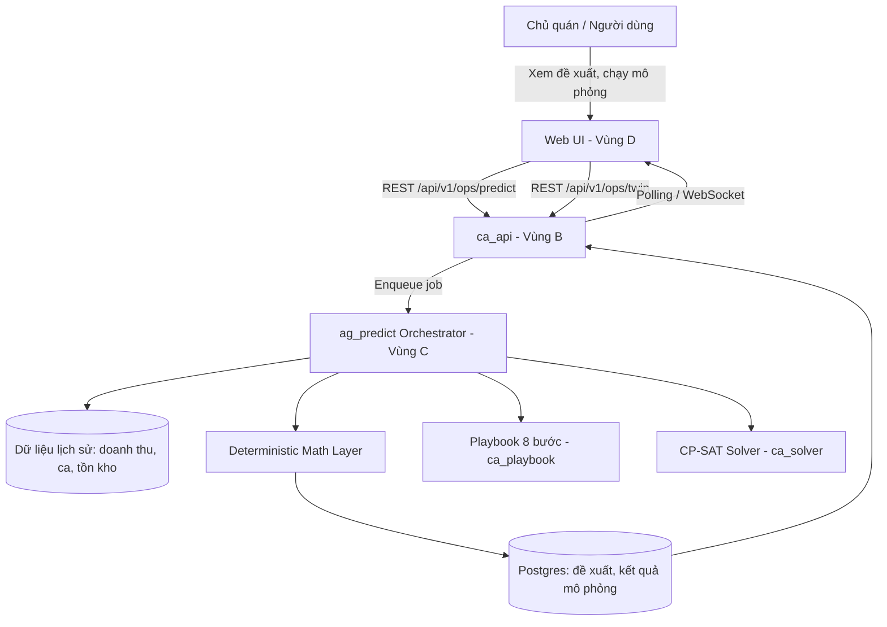
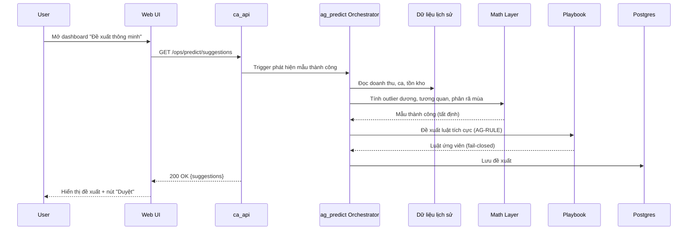
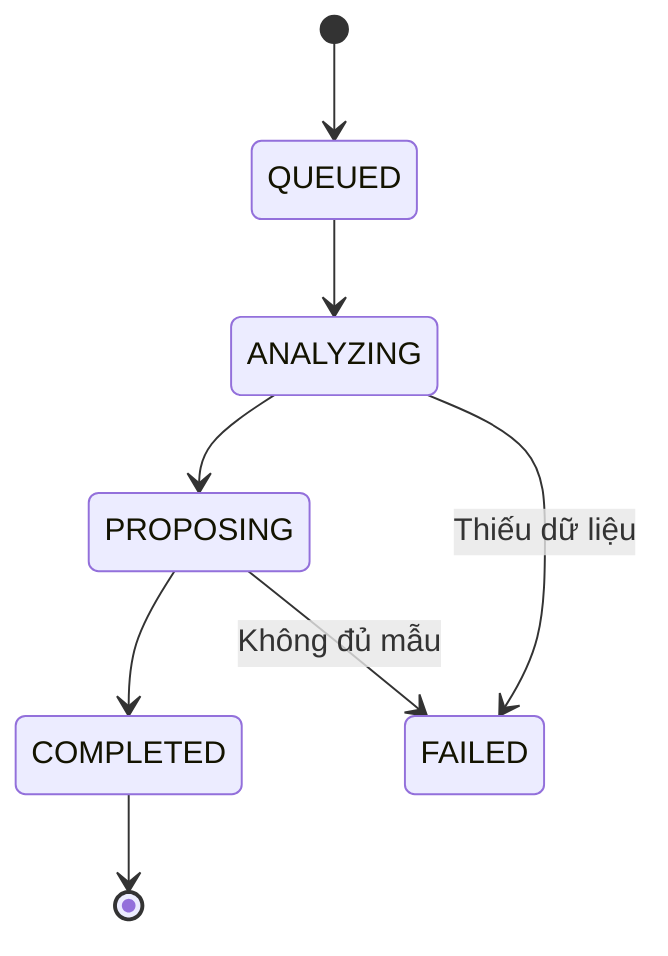

# Kế hoạch Kỹ thuật — NHỊP QUÁN OS: Bộ não doanh nghiệp tự học từ thành công & thử nghiệm an toàn

## (Predictive Playbook + Digital Twin)

> **Mã kế hoạch:** `260918-nhip-quan-os-brain`
> **Phiên bản:** v1.0
> **Ngày:** 2026-09-18
> **Vai trò soát xét:** Senior Software Engineer (kiến trúc/kỹ thuật) + Chuyên gia nghiệp vụ F&B (chuẩn hoá logic tự tối ưu hoá)
>
> **Tuân thủ ADR:**
> - **ADR-002** — Điều phối tất định: mọi con số (doanh thu dự báo, mức tăng nhân sự, độ co giãn giá) phải là hàm toán học thuần tuý, có thể unit-test, LLM **không** được phép tự sinh con số.
> - **ADR-003** — Contracts-first: schema/hợp đồng dữ liệu phải merge trước khi có bất kỳ PR triển khai nào.
> - **ADR-008** — Agent chỉ trích xuất và đề xuất; con người (chủ quán) là người quyết định cuối cùng — hệ thống **không** tự động áp dụng thay đổi.
>
> **Vùng sở hữu:** C (`ag_playbook`, `ag_rule`, `ag_predict`, `ag_twin`) · B (`ca_api`) · D (Web UI)

> ⚠️ **Quy ước đọc tài liệu:** Các mục đánh dấu **[GIỮ NGUYÊN]** là quyết định nghiệp vụ gốc, không thay đổi. Các mục đánh dấu **[MỞ RỘNG]** là chi tiết hoá thêm từ ý tưởng gốc. Các mục đánh dấu **[ĐỀ XUẤT MỚI]** là bổ sung kỹ thuật từ bản soát xét này (cần chủ dự án duyệt trước khi coi là quyết định chính thức).

---

## MỤC LỤC

1. [Tóm tắt điều hành](#0-tóm-tắt-điều-hành)
2. [Bối cảnh nghiệp vụ F&B](#1-bối-cảnh-nghiệp-vụ-fb)
3. [Kiến trúc giải pháp](#2-kiến-trúc-giải-pháp)
4. [Hợp đồng dữ liệu (Contracts-First)](#3-hợp-đồng-dữ-liệu-contracts-first)
5. [Tầng thuật toán định lượng (Deterministic Math Layer)](#4-tầng-thuật-toán-định-lượng-deterministic-math-layer)
6. [Thiết kế API & Backend](#5-thiết-kế-api--backend)
7. [UI/UX Web Dashboard](#6-uiux-web-dashboard)
8. [Chiến lược kiểm thử (QA Strategy)](#7-chiến-lược-kiểm-thử-qa-strategy)
9. [Ràng buộc pháp lý & đạo đức dữ liệu](#8-ràng-buộc-pháp-lý--đạo-đức-dữ-liệu)
10. [Vận hành & Giám sát (Observability)](#9-vận-hành--giám-sát-observability)
11. [Roadmap triển khai theo giai đoạn](#10-roadmap-triển-khai-theo-giai-đoạn)
12. [Ma trận rủi ro & kiểm soát](#11-ma-trận-rủi-ro--kiểm-soát)
13. [Chỉ số thành công (KPI)](#12-chỉ-số-thành-công-kpi)
14. [Phụ lục](#13-phụ-lục)

---

## 0. TÓM TẮT ĐIỀU HÀNH

**Vấn đề:** Hệ thống NHỊP QUÁN hiện tại chỉ **học từ sai lầm** — playbook chỉ kích hoạt khi lỗi lặp lại ≥3 lần (`tim_mau` trong `vong_doi.py` chỉ nhóm các `loai_quyet_dinh` có `n >= 3`). Hệ thống **không bao giờ học từ thành công**, và chủ quán **không có cách thử nghiệm an toàn** trước khi thay đổi vận hành (tăng giá, thêm nhân sự, đổi giờ mở cửa).

**Giải pháp:** Hai phân hệ bổ sung, tận dụng tối đa kiến trúc deterministic core + playbook + solver hiện có:

1. **Predictive Playbook (AG-PREDICT)** — Hệ thống **tự phát hiện mẫu thành công** (ca doanh thu cao, món bán chạy, giờ cao điểm) và **tự đề xuất luật tích cực** "làm nhiều hơn điều đang hiệu quả" — đi qua vòng đời playbook 8 bước hiện có (kiểm chứng → tập sự → chốt → hiệu lực → áp dụng).

2. **Digital Twin (AG-TWIN)** — Bản sao số của quán chạy bằng **CP-SAT solver** (thứ đã có), cho phép chủ quán **thử nghiệm "nếu... thì..."** an toàn trước khi áp dụng thật: tăng giá, thêm nhân sự, đổi giờ mở cửa.

**Phạm vi (in-scope):**

- Phát hiện mẫu thành công từ dữ liệu lịch sử (doanh thu, ca, tồn kho, feedback).
- Đề xuất luật tích cực qua vòng đời playbook (fail-closed, người duyệt).
- Mô phỏng "nếu... thì..." bằng solver CP-SAT.
- Dashboard hiển thị đề xuất + kết quả mô phỏng.

**Ngoài phạm vi (out-of-scope) ở v1.0:**

- Tự động áp dụng thay đổi (tăng giá, thêm nhân sự) — luôn cần người duyệt.
- Dự đoán doanh thu realtime liên tục (ban đầu chạy theo lịch — nightly).
- Multi-quán / franchise (để dành Phase sau).

**Thay đổi lớn so với hiện trạng:** bổ sung mô hình phát hiện mẫu thành công (tất định), mở rộng playbook để nhận luật tích cực, và mô phỏng digital twin bằng solver.

---

## 1. BỐI CẢNH NGHIỆP VỤ F&B

### 1.1. Hạn chế của "học từ sai lầm" **[GIỮ NGUYÊN hiện trạng]**

Playbook hiện tại (`packages/playbook/src/ca_playbook/vong_doi.py`) chỉ kích hoạt khi:

```python
def tim_mau(sua):
    for loai, items in buckets.items():
        if len(items) >= 3:  # ← chỉ khi lỗi lặp lại ≥3 lần
            out.append({...})
```

**Hệ quả:** Hệ thống chỉ biết "điều gì sai" (và sửa), nhưng **không bao giờ biết "điều gì đúng"** (và nhân rộng). Một quản lý giỏi không chỉ sửa lỗi — họ **nhận ra ca nào bán chạy, món nào được yêu thích, giờ nào đông khách** và **làm nhiều hơn điều đó**.

### 1.2. Nhu cầu "thử nghiệm an toàn" **[ĐỀ XUẤT MỚI]**

Chủ quán F&B thường đối mặt các câu hỏi rủi ro cao:

| Câu hỏi | Rủi ro nếu thử thật |
|---|---|
| "Tăng giá cà phê sữa đá từ 25k → 30k?" | Mất khách nếu sai |
| "Thêm 1 nhân viên ca tối T6, T7?" | Tăng chi phí cố định nếu không đủ khách |
| "Đóng cửa thứ 2 để tiết kiệm?" | Mất doanh thu nếu thứ 2 vẫn đông |

**Giải pháp:** Mô phỏng trên **bản sao số** trước khi áp dụng thật — "phòng thí nghiệm doanh nghiệp" an toàn.

### 1.3. Nguyên tắc bất biến (ADR-002, ADR-008)

1. Mọi con số (doanh thu dự báo, mức tăng nhân sự, độ co giãn giá) được tính bằng **toán học thuần tuý** trong `math_layer` — tuyệt đối không để LLM đoán mò hoặc tự sinh số.
2. Agent chỉ đưa ra **đề xuất** (luật tích cực, kịch bản mô phỏng) — chủ quán là người toàn quyền quyết định.
3. Luật tích cực đi qua **vòng đời playbook 8 bước** — không tự áp dụng.

---

## 2. KIẾN TRÚC GIẢI PHÁP

### 2.1. Sơ đồ ngữ cảnh hệ thống (System Context)



### 2.2. Hai phân hệ chức năng

#### Phân hệ 1 — Predictive Playbook (AG-PREDICT) **[ĐỀ XUẤT MỚI]**

Phát hiện mẫu thành công từ dữ liệu lịch sử, đề xuất luật tích cực qua vòng đời playbook.

**Nguồn dữ liệu:**
- Doanh thu theo ca/giờ/ngày (từ lịch sử bán hàng).
- Số lượng bán theo món (từ POS / đơn hàng).
- Tồn kho theo thời gian (tốc độ tiêu thụ).
- Feedback khách hàng (khen/chê).

**Phát hiện mẫu thành công (tất định):**
- So sánh doanh thu theo ca → tìm ca có hiệu suất vượt trội (outlier dương).
- Tìm tương quan: ca nào → doanh thu cao? Món nào → bán chạy?
- Phân rã mùa: ngày trong tuần, giờ, tháng.

**Đề xuất luật tích cực (AG-RULE mở rộng):**
- Nhận mẫu thành công (không phải mẫu lỗi).
- Đề xuất luật "làm nhiều hơn điều đang hiệu quả".
- Vẫn fail-closed: chỉ đề xuất, không tự áp dụng.

#### Phân hệ 2 — Digital Twin (AG-TWIN) **[ĐỀ XUẤT MỚI]**

Bản sao số của quán chạy bằng CP-SAT solver, cho phép thử nghiệm "nếu... thì...".

**Kịch bản hỗ trợ v1.0:**
- **Tăng/giảm giá món** → ước tính doanh thu mới (độ co giãn giá).
- **Thêm/bớt nhân sự ca** → ước tính chi phí vs doanh thu tăng thêm.
- **Đổi giờ mở cửa** → ước tính doanh thu mất/được.

**Cách hoạt động:**
1. Chủ quán chọn kịch bản + tham số.
2. Hệ thống chạy solver CP-SAT với tham số mới.
3. So sánh với baseline (hiện trạng).
4. Trả kết quả mô phỏng + rủi ro.

### 2.3. Sơ đồ trình tự (Sequence) cho một lượt phát hiện mẫu thành công



### 2.4. Trạng thái xử lý job (State Machine)



---

## 3. HỢP ĐỒNG DỮ LIỆU (CONTRACTS-FIRST)

> **ADR-003:** Module này phải tồn tại và có unit test validate TRƯỚC khi bất kỳ logic nghiệp vụ nào được viết.

### 3.1. `SuccessPattern` — Mẫu thành công

```python
class SuccessPattern(BaseModel):
    """Mẫu thành công phát hiện từ dữ liệu lịch sử (tất định)."""
    pattern_id: str
    loai: Literal["ca_doanh_thu", "mon_ban_chay", "gio_cao_diem", "ton_kho_nhanh"]
    mo_ta: str  # "Ca tối T6, T7 doanh thu cao gấp 2x trung bình"
    do_tin_cay: float  # 0.0–1.0, từ thống kê
    bang_chung: list[str]  # id các bản ghi hỗ trợ
    nguon: Literal["lich_su_doanh_thu", "lich_su_ban", "ton_kho", "feedback"]
```

### 3.2. `PositiveRule` — Luật tích cực

```python
class PositiveRule(BaseModel):
    """Luật tích cực đề xuất từ mẫu thành công."""
    id: str
    cau: str  # "Tăng cường 1 nhân viên pha chế vào ca tối T6, T7"
    dieu_kien: dict  # {thu: "T6", khung: "toi", vi_tri: "pha_che", so_nguoi: 2}
    bang_chung: list[str]
    do_tin_cay: float
    trang_thai: Literal["de_xuat", "qua_vf_rule", "du_tap_su", "hieu_luc", "tu_choi", "da_go"]
```

### 3.3. `TwinScenario` — Kịch bản mô phỏng

```python
class TwinScenario(BaseModel):
    """Kịch bản "nếu... thì..." cho digital twin."""
    scenario_id: str
    loai: Literal["tang_gia", "giam_gia", "them_nhan_su", "bot_nhan_su", "doi_gio_mo_cua"]
    tham_so: dict  # {mon_id: "caphe_sua_da", gia_moi: 30000}
    baseline: dict  # kết quả hiện trạng
    ket_qua: dict  # kết quả mô phỏng
    rui_ro: str  # mô tả rủi ro
```

### 3.4. `PredictResponse` — Phản hồi tổng hợp

```python
class PredictResponse(BaseModel):
    """Phản hồi tổng hợp cho dashboard đề xuất thông minh."""
    suggestions: list[PositiveRule]
    patterns: list[SuccessPattern]
    twin_scenarios: list[TwinScenario]
    generated_at: datetime
```

---

## 4. TẦNG THUẬT TOÁN ĐỊNH LƯỢNG (DETERMINISTIC MATH LAYER)

> **ADR-002:** MỌI con số nghiệp vụ nằm trong các hàm THUẦN ở module này. CẤM gọi LLM/network/DB/random/time trong module này.

### 4.1. Phát hiện mẫu thành công

```python
def detect_success_patterns(
    doanh_thu_by_ca: dict[str, float],
    doanh_thu_by_mon: dict[str, float],
    ton_kho_by_time: dict[str, float],
) -> list[SuccessPattern]:
    """Phát hiện mẫu thành công từ dữ liệu lịch sử (tất định)."""
    # 1. Tìm ca có doanh thu vượt trội (outlier dương)
    # 2. Tìm món bán chạy (top N theo doanh thu)
    # 3. Tìm giờ cao điểm (phân rã mùa)
    # 4. Tìm tồn kho tiêu thụ nhanh
```

### 4.2. Độ co giãn giá (Price Elasticity)

```python
def price_elasticity(
    gia_cu: float,
    gia_moi: float,
    luong_ban_cu: float,
    he_so_co_gian: float = -0.5,
) -> float:
    """Ước tính lượng bán mới khi đổi giá (tất định)."""
    phan_tram_gia = (gia_moi - gia_cu) / gia_cu
    phan_tram_luong = he_so_co_gian * phan_tram_gia
    return luong_ban_cu * (1 + phan_tram_luong)
```

### 4.3. Ước tính doanh thu mới

```python
def doanh_thu_moi(
    gia_moi: float,
    luong_ban_moi: float,
    chi_phi_bien_doi: float,
) -> float:
    """Doanh thu mới = giá mới × lượng bán mới − chi phí biến đổi."""
    return gia_moi * luong_ban_moi - chi_phi_bien_doi
```

### 4.4. Ước tính lợi nhuận thêm nhân sự

```python
def loi_nhuan_them_nhan_su(
    doanh_thu_tang_them: float,
    chi_phi_nhan_su: float,
) -> float:
    """Lợi nhuận ròng khi thêm nhân sự."""
    return doanh_thu_tang_them - chi_phi_nhan_su
```

### 4.5. Phân rã mùa (Seasonal Decomposition)

```python
def phan_ra_mua(
    doanh_thu_by_ngay: dict[str, float],
) -> dict[str, float]:
    """Phân rã doanh thu theo ngày trong tuần (tất định)."""
    # Trả về hệ số mùa cho từng ngày (T2–CN)
```

---

## 5. THIẾT KẾ API & BACKEND

### 5.1. Endpoint mới

| Method | Path | Mô tả |
|---|---|---|
| `GET` | `/api/v1/ops/predict/suggestions` | Lấy danh sách đề xuất luật tích cực |
| `POST` | `/api/v1/ops/predict/run` | Trigger phát hiện mẫu thành công |
| `POST` | `/api/v1/ops/twin/simulate` | Chạy mô phỏng "nếu... thì..." |
| `GET` | `/api/v1/ops/twin/scenarios` | Lấy danh sách kịch bản đã chạy |
| `POST` | `/api/v1/ops/predict/{rule_id}/approve` | Duyệt luật tích cực (fail-closed) |

### 5.2. Rate limit & idempotency

- Rate limit: 30 req/60s/user (tái sử dụng cơ chế hiện có).
- Idempotency: `POST /ops/predict/run` và `POST /ops/twin/simulate` dùng `IdempotencyStore` hiện có.

### 5.3. Worker nền

- Nightly job: phát hiện mẫu thành công → đề xuất luật → lưu DB.
- On-demand: chủ quán trigger qua UI.

---

## 6. UI/UX WEB DASHBOARD

### 6.1. Trang "Đề xuất thông minh" (`/de-xuat-thong-minh`)

- **Danh sách đề xuất:** luật tích cực + mẫu thành công + độ tin cậy.
- **Nút "Duyệt" / "Từ chối":** fail-closed, người duyệt.
- **Trạng thái vòng đời:** de_xuat → qua_vf_rule → du_tap_su → hieu_luc.

### 6.2. Trang "Thử nghiệm an toàn" (`/thu-nghiem-an-toan`)

- **Chọn kịch bản:** tăng giá / thêm nhân sự / đổi giờ mở cửa.
- **Nhập tham số:** món, giá mới, số nhân sự.
- **Kết quả mô phỏng:** doanh thu mới, lợi nhuận, rủi ro.
- **So sánh baseline vs mô phỏng:** biểu đồ.

---

## 7. CHIẾN LƯỢC KIỂM THỬ (QA STRATEGY)

### 7.1. Unit test (tất định)

- `test_math_layer.py`: phát hiện mẫu thành công, độ co giãn giá, phân rã mùa — **cùng input → cùng output**.
- `test_contracts.py`: validate `SuccessPattern`, `PositiveRule`, `TwinScenario`, `PredictResponse`.
- `test_playbook_positive.py`: luật tích cực đi qua vòng đời 8 bước.

### 7.2. Integration test

- `test_predict_api.py`: endpoint `/ops/predict/*` với DB test.
- `test_twin_api.py`: endpoint `/ops/twin/*` với solver.

### 7.3. E2E (Playwright)

- `de-xuat-thong-minh.spec.ts`: luồng duyệt/từ chối đề xuất.
- `thu-nghiem-an-toan.spec.ts`: luồng chạy mô phỏng.

### 7.4. Golden dataset

- `data/golden/success_patterns.json`: mẫu thành công chuẩn để so sánh.

---

## 8. RÀNG BUỘC PHÁP LÝ & ĐẠO ĐỨC DỮ LIỆU

- **ADR-008:** Hệ thống **không** tự động áp dụng thay đổi (tăng giá, thêm nhân sự). Mọi đề xuất cần người duyệt.
- **Dữ liệu cá nhân:** Không thu thập dữ liệu cá nhân khách hàng. Chỉ dùng dữ liệu tổng hợp (doanh thu, ca, tồn kho).
- **Minh bạch:** Mọi đề xuất đều có `bang_chung` (bản ghi hỗ trợ) — không có đề xuất "mù".

---

## 9. VẬN HÀNH & GIÁM SÁT (OBSERVABILITY)

- **Cost dashboard:** theo dõi chi phí LLM cho AG-RULE (đề xuất luật).
- **Canary:** chạy thử phát hiện mẫu thành công trên dữ liệu seed trước khi chạy thật.
- **Alert:** nếu phát hiện mẫu thành công có `do_tin_cay < 0.5` → cảnh báo (không tự đề xuất).

---

## 10. ROADMAP TRIỂN KHAI THEO GIAI ĐOẠN

### Phase 1 — Contracts & Math Layer (ADR-003, ADR-002)

- [ ] Tạo `ca_contracts/ops_predict.py` (SuccessPattern, PositiveRule, TwinScenario, PredictResponse).
- [ ] Tạo `ca_agents/ag_predict/math_layer.py` (phát hiện mẫu, co giãn giá, phân rã mùa).
- [ ] Unit test cho contracts + math layer.

### Phase 2 — Playbook mở rộng & AG-RULE

- [ ] Mở rộng `tim_mau` để nhận cả "mẫu thành công".
- [ ] Mở rộng AG-RULE để đề xuất luật tích cực.
- [ ] Test vòng đời 8 bước với luật tích cực.

### Phase 3 — Digital Twin & Solver

- [ ] Tạo `ca_agents/ag_twin/simulator.py` (chạy solver với tham số mới).
- [ ] Kịch bản: tăng giá, thêm nhân sự, đổi giờ mở cửa.
- [ ] Test mô phỏng với solver.

### Phase 4 — API & Backend

- [ ] Endpoint `/ops/predict/*` và `/ops/twin/*`.
- [ ] Worker nền nightly.
- [ ] Integration test.

### Phase 5 — UI Dashboard & E2E

- [ ] Trang `/de-xuat-thong-minh`.
- [ ] Trang `/thu-nghiem-an-toan`.
- [ ] Playwright E2E.

---

## 11. MA TRẬN RỦI RO & KIỂM SOÁT

| Rủi ro | Xác suất | Tác động | Giảm thiểu |
|---|---|---|---|
| Dự đoán sai → đề xuất sai | Trung bình | Cao | Fail-closed: người duyệt. `do_tin_cay` ngưỡng thấp → không đề xuất |
| Dữ liệu lịch sử ít | Cao | Trung bình | Dùng seed 8 tuần + sinh dữ liệu tổng hợp có kiểm soát |
| Solver chậm khi mô phỏng nhiều | Trung bình | Thấp | Giới hạn số kịch bản song song, cache kết quả |
| LLM bịa luật tích cực | Thấp | Cao | AG-RULE fail-closed: chỉ đề xuất khi có `bang_chung` đủ |

---

## 12. CHỈ SỐ THÀNH CÔNG (KPI)

| KPI | Mục tiêu |
|---|---|
| Tỷ lệ luật tích cực được duyệt | ≥ 60% |
| Tỷ lệ luật tích cực hiệu lực đúng (ti_le_dung) | ≥ 80% |
| Độ chính xác mô phỏng doanh thu | ± 15% |
| Thời gian chạy mô phỏng | < 30s |

---

## 13. PHỤ LỤC

### 13.1. Tài liệu tham khảo

- `packages/playbook/src/ca_playbook/vong_doi.py` — vòng đời 8 bước hiện có.
- `packages/playbook/src/ca_playbook/derive.py` — suy luật luật từ lần sửa.
- `packages/solver/src/ca_solver/luat_inject.py` — inject luật vào solver.
- `packages/contracts/src/ca_contracts/catchment_survey_v2.py` — mẫu contract chuẩn.

### 13.2. Quyết định nghiệp vụ chờ chủ dự án duyệt

| Tham số | Giá trị tạm | Trạng thái |
|---|---|---|
| Hệ số co giãn giá mặc định | `-0.5` | ⏳ Chờ duyệt |
| Ngưỡng `do_tin_cay` tối thiểu để đề xuất | `0.5` | ⏳ Chờ duyệt |
| Số ca "thành công" tối thiểu để coi là mẫu | `3` | ⏳ Chờ duyệt |
| Ngưỡng outlier dương (z-score) | `1.5` | ⏳ Chờ duyệt |