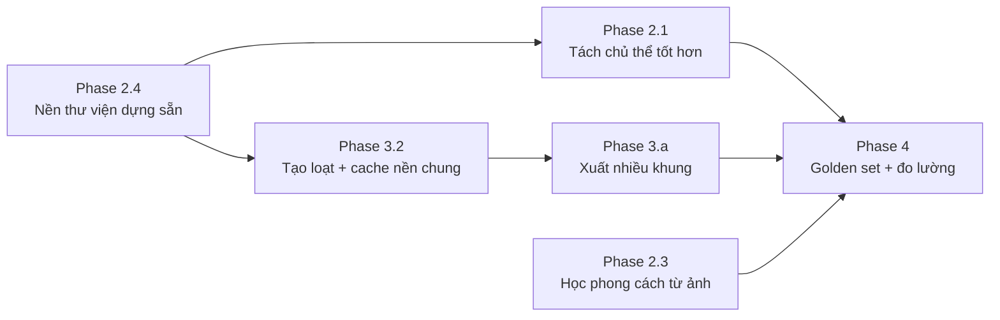

# Kế hoạch cải tiến tính năng tạo ảnh quảng cáo menu (AI)

> **Ngày lập:** 2026-09-22 · **Cập nhật:** 2026-09-25
> **Trạng thái:** Phase 1 **đã xong** · Phase 2–4 chờ làm
> **File liên quan:** `packages/agents/src/ca_agents/menu_prompt.py` ·
> `ca_agents/image_gen.py` · `ca_agents/bg_redesign.py` · `ca_agents/menu_style.py` ·
> `apps/web/src/app/menu/page.tsx` · `apps/api/src/ca_api/interfaces/http/pos.py`

---

## 7. Chốt lại 2026-09-25 — BA chế độ, có sửa ẢNH THẬT

Mục tiêu chốt: **úp ảnh thật lên rồi AI xử lý ra ảnh quảng cáo**. Sau khi khảo sát,
chỉ **Pollinations Gen** làm được image-to-image miễn phí; NVIDIA chỉ vẽ từ prompt chữ.

### 7.1 Ba chế độ (`MenuImageGenerateBody.mode`)

| `mode` | AI làm gì | Cần ảnh? | Provider |
|---|---|:--:|---|
| `from_prompt` (mặc định) | Vẽ ảnh mới hoàn toàn từ prompt | không | NVIDIA → Gemini → Pollinations |
| `edit_photo` | **Sửa chính ảnh quán chụp** thành ảnh quảng cáo (image-to-image) | ✅ | **Pollinations Gen** → Gemini |
| `keep_drink` | Giữ 100% pixel ly nước gốc, AI vẽ nền mới rồi ghép | ✅ | `bg_redesign` (NVIDIA/Pollinations sinh nền) |

### 7.2 Vì sao `edit_photo` KHÔNG dùng NVIDIA (đã kiểm chứng)

| Cách | Kết quả |
|---|---|
| `flux.1-kontext-dev` + base64 | ❌ `Expected: example_id, got: base64` |
| `flux.1-dev` `mode=canny/depth` (ControlNet) + base64 | ❌ `Image input is provided in the invalid form` |
| Upload asset NVCF → `PUT` S3 | ❌ `403 SignatureDoesNotMatch` |

NVIDIA chỉ nhận `example_id` do họ cấp cho ảnh nội bộ — **không nhận ảnh người dùng
với mọi hình thức**. Vì vậy `edit_image()` bỏ hẳn NVIDIA.

### 7.3 Provider image-to-image (khảo sát 2026-09-25)

| Provider | Miễn phí i2i? | Ghi chú |
|---|:--:|---|
| **Pollinations Gen** | ✅ | 19 model nhận ảnh; `POST /v1/images/edits` **multipart file nhị phân**; key free qua GitHub |
| OpenRouter | ❌ | 11 model xuất ảnh, **0 model miễn phí** |
| HuggingFace | ⚠️ | Nhận base64 + có Kontext-dev, nhưng free tier chỉ **$0.10/tháng** |
| Gemini image | ⚠️ | Nhận base64 nhưng free tier `429 quota exceeded` |
| NVIDIA | ❌ | Chỉ text-to-image |

**Bật chế độ `edit_photo`**: lấy key free tại https://enter.pollinations.ai/keys
(đăng nhập GitHub, kèm Pollen từ Quests) → dán vào `POLLINATIONS_API_KEY` trong `.env`.
Không có key thì chế độ này tự rơi xuống Gemini.

### 7.4 Kiểm chứng chạy thật (3 chế độ, qua API)

```
1 from_prompt  → 200 OK   provider=nvidia            1024×1024 JPEG 258KB
2 edit_photo   → chạy đúng luồng, nhưng thiếu POLLINATIONS_API_KEY
                 → rơi xuống Gemini → 429 (hết quota free tier)
3 keep_drink   → 200 OK   provider=local-composite   1024×1024 PNG 1.3MB
4 thiếu ảnh gốc ở chế độ cần ảnh → 422 "can_anh_goc" (đúng)
```

Sau khi bạn dán `POLLINATIONS_API_KEY`, chế độ 2 chạy thật — **không cần sửa code**.

---

## 6. Đổi hướng 2026-09-25 — bỏ tiền xử lý, chuyển sang NVIDIA

### 6.1 Đã bỏ khỏi LUỒNG ảnh quảng cáo

| Bỏ khỏi luồng | Lý do |
|---|---|
| `analyze_drink_image` + endpoint `/anh/analyze` | Vision-LLM tốn 3–10 giây và một lượt gọi mạng cho MỖI ảnh chỉ để suy ra vài tính từ — trong khi tên món + phong cách đã có sẵn trong dữ liệu menu. Provider LLM lỗi là cả tính năng đứng. |
| `refine_generation_prompt` + `/anh/refine`, `/anh/prompt-only` | Người dùng sửa thẳng prompt ngay trên UI — không cần một lượt LLM nữa để "dịch" feedback. |

> ℹ️ `bg_redesign.py` **không bị bỏ** — xem §7.1: nó là provider của chế độ
> `keep_drink` (giữ ly nước gốc). Ban đầu định gỡ, nhưng khi chốt lại yêu cầu
> "úp ảnh thật → AI xử lý" thì module này là một trong hai đường khả thi.

### 6.2 Đã thêm

| Thêm | Chi tiết |
|---|---|
| `ca_agents/menu_prompt.py` | Dịch tên món Việt→Anh bằng từ điển cụm (~150 mục, khớp **cụm dài trước** để "trà đào cam sả" ra một cụm đúng) + dựng prompt **tất định** từ tên món × phong cách × tỷ lệ khung. Không gọi LLM, không gọi mạng. Từ lạ được GIỮ NGUYÊN thay vì bỏ. |
| Provider NVIDIA trong `image_gen.py` | `POST https://ai.api.nvidia.com/v1/genai/{model}`, payload tối thiểu `{prompt, width, height, seed}`. Thứ tự: **NVIDIA → Gemini → Pollinations**. Thử lần lượt các model; chỉ `http_404` (model chưa mở) mới nhảy model kế tiếp, lỗi thật (5xx/422) báo thẳng cho người dùng. |
| `POST /api/v1/menu/{id}/anh/prompt` | Trả prompt ngay (không mạng) để UI hiện cho người dùng đọc/sửa trước khi bấm tạo ảnh. |
| UI: tỷ lệ khung + mô tả thêm + prompt sửa được | Đổi tỷ lệ/phong cách → prompt dựng lại ngay. Không còn bước tải ảnh lên. |

### 6.3 Model NVIDIA — kết quả dò thực tế (không suy đoán)

| Model | Kết quả |
|---|---|
| `black-forest-labs/flux.2-klein-4b` | ✅ **Mặc định mới** — 1–4 giây/ảnh, nhận MỌI kích thước chẵn, JPEG. `steps ≤ 4`, `cfg_scale ≤ 1.0`. |
| `black-forest-labs/flux.1-dev` | ✅ Chạy được, ~5–10 giây. `width/height` chỉ nhận tập cố định (768…1344). |
| `black-forest-labs/flux.1-schnell` | ⚠️ `cfg_scale` phải ≤ 0; hay timeout. |
| `black-forest-labs/flux.1-kontext-dev` | ⚠️ BẮT BUỘC có `image` (image-to-image). |
| `stabilityai/stable-diffusion-3.5-large` | ❌ `404 page not found` — đã dò 60+ biến thể tên trên cả `ai.api.nvidia.com` và `integrate.api.nvidia.com`. |
| `stabilityai/stable-diffusion-3-medium`, `sdxl-turbo` | ❌ Route tồn tại nhưng tài khoản nhận `Not found for account`. |

**Muốn dùng SD 3.5 Large**: đặt `NVIDIA_IMAGE_MODEL=stabilityai/stable-diffusion-3.5-large`
trong `.env` khi NVIDIA mở quyền — **không cần sửa code**. Nếu model đó 404, hệ thống
tự rơi về `flux.2-klein-4b` nên ảnh vẫn ra.

### 6.4 Đo lại sau đổi hướng

| Chỉ số | Trước | Sau |
|---|---|---|
| Bước trước khi sinh ảnh | tải ảnh → vision LLM (3–10s) → mask + composite | **không** (prompt dựng tức thì) |
| Thời gian ra ảnh | 30–60s | **1–4s** (NVIDIA flux.2-klein-4b) |
| Phụ thuộc khi tạo ảnh | Gemini/Pollinations + LLM vision | NVIDIA (khoá), fallback Gemini → Pollinations |
| Test | 1118 (agents) | **1888 toàn repo**, 44 test mới cho prompt/NVIDIA |

---

## 1. Vấn đề gốc người dùng nêu

| # | Vấn đề | Nguyên nhân gốc | Trạng thái |
|---|--------|-----------------|:----------:|
| 1 | Ảnh bị **biến dạng** | Nền sinh ở 1024×1024 rồi `resize` thẳng về 896×1120 → kéo dọc ~25%; ly scale bằng `min()` rồi làm tròn xuống nên nhỏ và lệch | ✅ xong |
| 2 | Ảnh **không đẹp**, thiếu thiết kế | Chỉ có hào quang phẳng (gradient tuyến tính) + vignette thô; bóng đổ dùng cả cột dọc của ly → vệt loang | ✅ xong |
| 3 | **Không giữ được phong cách** cho các ly khác | Mỗi lần tạo ảnh lại gọi LLM viết prompt nền mới từ đầu → 10 ly ra 10 phong cách | ✅ xong |
| 4 | **Gen ảnh lâu** | Gọi tuần tự vision bbox → LLM prompt → sinh nền; 3 lần retry × 90s có thể thành 270s; không cache | ✅ xong |
| 5 | **Tạo ra ảnh lỗi** | Không kiểm tra nền trả về (một màu, quá tối, trùng nền cũ) → ghép ra ảnh phẳng hoặc ảnh như không đổi | ✅ xong |

## 2. Phase 1 — đã triển khai (2026-09-22)

### 2.1 Chống biến dạng & nâng chất lượng

| Biện pháp | Hàm | Vì sao |
|---|---|---|
| Nền cắt theo **cover** (giữ tỷ lệ, crop dư) | `_cover_resize` | Không còn kéo giãn mép bàn/vệt sáng theo trục |
| Ly scale **đồng nhất** theo tỷ lệ cho phép, căn giữa theo hiệu số thực | `_fit_subject` | Ly đúng tỷ lệ gốc, không lệch ở khung lẻ |
| **Resize RGBA có nhân trước alpha** | `_premultiplied_resize` | Hết viền xám/bẩn do Pillow nội suy kênh RGB của pixel trong suốt |
| **Co mask + siết ngưỡng feather** | `_subject_alpha` | Hết quầng nền cũ quanh ly khi đổi sang nền tối |
| Hào quang & vignette dùng **gradient bậc 2** | `_glow_layer` | Hết vòng tròn lộ rõ trên nền trơn |
| Bóng đổ chỉ lấy **dải đáy ly** | `_composite` | Hết vệt bóng loang dọc theo thân ly |

### 2.2 Chống ảnh lỗi — fail-closed

`_background_is_usable` từ chối nền khi:

- Độ lệch chuẩn < `_BG_MIN_STD` (6.0) → `flat_background` (provider trả ảnh một màu)
- Màu trung bình < 12 hoặc > 246 → `extreme_background` (ảnh đen/nhiễu/trắng bệch)
- Khoảng cách màu euclide tới nền cũ < `_BG_MIN_COLOR_DELTA` (2.5) → `background_unchanged`
  (model bỏ qua prompt, trả lại chính khung ảnh gốc)

Không đạt → thử lại với **seed khác** (`_BG_ATTEMPTS = 2`); hết lượt → trả lỗi kèm
câu tiếng Việt hướng dẫn bấm "Tạo lại ảnh khác". **Ảnh hỏng không bao giờ được ghép.**

### 2.3 Giảm độ trễ

| Biện pháp | Chi tiết | Tiết kiệm |
|---|---|---|
| Vision bbox **song song** với sinh nền | `ThreadPoolExecutor(max_workers=2)` — hai I/O mạng độc lập | ~5s → 0s (chạy đè) |
| **Thoát sớm** khi tách chủ thể thất bại | `pool.shutdown(wait=False, cancel_futures=True)` | ~30s (không chờ nền vô ích) |
| Phong cách tất định — **không gọi LLM** viết prompt | `build_background_prompt` | ~3–10s mỗi ảnh |
| **Ngân sách thời gian tổng** thay vì timeout từng request | `deadline = time.monotonic() + timeout_s` | Chặn trần 270s → 45s |
| **Cache nền** trong tiến trình (12 ảnh, key = prompt+w+h+seed+model) | `_BG_CACHE` | Bấm lại = 0s |
| Fallback model **turbo** khi flux quá tải | `_POLLINATIONS_FALLBACK_MODELS` | ~30s → ~5s |
| Đọc response **có giới hạn byte** (24MB) | `_read_limited` | Chặn response lỗi khổng lồ |

### 2.4 Phong cách thiết kế (brand kit) — "giữ phong cách cho các ly khác"

Module mới `packages/agents/src/ca_agents/menu_style.py`:

- Phong cách là **dữ liệu có cấu trúc**, không phải prompt tự do: `scene` × `lighting`
  × `palette` × `lens`, mỗi trường thuộc bảng hợp lệ (6 × 5 × 6 × 4 tổ hợp).
- `MenuStyle.to_prompt()` dịch thành prompt nền **tất định** — cùng phong cách →
  cùng prompt, nên 10 ly của quán ra cùng một tông.
- 5 **preset** dựng sẵn (Nhịp Quán cổ điển, Tối giản sáng, Quán đêm moody, Vườn
  xanh, Đẹp sang trọng) hiện ngay khi quán chưa tạo phong cách nào.
- `normalize_slug` bỏ dấu tiếng Việt ("Moody Quán Đêm" → `moody_quan_dem`).

API (chỉ `chu_quan`):

| Endpoint | Việc |
|---|---|
| `GET /api/v1/menu/anh/phong-cach` | Danh sách + mặc định + bảng giá trị hợp lệ cho UI |
| `PUT /api/v1/menu/anh/phong-cach` | Tạo/cập nhật phong cách (upsert theo slug) |
| `DELETE /api/v1/menu/anh/phong-cach/{slug}` | Xoá (chặn xoá phong cách cuối cùng) |
| `POST /api/v1/menu/anh/phong-cach/{slug}/mac-dinh` | **Đặt làm mặc định** cho ảnh mới |

UI `/menu`: dropdown chọn phong cách + nút "Đặt làm mặc định" + mô tả phong cách
đang chọn bằng tiếng Việt; lựa chọn được nhớ giữa các lần mở form.

### 2.5 Kiểm thử

| Bộ test | Số lượng | Nội dung |
|---|---:|---|
| `packages/agents/tests/test_menu_style.py` | 32 | slug hoá tiếng Việt, validate bảng hợp lệ, prompt tất định, không chứa từ đồ uống |
| `packages/agents/tests/test_bg_redesign.py` | 28 | chống biến dạng (đo tỷ lệ), chống lem màu, validate nền, phong cách không gọi LLM — **vẫn xanh** dù module đã ra khỏi luồng ảnh quảng cáo |
| `apps/api/tests/unit/test_menu_style_http.py` | 18 → **22** | phân quyền, 422 kèm giá trị cho phép, đổi mặc định, chặn xoá cuối, dựng prompt tất định |
| `packages/agents/tests/test_menu_prompt.py` | **22** | dịch tên món (cụm dài thắng, giữ từ lạ), prompt tất định, không có điều khoản cấm đồ uống |
| `packages/agents/tests/test_image_gen.py` | **22** | thứ tự provider, payload NVIDIA đúng ràng buộc, fallback khi 404, báo lỗi thật khi 5xx |

Cổng `python scripts/pre_push_review.py` xanh toàn bộ (ruff + secret + mypy
+ tsc + pytest). Toàn repo sau đổi hướng: **1888 passed**.

---

## 6.5 Phase 2 — điều chỉnh lại sau khi bỏ tiền xử lý

Các mục Phase 2 dưới đây **không còn áp dụng cho luồng ảnh quảng cáo**:

- ~~3.1 Tách chủ thể tốt hơn (GrabCut/rembg)~~ — luồng chính không tách nền nữa.
- ~~3.2 Hàng đợi tạo ảnh loạt dùng cache nền chung~~ — vẫn hữu ích nhưng đơn giản
  hơn nhiều: mỗi ảnh chỉ là một lượt gọi NVIDIA 1–4 giây, chỉ cần hàng đợi tuần tự.

Mục **còn áp dụng được**: học phong cách từ ảnh mẫu, xuất nhiều khung cùng lúc.

---

## 3. Phase 2 — cải tiến nên làm tiếp (P1)

### 3.1 Tách chủ thể tốt hơn (chất lượng rìa ly)

**Vấn đề còn lại:** flood-fill màu vẫn thất bại khi nền gốc có **vật thể khác
cùng vùng màu** với ly (ví dụ cốc thủy tinh trong suốt trên nền sáng) — mask sẽ
ăn vào ly hoặc giữ lại mảng nền.

**Đề xuất:**
- Thêm bước **GrabCut** (qua `scipy` không có; cần `opencv-python-headless` ~60MB)
  hoặc **thuật toán closed-form matting** thuần numpy với trimap từ mask hiện tại.
- Hoặc thử `rembg` (ONNX U2Net, ~170MB model) — chất lượng cao nhất nhưng nặng
  và cần tải model lần đầu. **Cần ADR** vì ảnh hưởng kích thước image Docker.
- Trước mắt, có thể cải thiện rẻ: dùng **cạnh Canny** làm ràng buộc bổ sung cho
  flood-fill (không vượt qua cạnh mạnh).

**Đo lường:** bộ ảnh vàng 20 ly thật + mask gán tay, đo IoU. Ngưỡng chấp nhận ≥ 0.90.

### 3.2 Hàng đợi tạo ảnh loạt ("tạo cho cả menu")

**Vấn đề:** hiện mỗi ly phải bấm tay; quán có 25 món thì 25 lần chờ.

**Đề xuất:**
- Endpoint `POST /api/v1/menu/anh/tao-loat` nhận `{mon_ids: [], style_slug, aspect_ratio}`
  → 202 kèm `job_id`; worker chạy nền (đã có `apps/api/src/ca_api/worker.py`).
- Ghi tiến độ vào `kv_set("menu_anh_job:{job_id}", {...})`; UI poll mỗi 2s.
- **Cache nền dùng chung**: nhiều món cùng phong cách + cùng khung → có thể tái
  dùng **cùng một ảnh nền** cho mọi ly, chỉ composite khác chủ thể. Giảm N lần gọi
  mạng xuống 1. Đây là cải tiến lớn nhất về tốc độ cho luồng loạt.
- UI: nút "Tạo ảnh cho cả menu" + thanh tiến độ + preview từng ảnh để duyệt.

### 3.3 Học phong cách từ ảnh quán đã có

**Vấn đề:** chủ quán không biết chọn `scene/lighting/palette/lens` nào cho ra
"đúng chất quán mình".

**Đề xuất:**
- Endpoint `POST /api/v1/menu/anh/phong-cach/hoc-tu-anh` nhận 3–5 ảnh quán đã
  chụp → Vision LLM phân tích **tông màu trung bình, nhiệt độ màu, độ tương phản,
  bố cục** → map sang tổ hợp `scene/lighting/palette/lens` gần nhất.
- Fail-closed: độ tin cậy `low` → trả tổ hợp gần nhất kèm cảnh báo, không tự lưu.
- Trích **bảng màu chủ đạo** từ ảnh (k-means trên pixel) để hiển thị cho người
  dùng xác nhận trước khi lưu.

### 3.4 Preset nền dùng lại được (không phụ thuộc mạng)

**Vấn đề:** 100% nền phụ thuộc Pollinations — mất mạng hoặc rate-limit là hết
tính năng, dù ảnh đang demo.

**Đề xuất:**
- Thư viện **8–12 nền dựng sẵn** (ảnh chụp thật hoặc render) trong
  `data/menu_backgrounds/` theo từng phong cách, mỗi nền 2–3 khung tỷ lệ.
- `_generate_background` thử: cache → provider → **nền thư viện** → lỗi.
- Nền thư viện cũng là **đầu vào cho đánh giá** chất lượng composite (tất định).

---

## 4. Phase 3 — mở rộng (P2)

| Ý tưởng | Giá trị | Ghi chú |
|---|---|---|
| **Xuất nhiều khung một lần** (1:1 + 4:5 + 9:16 + 16:9) | Đăng multi-platform không phải tạo lại | Composite lại trên cùng nền: chỉ tốn CPU (~0.3s/khung) |
| **Bố cục nâng cao**: ly lệch trái/phải, chừa khoảng trống cho chữ | Ảnh quảng cáo chuyên nghiệp hơn | Thêm `layout` vào `MenuStyle`; dùng `_fit_subject` với anchor |
| **Lớp chữ tiếng Việt có kiểm soát** (tên món, giá) | Dùng được ngay làm poster | Cần font Việt trong image (`docs/THIRD_PARTY.md`); hiện cố ý KHÔNG vẽ chữ để tránh chữ vỡ |
| **Bóng đổ theo hướng sáng của nền** | Ghép tự nhiên hơn | Phân tích gradient sáng của nền → đặt hướng bóng |
| **Reflection (ly bóng trên mặt bàn)** | Tăng cảm giác "đặt trên bàn" | Lật dọc dải đáy + giảm alpha + blur |
| **Kiểm tra chất lượng đầu ra** (sharpness, tương phản vùng ly) | Phát hiện ảnh ra kém trước khi lưu | Fail-closed: cảnh báo thay vì âm thầm lưu ảnh xấu |
| **So sánh trước/sau + nút "chọn ảnh này"** trong danh sách nhiều seed | Người dùng chọn thay vì thử mù | Sinh 3 seed song song, hiện lưới 3 ảnh |

---

## 5. Phase 4 — vận hành & đo lường (P3)

| Việc | Vì sao |
|---|---|
| Đo **p50/p95 thời gian** sinh ảnh theo provider, ghi vào `docs/metrics-*.md` | Biết cải tiến có thật hay chỉ cảm giác |
| Theo dõi **tỷ lệ từ chối nền** (`flat_background`, `segment_failed`…) | Nếu > 20% thì provider đang kém, cần đổi model/thư viện nền |
| **Cost guard**: đếm số lần gọi provider/ngày, chặn khi vượt ngưỡng | Pollinations free nhưng có rate limit cộng đồng |
| **Golden set 20 ly thật** + ảnh tham chiếu đã duyệt | Chống hồi quy khi sửa thuật toán composite |
| **ADR** cho việc thêm `opencv`/`rembg` nếu Phase 2.1 chọn hướng đó | Ảnh hưởng kích thước image + giấy phép |

---

## 6. Thứ tự ưu tiên đề xuất



**Đề xuất bắt đầu ở 2.4** (nền thư viện): rẻ nhất, gỡ rủi ro phụ thuộc mạng, và
là tiền đề để 3.2 (cache nền chung) hoạt động hiệu quả.

---

## 7. Ràng buộc không được vi phạm khi làm Phase 2+

1. **Pixel ly nước = 100% ảnh gốc.** Mọi biến đổi chỉ được tác động ngoài mask.
2. **Fail-closed.** Không tách được / nền hỏng → trả lỗi rõ, không ghép ảnh hỏng.
3. **Không hard-code số nghiệp vụ.** Ngưỡng và bảng giá trị đặt ở đầu module,
   có tên và giải thích.
4. **Phong cách là dữ liệu, không phải prompt tự do.** Mọi trường phải validate.
5. **Không gọi LLM khi không cần.** Prompt từ phong cách là tất định.
6. **Chỉ `chu_quan` sửa phong cách**; mọi thao tác ghi đều qua `_audit`.
