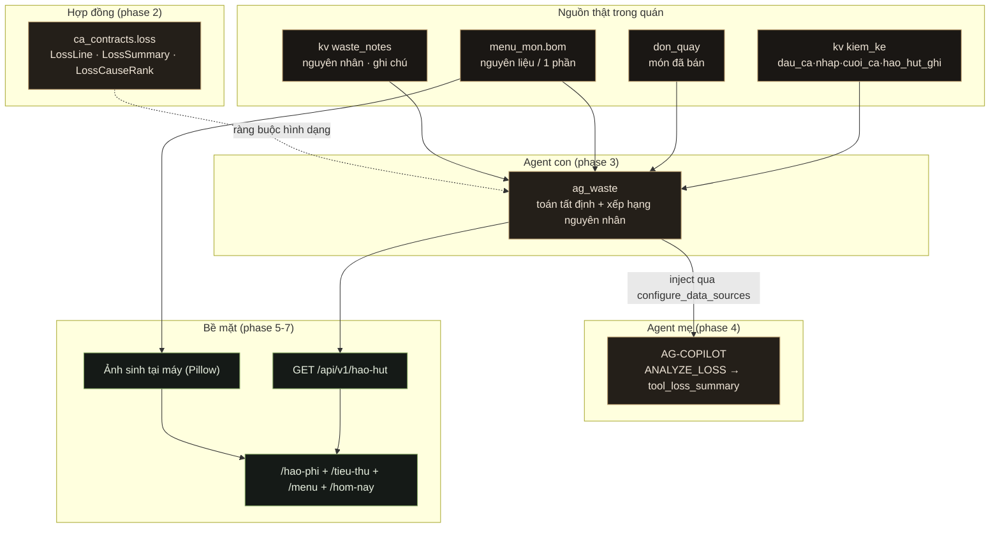

# Hao hụt tiêu thụ sản phẩm

## Outcome

Chủ quán mở `/hao-phi` và **thấy được hao hụt thật của quán theo từng nguyên liệu**:
lượng lý thuyết (theo công thức BOM × số món đã bán) so với lượng thực tế (theo
phiếu kiểm kê §4.3), khoảng lệch, tỷ lệ phần trăm, mức độ, và **nguyên nhân nào
đang lặp lại ở nguyên liệu nào** — có agent mẹ (AG-COPILOT) điều phối agent con
(AG-WASTE) trả lời được câu hỏi "hao hụt tuần này do đâu, nguyên liệu nào".
Toàn bộ danh mục sản phẩm — cà phê, trà, nước đóng chai, nguyên liệu — có trong
hệ thống và **mỗi sản phẩm có ảnh**.

## Why now — bằng chứng hiện trạng

| # | Sự thật đã kiểm bằng mã | Hệ quả |
|---|---|---|
| 1 | `ag_waste/extract.py:cluster()` chỉ 10 dòng, đếm thứ trong tuần khi ghi chú chứa `"dư"`/`"hết"`/`"hao"`, cần `n>=2` | Trang không biết **nguyên liệu nào** hao, **bao nhiêu**, **tỷ lệ bao nhiêu**. Bỏ qua hoàn toàn `mat_hang` và `nguyen_nhan` mà bản ghi đã có |
| 2 | `kv kiem_ke` có **112 dòng** theo đúng công thức §4.3 (`dau_ca + nhap_trong_ca − cuoi_ca − hao_hut_ghi = tieu_thu_suy_ra`) | Dữ liệu hao hụt thật **đã có sẵn trong repo nhưng không có endpoint nào đọc** |
| 3 | `menu_mon.bom` giữ nguyên liệu/1 đơn vị; `pos.py:_ghi_tieu_thu_uoc_luong` ghi tiêu thụ ước lượng khi đơn sang `xong` | Đủ hai vế để tính hao hụt lý thuyết ↔ thực tế, nhưng **chưa có hàm nào ghép hai vế** |
| 4 | `skills/.../barista-waste-audit/scripts/audit_recipe_waste.py` đã làm đúng phép toán này (`<=5%` đạt) | Thuật toán đã được kiểm chứng trong repo — dùng lại, không phát minh công thức mới |
| 5 | `POST /api/v1/waste` **không gọi `_audit`**, trong khi `POST /api/v1/tieu-thu` có gọi | Ghi hao hụt không để lại vết — vi phạm ADR-008 |
| 6 | `worker._tong_ket_ngay` lọc `x.get("ngay") or x.get("at")`, nhưng bản ghi thật ghi `luc` (route) và `created_at` (seed) | Bản tổng kết ngày **luôn ra 0** — lỗi thật, im lặng |
| 7 | `_MENU_MAC_DINH` chỉ có 4 món, chỉ seed khi `NHIPQUAN_SEED_DEMO`; `data/menu_images/` **rỗng** | Quán mới mở không có sản phẩm, không có nước đóng chai, không có ảnh |
| 8 | `GET /api/v1/menu/{mon_id}/anh` 404 khi chưa upload; `MenuThumb` rơi về chữ cái đầu | Mọi món đều trông như "chưa có ảnh" |
| 9 | `tool_get_waste_summary` chỉ gom cụm ghi chú qua `waste_cluster` được inject | Agent mẹ trả lời được "có mấy ghi chú", **không** trả lời được "hao hụt bao nhiêu, nguyên liệu nào" |

## Constraints

- **ADR-002 tất định** — mọi con số do hàm toán thuần sinh; LLM không tự sinh số.
- **ADR-003 contracts-first** — schema + test hợp đồng phải có trước logic nghiệp vụ.
- **ADR-008 người quyết định** — agent chỉ đọc và đề xuất; ghi hao hụt qua UI có duyệt.
- **Ràng buộc cứng demo offline (§14.9)** — mọi thứ phải chạy khi **rút mạng**;
  `docs/THIRD_PARTY.md` ghi free tier cloud là "dễ thu hồi" ⇒ **ảnh sinh tại máy**,
  không gọi API ảnh.
- **Tách lớp agent** — `tool_registry.py` **không được import** agent khác hay
  `ca_api`; dữ liệu vào qua `configure_data_sources()` (cổng `test_architecture.py`).
- **Cổng PR13** — route user-facing mới phải khai `CAPABILITY_REGISTRY` hoặc
  `EXCLUDED_ROUTES` kèm lý do.
- **Cổng commitlint** — scope chỉ được thuộc `solver|gates|ops|playbook|api|orc|agents|router|web|tpl|contracts|infra`.
- **Thêm thư viện phải ghi `docs/THIRD_PARTY.md`** (lỗi chặn merge theo `.github/copilot-instructions.md`).
- Giữ nguyên hình dạng `waste_notes`/`tieu_thu`/`kiem_ke` cũ; chỉ **thêm** trường.

## Non-goals

- Không làm kế toán, doanh thu, giá vốn, lãi lỗ (sổ này "số lượng, không kế toán").
- Không tự đặt hàng nhà cung cấp (AG-WASTE bị cấm điều này trong `PHAM_VI.md`).
- Không dùng API sinh ảnh đám mây, không thêm dịch vụ trả phí.
- Không xây lại menu/quầy/POS; chỉ mở rộng và nối.
- Không sửa `solver`, lịch tuần, hay miền công bằng.

## Acceptance criteria

1. `LossLine`/`LossSummary` có schema JSON + test hợp đồng xanh; `make contracts` không drift.
2. Hàm thuần `tinh_hao_hut(...)` cho ra `dat`/`canh_bao`/`nghiem_trong`/`thieu_du_lieu` — `thieu_du_lieu` khi thiếu vế, **không bịa số**.
3. `GET /api/v1/hao-hut` trả dòng hao hụt theo nguyên liệu + tổng + xếp hạng nguyên nhân, đọc `kiem_ke` + BOM + `waste_notes` thật.
4. `ANALYZE_LOSS` chạy được qua AG-COPILOT: `ag_waste` (con) tính, AG-COPILOT (mẹ) diễn giải; trả lời có số và có nguồn.
5. Danh mục ≥ 45 mặt hàng gồm cà phê, trà, nước đóng chai, nguyên liệu, bánh; nạp idempotent.
6. Mỗi món trong menu có ảnh xem được qua `/api/v1/menu/{id}/anh` **khi không có mạng**.
7. `/hao-phi` hiển thị bảng hao hụt theo nguyên liệu + xếp hạng nguyên nhân + vùng hỏi agent; `/tieu-thu`, `/menu`, `/hom-nay`, `/huong-dan` được nối tới.
8. Cổng xanh: `ruff`, `pytest`, `tsc --noEmit`, e2e cũ không vỡ, `test_capability_coverage.py` xanh.
9. Mỗi phase một commit conventional, không tham chiếu AI.

## Phases

| # | Phase | Nội dung | Phụ thuộc | Trạng thái |
|---|-------|----------|-----------|------------|
| 1 | [Khảo sát & bằng chứng](./phase-01-start.md) | Ghi lại hiện trạng kèm bằng chứng mã | — | ✅ |
| 2 | [Hợp đồng hao hụt](./phase-02-hop-dong-hao-hut.md) | `loss.py` + ngưỡng cấu hình + test hợp đồng | 1 | ✅ |
| 3 | [Động cơ hao hụt](./phase-03-dong-co-hao-hut.md) | Toán tất định trong `ag_waste` | 2 | ✅ |
| 4 | [Agent mẹ–con](./phase-04-agent-me-con.md) | `ANALYZE_LOSS` nối AG-COPILOT ↔ AG-WASTE | 3 | ✅ |
| 5 | [API & cổng](./phase-05-api-va-cong.md) | Router hao hụt + capability + audit | 4 | ✅ |
| 6 | [Danh mục & hình](./phase-06-danh-muc-san-pham-va-hinh.md) | Danh mục đầy đủ + sinh ảnh tại máy | 5 | ✅ |
| 7 | [Giao diện & trang liên kết](./phase-07-giao-dien-va-trang-lien-ket.md) | `/hao-phi` + nối 4 trang | 6 | ✅ |
| 8 | [Tài liệu, kiểm chứng, commit](./phase-08-tai-lieu-kiem-chung-commit.md) | Docs + cổng + commit theo phase | 7 | ✅ |

## Kiến trúc chốt

## Success criteria

- [x] Chủ quán trả lời được "tuần này hao hụt bao nhiêu, nguyên liệu nào, do đâu" **bằng số thật** — bảng `/hao-phi` + agent mẹ `ANALYZE_WASTE` gọi cùng hàm `ag_waste.tinh_tu_nguon`.
- [x] Không có chỗ nào hiển thị hoặc trả về con số bịa khi thiếu dữ liệu — `null` in gạch, `0` in số 0, thiếu vế mang `thieu_du_lieu` kèm `thieu_ve`. Có 4 test API + 2 e2e chốt.
- [x] Mọi món trong menu đều có ảnh, kể cả khi máy đang rút mạng — sinh tại máy bằng Pillow, ba bậc phục vụ, bậc ba sinh tại chỗ (ADR-019).
- [x] Không vỡ cổng nào đang xanh; mọi phase có commit riêng.

## Nhật ký thi công

| Commit | Nội dung |
|---|---|
| `9a4699c` | Hợp đồng hao hụt + ngưỡng cấu hình |
| `55f4a39` | Động cơ hao hụt AG-WASTE |
| `3df702d` | Agent mẹ AG-COPILOT trả lời bằng số thật |
| `7ab6432` | Bề mặt API `/api/v1/hao-hut` + vá 2 lỗ audit/khoá ngày |
| `7b018da` | Danh mục 49 món + ảnh sinh tại máy |
| `9f22a84` | Dựng lại `/hao-phi` + nối 3 trang |
| `8a194fc` | ADR-019 + tài liệu |
| `303c7d4` | e2e chốt ràng buộc null-vs-zero |
| `c14e5a3` | **Nối `/hom-nay`** — bù tiêu chí 7 còn thiếu |
| `a30addd` | e2e chốt lối `/hom-nay` + chịu được lỗi nguồn |

### Ghi chú sau khi đối chiếu tiêu chí

Tiêu chí số 7 liệt kê bốn trang phải nối tới (`/tieu-thu`, `/menu`, `/hom-nay`,
`/huong-dan`) nhưng phase 7 chỉ làm được ba trang đầu — `/hom-nay` bị bỏ sót. Đã
bù ở `c14e5a3`: `GET /api/v1/hom-nay` trả thêm khối `hao_hut`, và bảng Hôm nay
hiện cảnh báo kèm lối mở bảng hao hụt. Khối này gọi cùng hàm với `/hao-hut` nên
ba bề mặt không thể lệch số, và được bọc `try` để nguồn hỏng không kéo sập trang
mở đầu sau đăng nhập.

<!-- slug: hao-hut-tieu-thu-san-pham -->